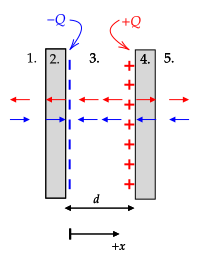

```mdextension
Title: Capacitance
```

# Overview

## Technique

The general technique for computing capacitance when Gauss's law applies is:

1. Place an equal and opposite amount of charge, $Q$, on the conductors.
2. Use Gauss's law to compute the electric field between the conductors.
3. Use $V(b)-V(a)=-\int^b_a \mathbf{E}\bfcdot d\mathbf{l}$ to find the potential difference between the conductors.
4. Use the equation for capacitance to find $C$: $C = Q/|\Delta V| = Q/|V(b)-V(a)|$.

## Review of Related Topics

**Conductors**

1. When charges are placed on an isolated conductor (meaning it is far away from other charges), they will reconfigure themselves to make the electric field inside the conductor zero.
2. If a charged conductor is not isolated, the charges on the conductor will reconfigure themselves to make the electric field inside the conductor zero. The total field in the conductor is the field due to the charges on the conductor and charges elsewhere.

**Electric Potential Energy and Electric Potential**

The general formula for work is $W_{a\rightarrow b}=\int_a^b \bfvec{F}\bfcdot d\bfvec{l}$. If $\bfvec{F}$ is a conservative force, such as the force due to a static electric field, we define potential energy $U$ according to

$\Delta U = U(b)-U(a) \equiv -W_{a\rightarrow b}$

The force on a charge $q_o$ in an electric field $\bfvec{E}$ is $\bfvec{F}=q_o\bfvec{E}$ and so we can write

$\ds U(b)-U(a) = -\int_a^b q_o\bfvec{E}\bfcdot d\bfvec{l}$. Dividing both sides by $q_o$ gives $\ds\frac{U(b)}{q_o}-\frac{U(a)}{q_o} = -\int_a^b\bfvec{E}\bfcdot d\bfvec{l}$

Defining electric potential as $V\equiv U/q_o$ gives $V(b)-V(a) = -\int_a^b\bfvec{E}\bfcdot d\bfvec{l}$

In summary, if you calculate the difference in potential between $a$ and $b$ (in Volts), you can also determine, for a charge $q_o$ moved from $a$ to $b$,

1. how much work (in Joules) the electric field did on the charge: $-q_o(V(b)-V(a))$, and
2. the change in the charge's electric potential energy (in Joules): $+q_o(V(b)-V(a))$.

\ifsolutions\else
   \newpage
\fi

# Parallel Plates

An equal and opposite amount of charge is placed on two conducting and parallel plates, as shown on the left in the following figure. On the right, a side view of the plates is shown. The area of the plates, $A = w^2$, is much larger than shown, such that the width, $w$, is much larger than the separation distance, $d$.


1. How will the charges distribute on each of the plates? That is, how much charge is on each of the four faces that have an area $A$? Assume that no charge appears on the other (thin, and having thickness $t$) faces of the plates, which have a much smaller area.

   \ifsolutions
   {\bf Answer}: The charges will move to the inner faces, as shown in the following diagram. Electric field vectors for the positive and negative charges are shown. Because the charges are on a large plane, the field is independent of distance from the plane. With this charge configuration, inside the conductors, the field due to the positive charges cancels the field due to the negative charges giving a net field of zero.

   
   \else
   \vspace{3em}
   \fi

2. What is the electric field in each of the five regions? (Hint: The magnitude of the field due to charges uniformly distributed on a plane is $|\sigma|/2\epsilon_o$. The field in each region will be the sum of the field due to charges on each plate. Your answer should be such that the electric field inside the conducting plates is zero!)  

   \ifsolutions
   {\bf Answer}: The magnitude of the field due to each charged surface is $|\sigma|/2\epsilon_o$, where $\sigma$ is the surface charge density. The surface charge densities are $\pm Q/A$.  
   
   

   From the diagram in the answer to part 1., the electric fields cancel except between the plates where it is 

   $\ds\frac{|+Q/A|}{2\epsilon_o} + \frac{|-Q/A|}{2\epsilon_o} = \frac{Q}{A\epsilon_o}$

   to the left, so
   
   $\ds\bfvec{E}=-\frac{Q}{A\epsilon_o}\ihat$

   \else
   \vspace{3em}
   \fi

3. What is the electric potential difference, $V(d)-V(0)$, between the left and right plate? (Make sure the sign of your result matches your expectation based on the techniques covered in the last activity.)

   \ifsolutions
   {\bf Answer}: The general equation is

   $\ds V(b)-V(a) = -\int_a^b\bfvec{E}\bfcdot d\bfvec{l}$
   
   where $b$ is the final position and $a$ is the initial position. Using our variables,
   
   $\ds V(d)-V(0) = -\int_0^d\bfvec{E}\bfcdot d\bfvec{l}$

   The electric field is constant, so we know the result of the integration will be $\pm Ed=\pm Qd/A\epsilon_o$. Based on techniques covered in the last activity, we expect the potential to be higher at the right plate, so we choose the $+$ option. More formally, using $d\mathbf{l}=dx\ihat$  and $\bfvec{E}=-\frac{Q}{A\epsilon_o}\ihat$ gives

   $\ds V(d)-V(0) = -\int_0^d\bfvec{E}\bfcdot d\bfvec{l}=-\int_0^d\left[-\frac{Q}{A\epsilon_o}\ihat\right]\bfcdot dx\ihat=\frac{Qd}{A\epsilon_o}$

   \else
   \vspace{3em}
   \fi

4. Use your answer to 3. to find the capacitance in terms of $k$, $A$, and $d$.

   \ifsolutions
   {\bf Answer}:

   $$C = \frac{Q}{|\Delta V|} = \frac{Q}{\frac{Qd}{A\epsilon_o}}=\frac{\epsilon_oA}{d}$$
   \else
   \vspace{3em}
   \fi

5. (Review question) How much work would the electric field do on a charge $q_o$ that is moved from the left plate to the right plate? What would be the change in $q_o$'s electric potential energy?

   \ifsolutions
  {\bf Answer}: $\ds W=-q_o(V(d)-V(0))=-q_o\frac{Qd}{A\epsilon_o}$. Sign check: The force of the field on $q_o$ is to the left and the displacement is to the right, so $\bfvec{F}\bfcdot d\bfvec{l}$ will be negative.

  $\ds\Delta U=-W=q_o(V(d)-V(0))=+q_o\frac{Qd}{A\epsilon_o}$
   \else
   \vspace{3em}
   \fi

\ifsolutions\else
   \newpage
\fi

# Spherical

Charge placed on two spherical conducting shells, the cross--section of which is shown. Both shells have a thickness of $t$. The inner shell has an outer radius of $a$ and a net charge of $-Q$. The outer shell has an inner radius of $b$ and a net charge of $+Q$. Assume that $Q$ is positive.


Using Gauss's law and the fact that the electric field inside a conductor must be zero show that

1. there can be no charge on the inner surface of the inner conductor,

   \ifsolutions
    **Answer**: A Gaussian sphere with a surface inside the inner conductor has $E=0$ on its surface (b/c $E$ inside a conductor is zero). Based on $\oint \bfvec{E}\bfcdot d\mathbf{l}=Q_{\text{encl}}/\epsilon_o$, this implies $Q_{\text{encl}}=0$. (Note that all charges must be on the surface of a conductor, so the only possible location for the charge is on the inner and outer surfaces.)
   \fi

2. the charge on the inner surface of the outer conductor is $+Q$, and

   \ifsolutions
    **Answer**: A Gaussian sphere with its surface inside the outer conductor has $E=0$ on its surface (b/c $E$ inside a conductor is zero). Based on $\oint \bfvec{E}\bfcdot d\mathbf{l}=Q_{\text{encl}}/\epsilon_o$, this implies $Q_{\text{encl}}=0$. We know the charge on the inner conductor must be $-Q$. To make the charge inside this sphere zero, we need $+Q$ on the inner surface of the inner conductor to get $Q_{\text{encl}}=0$.
   \fi

3. there is no charge on the outer surface of the outer conductor.

   \ifsolutions
    **Answer**: If the total charge on the outer conductor is $+Q$ and all of it is on its inner surface, but conservation of charge, there is no charge on its outer surface. Recall that charges arrange themselves on a conductor to make the electric field inside all conductors zero. With this charge arrangement, the field due to the charges on the outer surface of the inner conductor cancels the field due to the charge on the inner surface of the outer conductor for $r>b$.
   \fi

Draw the Gaussian surfaces you use to answer this question on the diagram above or on a new diagram in the space below.

\ifsolutions\else
   \newpage
\fi

\ifsolutions\else

\fi

4. What is the electric field in each of the 5 labeled regions? Region 1. is the empty volume inside of the inner conductor, region 2. is the inner conductor, region 3. is the empty volume between the conductors, region 4. is the outer conductor, and region 5. is the region outside of the outer conductor. (Hint: Use Gauss's law several times; when not zero, the electric field should be proportional to $1/r^2$.)
 
   \ifsolutions
   **Answer**: 1. $0\quad$ 2. $0\quad$ 3. $E_r=-Q/4\pi \epsilon_o r^2\quad$ 4. $0\quad$ 5. $0$
   \else
   \vspace{4em}
   \fi

5. What is the potential difference, $V(b) - V(a)$? (Make sure the sign of your result matches your expectation based on the techniques covered in the last activity.)

   \ifsolutions
   **Answer**: $\displaystyle V(b)-V(a)=\frac{Q}{4\pi\epsilon_o}\left(\frac{1}{a}-\frac{1}{b}\right)$

   Note that $V(b)-V(a)$ is positive, which is expected because moving from $a$ to $b$ we are moving against the direction of $\mathbf{E}$.
   \else
   \vspace{4em}
   \fi

6. Find the capacitance in terms of $k$, $a$, and $b$.

   \ifsolutions
   **Answer**: $\displaystyle C=\frac{Q}{V(b)-V(a)} = \frac{4\pi\epsilon_o}{\frac{1}{a}-\frac{1}{b}}$
   \else
   \vspace{4em}
   \fi

7. (Review question) How much work would the electric field do on a charge $q_o$ that is moved from $r=a$ to $r=b$? What would be the change in $q_o$'s electric potential energy?

   \ifsolutions
   **Answer**: $-q_o(V(b)-V(a))$ and $q_o(V(b)-V(a))$. Check: Work is negative b/c the electric field direction is opposite the direction of movement. PE increases.
   \fi