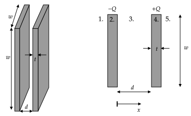
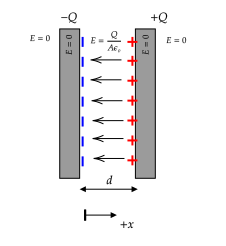

```mdextension
Title: Capacitance
```

# Overview

## Technique

A technique for computing capacitance when Gauss's law can be used to compute the electric field is:

1. place a positive charge $Q$ on one conductor and $-Q$ on the other conductor;
2. use Gauss's law to compute the electric field between the conductors;
3. use $V(b)-V(a)=-\int^b_a \mathbf{E}\bfcdot d\mathbf{l}$ to find the potential difference between the conductors. Point $a$ is any point on the negatively charged conductor, and point $b$ is any point on the positively charged conductor; and
4. Compute $C$ using $\ds C = {Q}/{\Delta V} = Q/\big(V(b)-V(a)\big)$.

## Review of Related Topics

**Conductors**: The electric field at any location in space is the superposition (vector sum) of electric fields due to every charge in the universe. For locations inside a conductor, the electric field will be zero. The reason is that charges on or in a conductor are free to move and position themselves, effectively instantaneously, on the surface in a way that makes the electric field inside the conductor zero.

1. If a conductor is isolated (meaning other charges are far enough away that we can ignore their electric fields), the electric field inside it is the superposition of the electric fields due to each charge on the conductor.
2. If a conductor is not isolated, the electric field inside it is the superposition of the electric fields due to each charge on the conductor and all other charges in the universe.

**Electric Potential Energy and Electric Potential**: The general formula for work is $W_{a\rightarrow b}=\int_a^b \bfvec{F}\bfcdot d\bfvec{l}$. If $\bfvec{F}$ is a conservative force, such as the force on a charge due to an electric field, we define potential energy $U$ according to

$\Delta U = U(b)-U(a) \equiv -W_{a\rightarrow b}$

The force on a charge $q_o$ in an electric field $\bfvec{E}$ is $\bfvec{F}=q_o\bfvec{E}$ and so we can write

$\ds U(b)-U(a) = -\int_a^b q_o\bfvec{E}\bfcdot d\bfvec{l}$. Dividing both sides by $q_o$ gives $\ds\frac{U(b)}{q_o}-\frac{U(a)}{q_o} = -\int_a^b\bfvec{E}\bfcdot d\bfvec{l}$

Defining electric potential as $V\equiv U/q_o$ gives $V(b)-V(a) = -\int_a^b\bfvec{E}\bfcdot d\bfvec{l}$. In summary, if you calculate the difference in potential between $a$ and $b$ (in volts), you can also determine, for a charge $q_o$ moved from $a$ to $b$,

1. how much work (in Joules) the electric field did on the charge: $-q_o(V(b)-V(a))$, and
2. the change in electric potential energy (in Joules): $+q_o(V(b)-V(a))$.

# Parallel Plates

An equal and opposite amount of charge is placed on two conducting and parallel plates, as shown on the left in the following figure. On the right, a side view of the plates is shown. The area of the plates, $A = w^2$, is much larger than shown, so the width, $w$, is much larger than the separation distance, $d$. Assume $Q$ is positive.



1. How will the charges be distributed on the plates? That is, how much charge is on each of the four large faces with area $A$? Assume the charges are uniformly distributed on these four faces and that no charge appears on the thin edge faces with thickness $t$.

   \ifsolutions
   {\bf Answer}: The charges will move to the inner faces, as shown in the following diagram. Electric field vectors associated with the positive and negative charges are shown.

   
   \else
   \vspace{3em}
   \fi

2. What is the electric field in each of the five regions? (Hint: The magnitude of the electric field due to charges uniformly distributed on a large plane is $|\sigma|/2\epsilon_o$. The electric field in each region will be the sum of the electric field due to charges on each plate. Your answer should be such that the electric field inside the conducting plates is zero!)  

   \ifsolutions
   {\bf Answer}: The magnitude of the field due to each charged surface is $|\sigma|/2\epsilon_o$, where $\sigma$ is the surface charge density. The surface charge densities are $\pm Q/A$. Adding the electric field vectors shown in the the answer to part 1. gives a total electric field that is zero except between the plates.

   


   $$\frac{|+Q/A|}{2\epsilon_o} + \frac{|-Q/A|}{2\epsilon_o} = \frac{Q}{A\epsilon_o}$$

   to the left, so $\ds\bfvec{E}=-\frac{Q}{A\epsilon_o}\ihat$ between the plates. The electric field is zero in all other regions.

   \else
   \vspace{3em}
   \fi

3. What is the electric potential difference, $V(d)-V(0)$, between the left and right plate? (Make sure the sign of your result matches your expectation based on the techniques covered in the last activity.)

   \ifsolutions
   {\bf Answer}: The general equation is

   $\ds V(b)-V(a) = -\int_a^b\bfvec{E}\bfcdot d\bfvec{l}$
   
   where $b$ is the final position and $a$ is the initial position. Using our variables for position,
   
   $\ds V(d)-V(0) = -\int_0^d\bfvec{E}\bfcdot d\bfvec{l}$

   The electric field is constant, so we know the result of the integration will be $\pm Ed=\pm Qd/A\epsilon_o$. Based on techniques covered in the last activity, we expect the potential to be higher at the right plate, so we choose the $+$ option. More formally, using $d\mathbf{l}=dx\ihat$  and $\bfvec{E}=-({Q}/{A\epsilon_o})\ihat$ gives

   $\ds V(d)-V(0) = -\int_0^d\bfvec{E}\bfcdot d\bfvec{l}=-\int_0^d\left[-\frac{Q}{A\epsilon_o}\ihat\right]\bfcdot (dx\ihat)=\frac{Qd}{A\epsilon_o}$

   \else
   \vspace{3em}
   \fi

4. Use your answer to 3. to find the capacitance in terms of $\epsilon_o$, $A$, and $d$.

   \ifsolutions
   {\bf Answer}:
   
   $$C = \frac{Q}{|\Delta V|} = \frac{Q}{V(d)-V(0)} = \frac{Q}{\frac{Qd}{A\epsilon_o}}=\frac{\epsilon_oA}{d}$$
   \else
   \vspace{3em}
   \fi

5. (Review question) How much work will the electric field do on a charge $q$ that is moved from the left plate to the right plate? What will be the change in electric potential energy?

   \ifsolutions
  {\bf Answer}: $\ds W=-q(V(d)-V(0))=-q\frac{Qd}{A\epsilon_o}$. Sign check: The force of the electric field on the positive charge $q$ is to the left and the displacement is to the right, so $\bfvec{F}\bfcdot d\bfvec{l}$ will be negative.

  $\ds\Delta U=-W=q(V(d)-V(0))=+q\frac{Qd}{A\epsilon_o}$
   \else
   \vspace{3em}
   \fi

\ifsolutions\else
   \newpage
\fi

# Spherical

Charge is placed on two spherical conducting shells, the cross--section of which is shown. Both shells have a thickness of $t$. The inner shell has an outer radius of $a$ and a net charge of $-Q$. The outer shell has an inner radius of $b$ and a net charge of $+Q$. Assume that $Q$ is positive.


It can be shown (see challenge questions below) that the surface at $r=a$ will have $-Q$ uniformly distributed on it, and the surface at $r=b$ will have $Q$ uniformly distributed on it. Given this, we can conclude that the inner surface of the inner conductor and the outer surface of the outer conductor will not have any charge (why?).

1. What is the electric field in each of the five labeled regions? Region 1. is the empty volume inside of the inner conductor, region 2. is the inner conductor, region 3. is the empty volume between the conductors, region 4. is the outer conductor, and region 5. is the region outside of the outer conductor. (Hint: Use Gauss's law several times; when not zero, the electric field should be proportional to $1/r^2$.)
 
   \ifsolutions
   **Answer**: 1. $0\quad$ 2. $0\quad$ 3. $E_r=-Q/4\pi \epsilon_o r^2\quad$ 4. $0\quad$ 5. $0$
   \else
   \vspace{6em}
   \fi

2. What is the potential difference, $V(b) - V(a)$?

   %(Make sure the sign of your result matches your expectation based on the techniques covered in the last activity.)

   \ifsolutions
   **Answer**: $\displaystyle V(b)-V(a)=\frac{Q}{4\pi\epsilon_o}\left(\frac{1}{a}-\frac{1}{b}\right)$

   %Sign check: $V(b)-V(a)$ is positive (because $a<b$), which is expected because a postive charge moved from $a$ to $b$ will have a force on it due to $\mathbf{E}$ that is opposite the direction of movement.
   \else
   \vspace{6em}
   \fi

3. Find the capacitance in terms of $\epsilon_o$, $a$, and $b$.

   \ifsolutions
   **Answer**: $\displaystyle C=\frac{Q}{V(b)-V(a)} = \frac{4\pi\epsilon_o}{\frac{1}{a}-\frac{1}{b}}$
   \else
   \vspace{6em}
   \fi

4. (Review question) How much work would the electric field do on a charge $q$ that is moved from $r=a$ to $r=b$? What will be the change in electric potential energy?

   \ifsolutions
   **Answer**: $-q(V(b)-V(a))$ and $q(V(b)-V(a))$.
   \fi

\newpage

**Optional challenge questions**


Draw the cross-section of Gaussian surfaces you use to answer any of the following questions on the diagram above.

Use Gauss's law and the fact that the electric field inside a conductor must be zero to show

5. there can be no charge on the inner surface of the inner conductor,

   \ifsolutions
    **Answer**: A Gaussian sphere with its surface inside the inner conductor has $E=0$ on its surface (because $E$ inside a conductor is zero). It follows from $\oint \bfvec{E}\bfcdot d\bfvec{A}=Q_{\text{encl}}/\epsilon_o$ that $Q_{\text{encl}}=0$. (Note that all charges must be on the surface of a conductor, so the only possible location for the charge is on the inner and outer surfaces.)
   \else
   \vspace{10em}
   \fi

6. the charge on the inner surface of the outer conductor is $+Q$, and

   \ifsolutions
    **Answer**: A Gaussian sphere with its surface inside the outer conductor has $E=0$ on its surface (because $E$ inside a conductor is zero). Based on $\oint \bfvec{E}\bfcdot d\mathbf{\bfvec{A}}=Q_{\text{encl}}/\epsilon_o$, this implies $Q_{\text{encl}}=0$. The charge on the inner conductor was given as $-Q$. To make the charge inside this sphere zero (so that $Q_{\text{encl}}=0$), we need $+Q$ on the inner surface of the inner conductor.
   \else
   \vspace{10em}
   \fi

7. there is no charge on the outer surface of the outer conductor.

   \ifsolutions
    **Answer**: If the total charge on the outer conductor is $+Q$ and all of it is on its inner surface, by conservation of charge, there is no charge on its outer surface.
   \else
   \newpage
   \fi

# Cylindrical

Charge is placed on two long cylindrical conducting shells, the cross--section of which is shown. Both shells have a thickness of $t$. The inner shell has an outer radius of $a$ and a net charge of $-Q$. The outer shell has an inner radius of $b$ and a net charge of $+Q$. Assume that $Q$ is positive and the cylinders have length $L$.


1. What is the net charge and surface charge density on each surface? Assume the charges are uniformly distributed on long surfaces and that no charge appears on end surfaces. That is, find the charge density on

   * the inner surface of the inner cylinder,
   * the outer surface of the inner cylinder,
   * the inner surface of the outer cylinder, and
   * the outer surface of the outer cylinder.

   \ifsolutions
    **Answer**:
    * Net charge: $0$, $-Q$, $Q$, and $0$
    * Surface charge density: $\lambda$ = $0$, $-Q/2\pi a L$, $Q/2\pi b L$, $0$
    * Linear charge density: $\sigma$ = $0$, $-Q/L$, $Q/L$, $0$. See the cylindrical shell problem in [the solutions for the Enclosed Charge activity](https://rweigel.github.io/phys260/Enclosed_Charge/Enclosed_Charge-solutions.pdf) for a discussion of why we can describe the charge density in terms of both surface and linear densities.
   \else
   \newpage
   \fi

\ifsolutions
\else


The cross--section figure from the previous page is repeated above.
\fi

2. Given your answer to part 1. of this problem, what is the electric field in each of the five regions? (Hint: Use Gauss's law)

   \ifsolutions
    **Answer**: In region 3., the field points in the radial direction and inward: $\ds E_r = -\frac{\lambda }{2\pi\epsilon_o}\frac{1}{r} = -\frac{Q/L}{2\pi\epsilon_o}\frac{1}{r}$
    
    The field is zero in all other regions.
   \else
   \vspace{8em}
   \fi

3. What is the electric potential difference, $V(b)-V(a)$, between the outer and inner cylinder? (Make sure the sign of your result matches your expectation based on the techniques covered in the last activity.)

   \ifsolutions
    **Answer**: $\ds V(b)-V(a) =  \frac{\lambda}{2\pi\epsilon_o}\ln(b/a) = \frac{Q/L}{2\pi\epsilon_o}\ln(b/a) $
   \else
   \vspace{8em}
   \fi

4. Find the capacitance in terms of $\epsilon_o$, $L$, $a$, and $b$.

   \ifsolutions
   **Answer**: $\displaystyle C= \frac{Q}{V(b)-V(a)} = \frac{Q}{\frac{Q/L}{2\pi\epsilon_o}\ln(b/a)}=\frac{2\pi \epsilon_o L}{\ln(b/a)}$.
   Note that sometimes the capacitance for this case is written in terms of capacitance per unit length: $\ds C/L={2\pi \epsilon_o}/{\ln(b/a)}$.
   \else
   \vspace{10em}
   \fi
