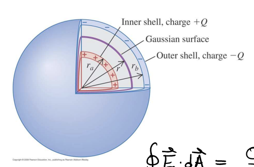

# TODO: 

Add cut-away view of sphere from textbook:

# Fall, 2022

rsw:

The first part of these two problems were solved for in the lectures on Gauss's law. The latter parts were solved in the lecture on capacitance. They also appear in the textbook.

Most did not start on the second problem, and roughly 1/2 of the students were able to get the correct answer for the capacitance for the first problem.

I gave a 5-minute overview of capacitance and how it is calculated and then let them start on the first problem. After about 5 minutes, I wrote the diagram on the board and explained that the charges would move to the inner faces. Then I explained in words that they could find the field due to each face using $\sigma/(2\epsilon_o)$ and superposition and drew colored vectors for the field due to each face in all 5 regions. Even then, only about 1/2 of the students were able to determine the total electric field in each region.

Once students had the field between the faces, many struggled to apply the general formula for potential difference. For some students, I suggested that we know E is constant and so the result will be |E|d, and you can reason out what the sign will be. It is clear to me that there needs to be a separate activity on dot products and line integrals.

At least three students did not know how to evaluate $\int_0^d (\sigma/\epsilon_o) dx$ even after I said it was equivalent to $\int_0^d (\text{const}) dx$.

Based on the results this week, this activity should be revised so that students can make more progress.

----
