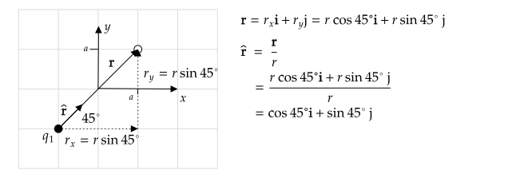

```mdextension
Title: Electric Field and $\rhat$
```

# Overview

This activity covers topics in [Section 21.4 of Young and Freedman 2015, 14th Edition](https://drive.google.com/file/d/1JS_pBuNEwXdz9IzpSBFPJffgVacZmqN7/view?usp=sharing_remove_).

The electric field vector, $\bfvec{E}$, is a quantity assigned to a point in space. Given this quantity, we can compute the force on a charge $Q$ will experience if it is placed at that point in space using the equation $\bfvec{F}=Q\bfvec{E}$. The direction of $\mathbf{E}$ is also the direction a charge will begin to move if released from rest.

To find $\bfvec{E}$ at any point in space, 
compute the force $\bfvec{F}$ due to all other charges on a hypothetical (or "test") charge $q_o$ at a point where you want to know $\bfvec{E}$. To find $\bfvec{E}$ at that point, divide $\bfvec{F}$ by $q_o$.

$$\bfvec{E} = \frac{\bfvec{F}}{q_o}$$

%To find $\bfvec{F}$ when a different charge $Q$ is placed where $q$ was, multiply $\bfvec{E}$ by $Q$.

# Example I

Charge $q_1$ is at $(x,y)=(-a,-a)$. Find the electric field at $(x,y)=(a,a)$ in the form $\bfvec{E}=E_x\ihat + E_y\jhat$. Also, find $E$. (Note that $E$ and $|\mathbf{E}|$ are used interchangebly.)

**Solution**

To find the electric field at a point in space, we put a hypothetical "test" charge $q_o$ at that point, compute the force on it due to all other charges, and then use

$$\bfvec{E} = \frac{\bfvec{F}}{q_o}$$

The force a charge $q_1$ at $(x,y)=(-a,-a)$ exerts on a charge $q_2$ at $(x,y)=(a,a)$ was computed in a previous activity. We can use that answer after replacing $q_2$ with $q_o$. The result is

$$\bfvec{F}_{q_1\text{ on } q_o}=k\frac{|q_1q_o|}{8a^2}(\cos 45^\circ \ihat + \sin 45^\circ \jhat)$$

We also found that this equation applies when $q_1$ and $q_o$ are both positive or both are negative. If $q_1$ was positive and $q_o$ was negative, or vice-versa, we found the sign changed:

$$\bfvec{F}_{q_1\text{ on } q_o}=-k\frac{|q_1q_o|}{8a^2}(\cos 45^\circ \ihat + \sin 45^\circ \jhat)$$

Based on this, we can write a single equation for all possibilities:

$$\bfvec{F}_{q_1\text{ on } q_o}=k\frac{q_1q_o}{8a^2}(\cos 45^\circ \ihat + \sin 45^\circ \jhat)$$

The electric field at the location of $q_o$ is then 

$\ds\bfvec{E}_{\text{at }(a,a) \text{ due to }q_1} = \frac{\bfvec{F}}{q_o} = \frac{kq_1}{8a^2}(\cos 45^\circ \ihat + \sin 45^\circ \jhat) =\frac{kq_1}{8a^2}\left[\frac{1}{\sqrt{2}}\ihat + \frac{1}{\sqrt{2}}\jhat\right]$

where the fact that $\sin 45^\circ=\cos 45^\circ=1/\sqrt{2}$ was used.

Sign check: When computing electric fields and forces, it is easy to make a sign error. The electric field vector points in the direction a positive charge will move if released there from rest. Suppose $q_1$ is positive. Our equation predicts that a charge released from rest at $(a,a)$ will move up and to the right. Suppose $q_1$ is negative. Our equation predicts that the charge will move down and to the left. This is consistent with the fact that like charges repel and unlike charges attract.

# Problem I

Charge $q_1$ is at $(x,y)=(-a,a)$. At $(x,y)=(a, 0)$, find $\mathbf{E}$ in the form $\bfvec{E}=E_x\ihat + E_y\jhat$. Check signs of the components of $\mathbf{E}$ using the technique used in Example I. Also, find $E$.


\newpage

# The $\rhat$ Unit Vector

Previously, when computing the electric force between two charges, you used the formula $F=k{|q_1q_2|}/{r^2}$ to find the magnitude of the force and then used a diagram to write $\mathbf{F}$ in the form $\bfvec{F}=F_x\ihat + F_y\jhat$. A similar process was used for computing $\bfvec{E}$ above (because we calculated $\mathbf{F}$ as part of the process). The textbook provides an equation for the electric field that requires a slightly different calculation method.

The equation for the electric field using a unit vector is

$$\bfvec{E}_{\text{due to }q_1}=kq_1\frac{\rhat}{r^2}\thinspace,$$

where $\rhat$ is the unit vector that points from the position of $q_1$ to the point in space where we want to know $\mathbf{E}$, and $r$ is the distance between $q_1$ and that point.

To find $\rhat$, 

1. draw a vector, $\mathbf{r}$ from $q_1$ to the point in space where you want to know $\mathbf{E}$;
2. Write $\mathbf{r}$ in the form $\mathbf{r}=r_x\ihat+r_y\jhat$; then
3. $\rhat=\mathbf{r}/r$, where $r=\sqrt{r_x^2+r_y^2}$.

# Example II

If $q_1$ is at $(x,y)=(-a,-a)$, find the electric field at $(x,y)=(a,a)$ using $\bfvec{E}_{\text{due to }q_1}=kq_1{\rhat}/{r^2}$. Also, find $E$.

**Solution**

The calculation of $\rhat$ is shown in the following diagram.



Substitution gives

$$\bfvec{E}_{\text{at }(a,a)\text{ due to }q_1}=kq_1\frac{1}{r^2}\rhat = kq_1\frac{1}{8a^2}(\cos 45^\circ \ihat + \sin 45^\circ \jhat) =\frac{kq_1}{8a^2}\left[\frac{1}{\sqrt{2}}\ihat + \frac{1}{\sqrt{2}}\jhat\right]\thinspace,$$

which is the same result obtained in the previous example, as expected.

To calculate $\mathbf{E}$, we can use

$$|\mathbf{E}|=E=\sqrt{E_x^2+E_y^2}$$

and plug in $E_x=k\frac{q_1}{8a^2}\frac{1}{\sqrt{2}}$ and $E_y=k\frac{q_1}{8a^2}\frac{1}{\sqrt{2}}$ and use $\sqrt{c^2}=|c|$ (where $c$ is a real number) to show that $E=k|q_1|/{8a^2}$. There is an easier way. Taking the magnitude of both sides of

$\ds\bfvec{E}=kq_1\frac{\rhat}{r^2}\quad$
gives
$\quad\ds|\bfvec{E}|=k|q_1|\frac{|\rhat|}{r^2}$.

The magnitude of a unit vector is $1$, so

$\ds|\bfvec{E}|=k|q_1|\frac{1}{r^2}=\frac{k|q_1|}{8a^2},\thickspace$ as before.

# Problem II

Charge $q_1$ is at $(x,y)=(-a,a)$. Find the electric field at $(x,y)=(a, 0)$ using $\bfvec{E}_{\text{at }(a,0)\text{ due to }q_1}=kq_1{\rhat}/{r^2}$. Check signs of the components of $\mathbf{E}$ using the technique used in Example I. Also, find $E$.


\newpage

# Problem III - Superposition

In the previous examples, only one charge was responsible for creating the electric field $\bfvec{E}$. When there are more charges, superposition can be used to find the total electric field by summing $\mathbf{E}$ due to each charge.

Charge $q_1 = +q$ is at $(x, y) = (a, 0)$, charge $q_2 = +q$ is at $(x, y) = (-a, 0)$, and charge $q_3 = -q$ is at $(x, y) = (0, a)$. Assume that $q$ is a positive number.

1. Draw this charge configuration below.


2. Why does it not make sense to ask what the electric _force_ is at the origin?

<div style="height:2em"/>

In the following, 

3. Find the electric field at the origin due to $q_1$. Write your answer in the form $\bfvec{E}\_1=E_{x1}\ihat + E_{y1}\jhat$.

<div style="height:6em"/>

4. Find the electric field at the origin due to $q_2$. Write your answer in the form $\bfvec{E}\_2=E_{x2}\ihat + E_{y2}\jhat$.

<div style="height:6em"/>

5. Find the electric field at the origin due to $q_3$. Write your answer in the form $\bfvec{E}\_3=E_{x3}\ihat + E_{y3}\jhat$.

<div style="height:6em"/>

6. Find the total electric field at the origin by adding $\mathbf{E}_1$, $\mathbf{E}_2$, and $\mathbf{E}_3$. Write your answer in the form $\bfvec{E}=E_{x}\ihat + E_{y}\jhat$.

<div style="height:6em"/>

7. Will your answers to 3.--6. change if the problem had asked for the electric field at a different position? If so, which answers?

<div style="height:6em"/>

8. Find the electric field at the origin if charge $q_1=2q$ (instead of $q$).

<div style="height:12em"/>

9. Find the electric field at the origin if charge $q_1=-2q$ (instead of $q$).