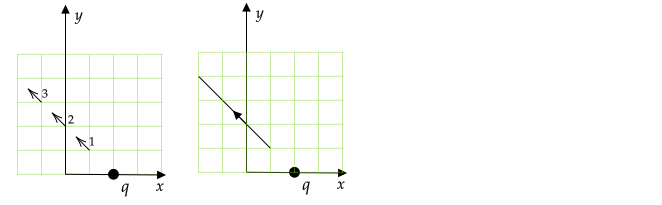
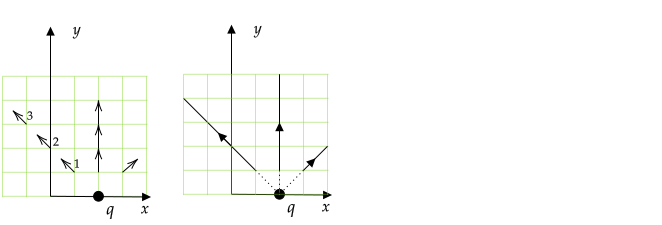
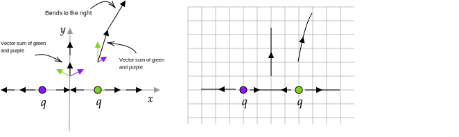
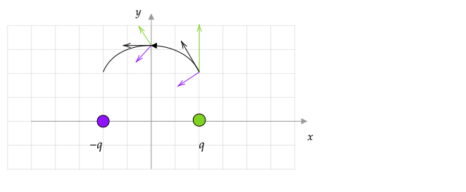

```mdextension
title: Electric Field Lines
```

# Overview

Previously, you have computed the electric field at only one point. Suppose that we want to know about the electric field everywhere. One option is to draw many electric field vectors. At  https://www.geogebra.org/m/KMVuhygy, the electric field vector is shown at many locations for four point charges and you can see that the vectors appear to form lines. These vectors were drawn so that they all have the same length even though the magnitude of the electric field is not the same at all locations. The reason for this is that electric field lines are determined by considering the direction of the electric field only. (If you select the "Show Electric Field Magnitude and Direction" checkbox, you will see that the diagram becomes more difficult to understand because the lengths of the vectors vary so much.)

In this activity, you will not compute exact field lines. Instead, you will use basic reasoning to determine the general trend of field lines using only knowledge of the general direction of the electric field at a given location. As a result, {\bf you do not need to calculate the exact magnitude of the electric field} as was done previously. Instead, you will need to only determine the general direction within approximately $45^{\circ}$.

Electric field lines are computed with the following algorithm:

1. Pick a starting point $(x,y)$ in space. Estimate the electric field vector direction there (ignore the magnitude).
2. Take a small step along this direction to another point. Estimate the electric field direction at this point. Pay particular attention to how the direction changes relative to the direction at the previous step. Connect this point to the previous point with a straight line.
3. Repeat 2. until you step off the page, step into a charge, or reach a location where the electric field is zero.
4. Repeat 1.-3. until you have as many electric field lines as desired.

\newpage

# Example -- One Charge

Draw a field line starting at $(x,y)=(1,1)$ due to positive point charge $q$ at $(x,y)=(2,0)$.



Because there is only one charge, we know that the electric field will point along a line connecting the point $(x,y)=(1,1)$ with $(x,y)=(2,0)$. We know that the direction of the electric field at $(x,y)=(1,1)$ will be as shown by vector 1. because by convention, the electric field points in the direction that a positive charge would be pushed if placed there and we are given that $q$ is positive. If we take a step along vector 1., we arrive at point 2., which is located at $(x,y)=(0,2)$. The direction of the electric field will be the same. In the figure on the right, the vectors have been removed and replaced with a line.

It is important to note that vectors 1, 2, and 3 are not the correct lengths. If we drew vectors with lengths that were consistent with the magnitude of the electric field, vector 1 would be much longer than vector 2, which would be much longer than vector 3.

In addition, keep in mind that the electric field line tells you the direction of force a test charge would feel if placed on the line. A common misconception is that the field line is the path along which a charge will move if released at any point on the line. This is not true in general.

# Problem -- One Charge

1. In the previous example, how much larger is the magnitude of electric field vector 1 than electric field vector 2? (State the ratio of their magnitudes.)

\ifsolutions
\else
<div style="height:2em"/>
\fi

2. Draw field lines with start points of (a.) $(x,y)=(2,1)$ and (b.) $(x,y)=(3,1)$ on the diagram in the previous example.

3. If the point charge in the previous example was replaced with a charge of magnitude $10q$, will the field lines you drew change? If yes, how?

\ifsolutions
**Answer**



3. Field lines will not change.
\fi

\newpage

# Problem -- Two Charges

Draw field lines with the starting points
1. $(x,y)=(1,0)$
2. $(x,y)=(3,0)$
3. $(x,y)=(2,2)$
3. $(x,y)=(0,1)$


\ifsolutions

\else

\fi

# Problem -- Dipole

Draw a field line with the starting point $(x,y)=(2,2)$.

\ifsolutions

\else

\fi
