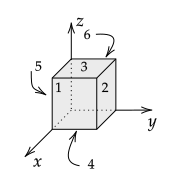

# Overview

See also [Chapter 21 of Young and Freedman 2015, 14th Edition](https://drive.google.com/drive/u/1/folders/1RbJbDlpZB6THg1cKvlmRnvQYewRKmn03_remove_)

## Mathematical

To use Gauss’s law to find the electric field for a system of charges, several calculations must be performed. First, one must find the electric flux through a closed surface. Second, one must find the amount of charge inside of a closed surface. In this activity, you will compute the electric flux through an open surface and then compute the amount of charge enclosed by the surface of a volume.

Electric flux, $\Phi_E$, is the integral of $\mathbf{E}\bfcdot d\mathbf{A}$ over a surface: 

$$
\Phi_E=\int\mathbf{E}\bfcdot d\mathbf{A}
$$

(Gauss’s law involves an integral over a closed surface, but here we will consider only an open surface.) When the magnitude and direction of $\mathbf{E}$ is the same at all points on the surface, the integral simplifies to 

$$
\Phi_E = \mathbf{E}\bfcdot \mathbf{A} = \mathbf{E}\bfcdot \hat{\mathbf{n}}A
$$

where $\hat{\mathbf{n}}$ is a unit vector that is perpendicular to the surface with area $A$. Electric flux is a scalar quantity because it is the result of the dot product of two vectors (similar to work, which is the dot product of a force vector and displacement vector).

## Conceptual

See https://rweigel.github.io/phys305/flux.html

\newpage

# $\Phi_E$ through Open Surface I

1. Draw the area vector $\mathbf{A}=\hat{\mathbf{n}}A$ on the figure and explain what it means for area to be a vector quantity.

    a. Can you come up with another way to describe the orientation of this rectangle in space?

    b. Is there only one normal direction to this area? Discuss your reasoning with your group. 

2. For each of the following cases, draw the area and $\hat{\mathbf{n}}$  for the previous figure and $\mathbf{E}$ when viewed from a point on the positive $z$-axis that is far from the origin. Then compute $\Phi_E$.

    a. $\mathbf{E}=E_o\ihat$ 

    b. $\mathbf{E}=E_o\jhat$ 

    c. $\mathbf{E}=E_o\khat$ 

    d. $\mathbf{E}=E_o\ihat + E_o\jhat$

\newpage

# $\Phi_E$ through Closed Surface I

In the previous problem, you computed the flux through an open surface. It was noted that one associate two area vectors to an open surface -- imagine your hand being an open surface. You can put the eraser of a pencil (1) on the top of your hand with the tip pointing up or (2) in your palm with the tip pointing down. The pencil represents the vector and the tip indicates the direction.

Gauss's law, which involves electric flux, always involves a closed surface (if you put water inside the surface, it would not leak out). For Gauss's law, there is a convention for which area vector to choose -- it is the one that points outwards from the volume that the surface encloses. Suppose you have a cardboard box. You can put a pencil with the eraser on the outside of the box and perpendicular to one of the sides; this corresponds to an outward area vector. You can also put the eraser on the inside of the box with the eraser on the inner surface and the pencil perpendicular to the surface; this corresponds to an inward area vector.

In the following example, the electric flux is computed through a closed surface (a cube) by finding the flux through each of the faces of the cube. The total electric flux is the sum of the fluxes though each cube.

The reason that we are interested in knowing the flux through a closed surface is due to a remarkable mathematical result known as Gauss's law. Suppose that you are able to measure the electric field on an arbitrary and closed surface. The net flux through the surface that you compute is related to the total amount of charge inside the surface! Said another way, if you are given the electric field at all points on the surface of a closed cardboard box, you can compute the total charge inside the box without having to open it.

With Coulomb's law, we are given the location and values of charges and we compute the electric field anywhere in space. With Gauss's law, we can do the reverse -- given the electric field, we can compute the charge. If the volume used for the flux calculation is large, we can only find the amount of charge enclosed in the volume; however, if the closed surface is small enough, we can compute the amount of charge at a point in space.

## Example

Find the flux through the six labeled faces of the cube with side length $a$ when the electric field is everywhere in the $+z$ direction.

{\bf Answer}

This example is similar to Example 22.2a of the textbook. We'll solve part 1. using two methods. The first is a more visual method. The second is more mathematical. Although the mathematical complexity of the second method is not really needed for this problem, it allows one to solve the next problem without an additional diagram.

Method I

The electric field is parallel to surfaces 1, 2, 5, and 6. Thinking in terms of the analogy of the electric field representing lines of flow, the flux is zero through these faces.

$\Phi_E^{1}=\Phi_E^{2}=\Phi_E^{5}=\Phi_E^{6}=0$

By convention, the normal direction for surface 3 is outwards from the volume, which is in the $+z$-direction. The electric field is in the same direction, so

$\Phi_E^{3}=E_oA=E_oa^2$

The normal direction for the bottom surface is downwards, which is in the opposite direction as the electric field, so

$\Phi_E^{4}=-E_oA=-E_oa^2$

The total flux through the cube, $\Phi_E^1+...+\Phi_E^6$, is zero. Thinking again in terms of the electric field representing flow lines, every electric field line that enters the cube exits, so the flow in equals the flow out. (Perhaps confusingly, flow out of a volume corresponds to a positive flux. The reason for this convention for flux is that from Gauss's law, a net positive flow out of a closed surface corresponds to a net positive charge inside the surface.)

Method II

Conveniently, the normal vectors are parallel to the Cartesian unit vectors. Based on the diagram, $\hat{\mathbf{n}}_1=\ihat$, $\hat{\mathbf{n}}_2=\jhat$, $\hat{\mathbf{n}}_3=\khat$, $\hat{\mathbf{n}}_4=-\khat$
$\hat{\mathbf{n}}_5=-\jhat$, $\hat{\mathbf{n}}_6=-\ihat$. The negative sign for the last three normal vectors is due to the convention that the normal points outwards from a closed surface.

The area vector is the area times the normal vector, so $\mathbf{A}_1=A\ihat$, $\mathbf{A}_2=A\jhat$, $\mathbf{A}_3=A\khat$, $\mathbf{A}_4=-A\khat$, $\mathbf{A}_4=-A\jhat$, and $\mathbf{A}_4=-A\ihat$, where $A=a^2$.

Recall that $\ihat\cdot\ihat=\jhat\cdot\jhat=\khat\cdot\khat=1$ and the dot product of any other combinations of Cartesian unit vectors is zero: $\ihat\cdot\jhat=0$, $\jhat\cdot\khat=0$, and $\ihat\cdot\khat=0$. Dot products of unit vectors are reviewed in Section 1.10 of the textbook.

$\Phi_E^{1}=\mathbf{E}\cdot \mathbf{A}_1=\mathbf{E}\cdot A\hat{\mathbf{n}}_1=E_o\khat\cdot A\ihat=E_oA(\khat\cdot \ihat)=0$

$\Phi_E^{2}=\mathbf{E}\cdot \mathbf{A}_2=\mathbf{E}\cdot A\hat{\mathbf{n}}_2=E_o\hat{\mathbf{k}}\cdot A\jhat=E_oA(\khat\cdot \jhat)=0$

$\Phi_E^{3}=\mathbf{E}\cdot \mathbf{A}_3=\mathbf{E}\cdot A\hat{\mathbf{n}}_3=E_o\hat{\mathbf{k}}\cdot A\khat=E_oA(\khat\cdot\khat)=E_oA=E_oa^2$

$\Phi_E^{4}=\mathbf{E}\cdot \mathbf{A}_4=\mathbf{E}\cdot A\hat{\mathbf{n}}_4=E_o\hat{\mathbf{k}}\cdot (-A\khat)=-E_oA(\khat\cdot\khat)=-E_oa^2$

$\Phi_E^{5}=\mathbf{E}\cdot \mathbf{A}_5=\mathbf{E}\cdot A\hat{\mathbf{n}}_5=E_o\hat{\mathbf{k}}\cdot (-A\jhat)=E_oA(\khat\cdot\jhat)=0$

$\Phi_E^{6}=\mathbf{E}\cdot \mathbf{A}_6=\mathbf{E}\cdot A\hat{\mathbf{n}}_6=E_o\hat{\mathbf{k}}\cdot (-A\ihat)=-E_oA(\khat\cdot\ihat)=0$

Incidentally, there is an additional questions that could have been asked: How much charge is inside the cube? The net flux through the cube's surface is zero, so it follows from Gauss's law that the total charge enclosed is zero.

## Problem

Find the flux through the cube for the electric field given in the above figure. Use both Methods I and II.

# $\Phi_E$ through Open Surface II

Previously you computed the flux through an open surface when the electric field was either parallel or perpendicular to the surface. 

To compute the flux through an open surface when this is not the case, take the given electric field and break it down into components parallel ($E_{||})$ and perpendicular ($E_{
\perp}$) to the surface. The component parallel to the surface contributes zero flux and the component perpendicular contributes a flux of $E_{\perp}A$.

# $\Phi_E$ through Closed Surface II

Previously you computed the flux through a closed surface when the electric field was either parallel or perpendicular to the surface. 

To compute the flux through a closed surface when this is not the case, use the technique from the previous section to compute the flux through each of the sides of the surface.

# $\Phi_E$ through General Closed Surfaces

