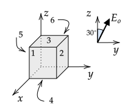
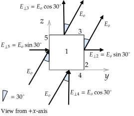

```mdextension
Title: Electric Flux
```

# Overview

Several calculations must be performed to use Gauss's law to find the electric field for a system of charges (if possible). First, one must find the electric flux through a closed surface. Second, one must find the amount of charge inside a closed surface. In this activity, you will compute the electric flux through open and closed surfaces.

Electric flux, $\Phi_E$, is the integral of $\bfvec{E}\bfcdot d\bfvec{A}$ over a surface:

$$
\Phi_E=\int\bfvec{E}\bfcdot d\bfvec{A}
$$

When the magnitude and direction of $\bfvec{E}$ is the same at all points on the surface, the integral simplifies to 

$$
\Phi_E = \bfvec{E}\bfcdot \bfvec{A}=\bfvec{E}\bfcdot \hat{\mathbf{n}}A
$$

where $\hat{\mathbf{n}}$ is a unit vector perpendicular to the surface with area $A$. Electric flux is a scalar quantity because it results from the dot product of two vectors (similar to work, which is the dot product of a force vector and displacement vector).

The textbook also discusses several other forms for $\Phi_E$. The equation $\Phi_E = \bfvec{E}\bfcdot \hat{\mathbf{n}}A$ can also be written as

$$
\Phi_E = E_{\perp}A
$$

where $E_{\perp}$ is the component of $\bfvec{E}$ that is perpendicular to $A$. If the perpendicular component of $\bfvec{E}$ is in the same direction as the normal direction for $\bfvec{A}$, the flux is positive. If the perpendicular component of $\bfvec{E}$ is in the opposite direction as the normal direction for $\bfvec{A}$, the flux is negative. A final form is

$$
\Phi_E = EA\cos\theta
$$

where $\theta$ is the angle between the $\mathbf{E}$ and $\mathbf{A}$ vectors. Any of these equations can be used, and students are encouraged to use the one they are more comfortable with and ideally understand the relationship between the different equations. When t finding $\theta$ is simple based on a diagram, $EA\cos\theta$ is the easiest to use. When $\bfvec{E}$ and/or $\hat{\mathbf{n}}$ as three components, $\bfvec{E}\bfcdot \hat{\mathbf{n}}A$ is usually easier to use.

\newpage

# $\Phi_E$ Through Open Surface

## Problem I


1. a. Draw an area vector $\bfvec{A}=\hat{\mathbf{n}}A$ on the figure above, where $A$ is the area of the dotted rectangle..

   \ifsolutions
   
   \fi

   b. Is there only one normal direction to this area? Discuss your reasoning with your group. 

   \ifsolutions
   There are two normal directions, one in $+y$ as shown and another in $-y$ direction.
   \else
   \vspace{1in}
   \fi

2. For each of the following $\bfvec{E}$ vectors a.-d., draw $\bfvec{E}$ and $\hat{\mathbf{n}}$ on the following diagram, which shows the area in the previous figure when viewed from a point on the positive $z$--axis that is far from the origin. Then find $\theta$ and compute $\Phi_E$.

   

   a. $\quad\ds\bfvec{E}=E_o\ihat\qquad\phantom{+\frac{E_o}{\sqrt{2}}\jhat}\theta=\qquad\qquad\Phi_E=0$

   b. $\quad\ds\bfvec{E}=E_o\jhat\qquad\phantom{+ \frac{E_o}{\sqrt{2}}\jhat}\theta=\qquad\qquad\Phi_E=$ 

   c. $\quad\ds\bfvec{E}=E_o\khat\qquad\phantom{+\frac{E_o}{\sqrt{2}}\jhat}\theta=\qquad\qquad\Phi_E=0$ 

   d. $\quad\ds\bfvec{E}=\frac{E_o}{\sqrt{2}}\ihat + \frac{E_o}{\sqrt{2}}\jhat\qquad\theta=\qquad\qquad\Phi_E=$

   \ifsolutions
   **Answer**

   

   a. $\quad\ds\bfvec{E}=E_o\ihat\qquad\phantom{+\frac{E_o}{\sqrt{2}}\jhat}\theta=90^\circ\qquad\qquad\Phi_E=0$

   b. $\quad\ds\bfvec{E}=E_o\jhat\qquad\phantom{+ \frac{E_o}{\sqrt{2}}\jhat}\theta=0^\circ\qquad\qquad\Phi_E=E_oA$ 

   c. $\quad\ds\bfvec{E}=E_o\khat\qquad\phantom{+\frac{E_o}{\sqrt{2}}\jhat}\theta=90^\circ\qquad\qquad\Phi_E=0$ 

   d. $\quad\ds\bfvec{E}=\frac{E_o}{\sqrt{2}}\ihat + \frac{E_o}{\sqrt{2}}\jhat\qquad\theta=45^\circ\qquad\qquad\Phi_E=E_o A\cos 45^\circ=E_oA/\sqrt{2}$
   \fi

\newpage

## Problem II


If the area from the previous problem is rotated by $\phi=45^\circ$ around the $z$--axis, draw the area as it would look from a point on the positive $z$-axis that is far from the origin (that is, draw the projection onto the $x$--$y$ plane). Then draw $\hat{\mathbf{n}}$ and $\bfvec{E}$ for each of the electric fields a.--d.


a. $\quad\ds\bfvec{E}=E_o\ihat\qquad\phantom{+\frac{E_o}{\sqrt{2}}\jhat}\theta=\qquad\qquad\Phi_E=$

b. $\quad\ds\bfvec{E}=E_o\jhat\qquad\phantom{+ \frac{E_o}{\sqrt{2}}\jhat}\theta=\qquad\qquad\Phi_E=$ 

c. $\quad\ds\bfvec{E}=E_o\khat\qquad\phantom{+\frac{E_o}{\sqrt{2}}\jhat}\theta=\qquad\qquad\Phi_E=$ 

d. $\quad\ds\bfvec{E}=\frac{E_o}{\sqrt{2}}\ihat + \frac{E_o}{\sqrt{2}}\jhat\qquad\theta=\qquad\qquad\Phi_E=$

   \ifsolutions
   
   \fi
   
# $\Phi_E$ Through Closed Surface

In the previous problem, you computed the flux through an open surface. You should have noted that one can associate two area vectors to an open surface -- imagine your hand being an open surface. You can put the a pencil (1) on the top of your hand with the tip pointing up or (2) in your palm with the tip pointing down. The pencil represents the vector and the tip indicates the direction.

Gauss's law, which involves electric flux, always involves a closed surface (if you put water inside a closed surface, it would not leak out). For Gauss's law, there is a convention for which area vector to choose -- it is the one that points outwards from the volume that the surface encloses. 

In the following example, the electric flux is computed through a closed surface (a cube) by finding the flux through each of the faces of the cube. The total electric flux is the sum of the fluxes though each cube.

%The reason we are interested in knowing the flux through a closed surface is due to a remarkable mathematical result known as Gauss's law. Suppose that you can measure the electric field on an arbitrary and closed surface. The net electric flux through the surface that you compute is related to the total amount of charge inside the surface! For example, if you are given the electric field at all points on the surface of a closed cardboard box, you can compute the total charge inside the box without having to open it. 

With Coulomb's law, we are given the location and values of charges, and we compute the electric field anywhere in space. With Gauss's law, we can do the reverse -- given an electric field on the surface of a small volume of space, we can compute the charge in the volume. (If the volume is large, we can only compute the amount of charge enclosed in the volume; however, if the closed surface volume approaches zero, we can compute the amount of charge at a point in space.)

## Example


Find the flux through the six labeled faces of the cube with side length $a$ when the electric field is everywhere in the $+z$ direction with magnitude $E_o$.

{\bf Answer} This example is similar to [Example 22.2a pg 728 in the textbook](https://drive.google.com/file/d/1xt3U54huNwt9epviaBRbu2GJ64poSEWB★★★★remove★★★★). The electric field is parallel to surfaces 1, 2, 5, and 6. For each of these surfaces, $\theta=90^\circ$, and $\cos( 90^\circ)=0$). Or, thinking in terms of the analogy of the electric field representing lines of flow, the flux is zero through these faces. 

%We'll solve it using two methods. The first method is useful when the electric field is either parallel or perpendicular to all surfaces. The second method is useful for more general cases, such as problem 3.3.

%**Method I**

$\Phi_E^{1}=\Phi_E^{2}=\Phi_E^{5}=\Phi_E^{6}=0$

By convention, the normal direction for surface 3 is outwards from the volume, which is in the $+z$-direction. The electric field is in the same direction, so $\theta=0$ and

$\Phi_E^{3}=E_oA\cos0^\circ=E_oa^2$

The normal direction for the bottom surface is downwards, which is in the opposite direction as the electric field, so $\theta=180^\circ$ and

$\Phi_E^{4}=E_oA\cos 180^\circ=-E_oa^2$

The total flux through the cube, $\Phi_E^1+...+\Phi_E^6$, is zero. Thinking again in terms of the electric field representing flow lines, every electric field line that enters the cube exits, so the flow in equals the flow out. (Perhaps confusingly, flow out of a volume corresponds to a positive flux. The reason for this convention for flux is that from Gauss's law, a net positive flow out of a closed surface corresponds to a net positive charge inside the surface.)

How much charge is inside the cube? The net flux through the cube's surface is zero, so it follows from Gauss's law that the total charge enclosed is zero.

<!--
**Method II**

In this problem, the normal vectors are parallel to the Cartesian unit vectors. Based on the diagram,
$\hat{\mathbf{n}}_1=\ihat$,
$\hat{\mathbf{n}}_2=\jhat$,
$\hat{\mathbf{n}}_3=\khat$,
$\hat{\mathbf{n}}_4=-\khat$
$\hat{\mathbf{n}}_5=-\jhat$,
$\hat{\mathbf{n}}_6=-\ihat$. 
The negative sign for the last three normal vectors is due to the convention that the normal points outwards from a closed surface.

The area vector is the area times the normal vector, so $\bfvec{A}_1=A\ihat$, $\bfvec{A}_2=A\jhat$, $\bfvec{A}_3=A\khat$, $\bfvec{A}_4=-A\khat$, $\bfvec{A}_4=-A\jhat$, and $\bfvec{A}_4=-A\ihat$, where $A=a^2$.

Recall that $\ihat\cdot\ihat=\jhat\cdot\jhat=\khat\cdot\khat=1$ and the dot product of any other combinations of Cartesian unit vectors is zero: $\ihat\cdot\jhat=0$, $\jhat\cdot\khat=0$, and $\ihat\cdot\khat=0$. Dot products of unit vectors are reviewed in Section 1.10 of the textbook.

$\Phi_E^{1}=\bfvec{E}\cdot \bfvec{A}_1=\bfvec{E}\cdot A\hat{\mathbf{n}}_1=E_o\khat\cdot A\ihat=E_oA(\khat\cdot \ihat)=0$

$\Phi_E^{2}=\bfvec{E}\cdot \bfvec{A}_2=\bfvec{E}\cdot A\hat{\mathbf{n}}_2=E_o\hat{\mathbf{k}}\cdot A\jhat=E_oA(\khat\cdot \jhat)=0$

$\Phi_E^{3}=\bfvec{E}\cdot \bfvec{A}_3=\bfvec{E}\cdot A\hat{\mathbf{n}}_3=E_o\hat{\mathbf{k}}\cdot A\khat=E_oA(\khat\cdot\khat)=E_oA=E_oa^2$

$\Phi_E^{4}=\bfvec{E}\cdot \bfvec{A}_4=\bfvec{E}\cdot A\hat{\mathbf{n}}_4=E_o\hat{\mathbf{k}}\cdot (-A\khat)=-E_oA(\khat\cdot\khat)=-E_oa^2$

$\Phi_E^{5}=\bfvec{E}\cdot \bfvec{A}_5=\bfvec{E}\cdot A\hat{\mathbf{n}}_5=E_o\hat{\mathbf{k}}\cdot (-A\jhat)=E_oA(\khat\cdot\jhat)=0$

$\Phi_E^{6}=\bfvec{E}\cdot \bfvec{A}_6=\bfvec{E}\cdot A\hat{\mathbf{n}}_6=E_o\hat{\mathbf{k}}\cdot (-A\ihat)=-E_oA(\khat\cdot\ihat)=0$
-->

%\newpage

## Problem


Find the flux through the six labeled faces of the cube with side area $A$ when the electric field of magnitude $E_o$ is everywhere in the $+y$ direction.

**Solution**

$\Phi_E^1=0$ because $\bfvec{E}$ is perpendicular to $\hat{\mathbf{n}}_1$

$\Phi_E^2=E_oa^2$ because $\bfvec{E}$ points in same direction as $\hat{\mathbf{n}}_2$

$\Phi_E^3=0$ because $\bfvec{E}$ is perpendicular to $\hat{\mathbf{n}}_3$

$\Phi_E^4=0$ because $\bfvec{E}$ is perpendicular to $\hat{\mathbf{n}}_4$

$\Phi_E^5=-E_oa^2$ because $\bfvec{E}$ points in the opposite direction of $\hat{\mathbf{n}}_5$

$\Phi_E^6=0$ because $\bfvec{E}$ is perpendicular to $\hat{\mathbf{n}}_6$


\newpage


## Problem



Find the flux through the six labeled faces of the cube with side length $a$ when the electric field is as shown in the diagram. Provide diagrams to justify your equations.

**Solution**

The electric field is parallel to sides 1 and 6, so

$\Phi_E^1=\Phi_E^6=0$

*Method I*


$\Phi_E^2=E_oA\cos 60^\circ$

$\Phi_E^3=E_oA\cos 30^\circ$

$\Phi_E^4=E_oA\cos 150^\circ$

$\Phi_E^5=E_oA\cos 120^\circ$


*Method II*

When using this method, it is necessary to draw a diagram to ensure the calculations are correct. In the following, the cube viewed from a point on the $+x$-axis is shown.



The above diagram was used to compute the electric field perpendicular to the side faces.

$\Phi_E^2=E_{\perp 2}A=E_oA\sin 30^\circ$

$\Phi_E^3=E_{\perp 3}A=E_oA\cos 30^\circ$

$\Phi_E^4=E_{\perp 4}A=-E_oA\cos 30^\circ$

$\Phi_E^5=E_{\perp 5}A=-E_oA\sin 30^\circ$

The negative signs in the last two equations were inserted based on the diagram which shows the electric field points into the volume. These answers are the same as from Method I becuase $\cos 120^\circ = -\cos 30^\circ$ and $\cos 120^\circ = -\sin 30^\circ$.

*Method III*

This is a problem for which using unit vectors is easier in that an additional diagram is not needed. Compare it to the approach taken in [Example 22.2b, pg 728 in the textbook](https://drive.google.com/file/d/1xt3U54huNwt9epviaBRbu2GJ64poSEWB★★★★remove★★★★), which is similar to Method I except that an additional diagram was not given (but was likely used to figure out the answer given).

Based on the diagram, $\hat{\mathbf{n}}_1=\ihat$, $\hat{\mathbf{n}}_2=\jhat$, $\hat{\mathbf{n}}_3=\khat$, $\hat{\mathbf{n}}_4=-\khat$
$\hat{\mathbf{n}}_5=-\jhat$, $\hat{\mathbf{n}}_6=-\ihat$

Also from the diagram, $\mathbf{E}=E_o\sin30^\circ\jhat+E_o\cos30^\circ\khat$.

What remains is to evaluate dot products (you should be able to skip most of the intermediate steps). Using $\mathbf{E}\cdot\mathbf{A}=\mathbf{E}\cdot A\hat{\mathbf{n}}$,

$$\Phi_E^1=\mathbf{E}\cdot \hat{\mathbf{n}}_1A=E_o(\sin 30^\circ\jhat+\cos 30^\circ\khat)\cdot\ihat A = E_oA(\jhat\cdot\ihat\sin 30^\circ+\khat\cdot\ihat\cos 30^\circ)=0$$

$$\Phi_E^2=\mathbf{E}\cdot \hat{\mathbf{n}}_2A=E_o(\sin 30^\circ\jhat+\cos 30^\circ\khat)\cdot\jhat A = E_oA(\jhat\cdot\jhat\sin 30^\circ+\khat\cdot\jhat\cos 30^\circ)=E_oA\sin 30^\circ$$

$$\Phi_E^3=\mathbf{E}\cdot \hat{\mathbf{n}}_3A=E_o(\sin 30^\circ\jhat+\cos 30^\circ\khat)\cdot\khat A = E_oA(\jhat\cdot\khat\sin 30^\circ+\khat\cdot\khat\cos 30^\circ)=E_oA\cos 30^\circ$$

$$\Phi_E^4=\mathbf{E}\cdot \hat{\mathbf{n}}_4A=E_o(\sin 30^\circ\jhat+\cos 30^\circ\khat)\cdot(-\khat A) = -E_oA(\jhat\cdot\khat\sin 30^\circ+\khat\cdot\khat\cos 30^\circ)=-E_oA\cos 30^\circ$$

$$\Phi_E^5=\mathbf{E}\cdot \hat{\mathbf{n}}_5A=E_o(\sin 30^\circ\jhat+\cos 30^\circ\khat)\cdot(-\jhat A) = -E_oA(\jhat\cdot\jhat\sin 30^\circ+\khat\cdot\jhat\cos 30^\circ)=-E_oA\sin 30^\circ$$

$$\Phi_E^6=\mathbf{E}\cdot \hat{\mathbf{n}}_6A=E_o(\sin 30^\circ\jhat+\cos 30^\circ\khat)\cdot(-\ihat A) =  -E_oA(\jhat\cdot\ihat\sin 30^\circ+\khat\cdot\ihat\cos 30^\circ)=0$$

Checks: The flux is positive for faces 2 and 3. This is consistent with the diagram because if electric field lines were drawn, they would emerge from the volume out of these faces. The flux is negative for faces 4 and 5. This is consistent with the diagram because if electric field lines were drawn, they would enter the volume.
