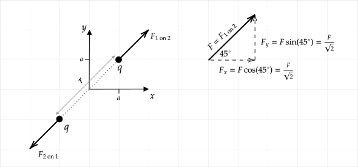

```mdextension
Title: Electric Force
```

# Overview

We generally describe vector equations in two ways:

1. Simple -- An equation for the magnitude is given, and words are used to describe the direction.
1. Compact -- A single equation is given for the vector, and additional equations are given for parts of the equation.

For example, in [Section 21.3](https://drive.google.com/file/d/1JS_pBuNEwXdz9IzpSBFPJffgVacZmqN7/view?usp=sharing_remove_) of the textbook, the equation for Coulomb's Law was given in the simple form. In [Section 21.4](https://drive.google.com/file/d/1JS_pBuNEwXdz9IzpSBFPJffgVacZmqN7/view?usp=sharing_remove_), the equation for the electric field due to a point charge was given in the compact form.

In PHYS 260, you will need to be able to solve problems similar to the examples given here quickly. If you found the problems in this activity to be difficult, review [Sections 1.7-1.8](https://drive.google.com/file/d/1Gg-ZzUWWqJNn3Eaw6hmix1Hsym5K4Mv3/view?usp=sharing) in the textbook and see Khan Academy's comprehensive [introduction to vectors](https://www.khanacademy.org/math/precalculus/x9e81a4f98389efdf:vectors).

# Coulomb's Law in Simple Form

*Magnitude*

$$F_{1\mbox{ on } 2}=k\frac{|q_1q_2|}{r^2}$$

where $r$ is the distance between $q_1$ and $q_2$. To simplify notation, we are using $k$ in place of $1/4\pi\epsilon_o$.

*Direction*

Along line that connects $q_1$ and $q_2$. Direction depends on signs of $q_1$ and $q_2$. (Likes repel, opposites attract.).

## Example

Charge $q_1$ is at $(x,y)=(-a,-a)$ and charge $q_2$ is at $(a, a)$. Both charges have a charge of $q$.

1. Find the magnitude and direction of the force of $q_1$ on $q_2$.
2. Write the force of $q_1$ on $q_2$ in the form $\bfvec{F}=F_x\ihat + F_y\jhat$.

\ifsolutions
**Solution**

1. The distance between the charges is $r=2\sqrt{2}a$, so

   $$F_{1\mbox{ on } 2}=k\frac{|q_1q_2|}{r^2}=\frac{k|qq|}{(2\sqrt{2}a)^2}=\frac{kq^2}{8a^2}$$

   The charges will repel each other, so the direction of forces of one on the other will be as shown in the diagram. The direction of the force vector on $q_2$ is shown in the diagram.

   

2. Let $F = F_{1\mbox{ on } 2}$ from part 1. to simplify notation. Then
    
   $\bfvec{F} = F\cos 45^\circ \ihat + F\sin 45^\circ \jhat$. Given that $\cos 45^\circ=\sin 45^\circ = \frac{1}{\sqrt{2}}$, we can also write 
    
   $$\bfvec{F} = F\left[\frac{1}{\sqrt{2}}\ihat + \frac{1}{\sqrt{2}}\jhat\right]$$
\fi

## Problem

Charge $q_1$ is at $(x,y)=(a,a)$ and charge $q_2$ is at $(-a, -a)$. Both charges have a charge of $q$. Draw this charge configuration and then using the steps in the previous example,


1. Find the magnitude and direction of the force of $q_1$ on $q_2$.
2. Write the force of $q_1$ on $q_2$ in the form $\bfvec{F}=F_x\ihat + F_y\jhat$.

\newpage

# Coulomb's Law in Compact Form

$$\bfvec{F}_{1\mbox{ on } 2}=kq_1q_2\frac{\rhat}{r^2}$$

$\bfvec{r}=\bfvec{r}_2-\bfvec{r}_1$ is the vector from the position of $q_1$ to the position of $q_2$, $\bfvec{r}_1$ is a vector from the origin to the location of $q_1$, and $\bfvec{r}_2$ is a vector from the origin to the location of $q_2$.

$r=|\bfvec{r}|=|\bfvec{r}_2-\bfvec{r}_1|$ is the distance from $q_1$ to $q_2$.

$\displaystyle\rhat=\frac{\bfvec{r}}{r}$ is the unit vector pointing from the position of $q_1$ to the position of $q_2$.


Although this form looks more complex, it requires basic steps to use.

## Example

Charge $q_1$ is at $(x,y)=(-a,-a)$ and charge $q_2$ is at $(a, a)$. Both charges have a charge of $q$.

1. Write the force of $q_1$ on $q_2$ in the form $\bfvec{F}=F_x\ihat + F_y\jhat$.
2. Find the magnitude and direction of the force of $q_1$ on $q_2$.

\ifsolutions
**Solution**

1. The vector from the origin to the location of $q_1$ is $\bfvec{r}_1=-a\ihat -a\jhat$

   The vector from the origin to the location of $q_2$ is $\bfvec{r}_2=a\ihat + a\jhat$

   The distance vector is $\bfvec{r}=\bfvec{r}_2-\bfvec{r}_1=2a\ihat+2a\jhat$

   The length of the distance vector is 
    
   $r=|\bfvec{r}_2-\bfvec{r}_1|=\sqrt{(2a)^2 + (2a)^2} = 2\sqrt{2}a$

   The unit vector pointing from the position of $q_1$ to the position of $q_2$ is

   $$\rhat=\frac{\bfvec{r}}{r}=\frac{1}{\sqrt{2}}\ihat + \frac{1}{\sqrt{2}}\jhat$$

   Inserting the above results into the equation

   $\displaystyle \bfvec{F}_{1\mbox{ on } 2}=kq_1q_2\frac{\rhat}{r^2}\quad$ gives
    
   $$\bfvec{F}\_{1\mbox{ on } 2}=
    kq^2\frac{\left[\frac{1}{\sqrt{2}}\ihat + \frac{1}{\sqrt{2}}\jhat\right]}{(2\sqrt{2}a)^2}
    \quad\text{ or }\quad
    \bfvec{F}_{1\mbox{ on } 2}=
    \frac{kq^2}{8a^2}\left[\frac{1}{\sqrt{2}}\ihat + \frac{1}{\sqrt{2}}\jhat\right]$$

   (Note that one can avoid the need to compute $\rhat$ by using the equivalent formula $\displaystyle \bfvec{F}_{1\mbox{ on } 2}=kq_1q_2{\bfvec{r}}/{r^3}$.)

2. Let $\bfvec{F} = \bfvec{F}_{1\mbox{ on } 2}$ from part 1. to simplify notation. Then

   $$F=|\bfvec{F}|=\frac{kq^2}{8a^2}\sqrt{\left(\frac{1}{\sqrt{2}}\right)^2 + \left(\frac{1}{\sqrt{2}}\right)^2}=\frac{kq^2}{8a^2}$$

   The angle is $\displaystyle \theta = \tan^{-1}\left(\frac{F_y}{F_x}\right) = \tan^{-1}\bigg( \frac{\frac{F}{\sqrt{2}}}{\frac{F}{\sqrt{2}}}\bigg)=45^\circ$

   See the margin note on [page 16 of the textbook](https://drive.google.com/file/d/1Gg-ZzUWWqJNn3Eaw6hmix1Hsym5K4Mv3/view?usp=sharing_remove_) for an issue that may arise when using this formula to compute an angle.
\fi

## Problem

Charge $q_1$ is at $(x,y)=(a,a)$ and charge $q_2$ is at $(-2a, -2a)$. Both charges have a charge of $q$. Using the steps in the previous example,

1. Write the force of $q_1$ on $q_2$ in the form $\bfvec{F}=F_x\ihat + F_y\jhat$.
2. Find the magnitude and direction of the force of $q_1$ on $q_2$.
