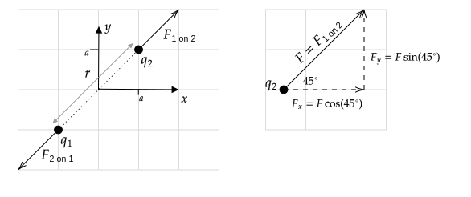

```mdextension
Title: Electric Force
```

% Figures:
% https://www.mathcha.io/editor/5wDQpF09tVvhYnVkOMFvlJp3hDwwMQ0sDKkZme

This activity covers topics in [Section 21.3 of Young and Freedman 2015, 14th Edition](https://drive.google.com/file/d/1JS_pBuNEwXdz9IzpSBFPJffgVacZmqN7/view?usp=sharing_remove_). If you need to review vectors, see [sections 1.6-1.8 of Young and Freedman 2015, 14th Edition](https://drive.google.com/file/d/1SkXaUZ-y5jF5c2ptpJhmK-XjrsSX_hfD/view?usp=sharing_remove_) and  [Vectors](https://www.khanacademy.org/math/precalculus/x9e81a4f98389efdf:vectors) at Khan Academy.

# Coulomb's Law

*Magnitude*

$$F_{1\mbox{ on } 2}=F_{2\mbox{ on } 1}=k\frac{|q_1q_2|}{r^2}$$

where $r$ is the distance between $q_1$ and $q_2$. To simplify notation, we are using $k$ in place of $1/4\pi\epsilon_o$. Note that by definition, the magnitude of a vector is positive, which is the reason for the use of the absolute value.

*Direction*: Along line that connects $q_1$ and $q_2$. Direction depends on signs of $q_1$ and $q_2$. (Likes repel, opposites attract.).

# Example

Charge $q_1$ is at $(x,y)=(-a,-a)$ and charge $q_2$ is at $(a, a)$. Both charges have a charge of $q$.

1. Find the magnitude and direction of the force of $q_1$ on $q_2$.
2. Write the force of $q_1$ on $q_2$ in the form $\bfvec{F}=F_x\ihat + F_y\jhat$.
3. If the charges have opposite signs, how will your answers to 1. and 2. change?

**Solution**

1. The distance between the charges is $r=\sqrt{(2a)^2+(2a)^2}=\sqrt{8a^2}$, so

   $$F_{1\mbox{ on } 2}=k\frac{|q_1q_2|}{r^2}=\frac{k|qq|}{(\sqrt{8a^2})^2}=\frac{kq^2}{8a^2}$$

   The charges will repel each other, so the direction of forces of one on the other will be as shown in the left part of the following diagram.

   

2. Let $F = F_{1\mbox{ on } 2}$ from part 1. to simplify notation. The right part of the above diagram shows the calculation of the components $F_x$ and $F_y$, from which it follows that $\bfvec{F} = F\cos 45^\circ \ihat + F\sin 45^\circ \jhat$. 

3. The magnitude will not change (it is by definition a positive number). The force vectors will reverse direction as shown on the left in the following diagram. The diagram on the right shows the calculation of $\bfvec{F}_{1\mbox{ on } 2}$, from which it follows that $\bfvec{F}_{1\mbox{ on } 2} = -F\cos 45^\circ \ihat - F\sin 45^\circ \jhat$. Note that reversing the direction of a vector is the same as multiplying each of its components by $-1$.

   

# Problem I

Charge $q_1$ is at $(x,y)=(-a,a)$ and charge $q_2$ is at $(a, -a)$. Both charges have a charge of $q$. Draw this charge configuration and then using the steps in the previous example,

1. Find the magnitude and direction of the force of $q_1$ on $q_2$.
2. Write the force of $q_1$ on $q_2$ in the form $\bfvec{F}=F_x\ihat + F_y\jhat$.
3. If the charges have opposite signs, how will your answers to 1. and 2. change?


\ifsolutions
{\bf Solution}
1. $\ds F_{1\mbox{ on } 2}=k\frac{|q_1q_2|}{r^2}=\frac{k|qq|}{(\sqrt{8a^2})^2}=\frac{kq^2}{8a^2}$
2. $\bfvec{F}_{1\mbox{ on } 2} = F_{1\mbox{ on } 2}(\cos 45^\circ \ihat - \sin 45^\circ \jhat)$
3. 1.: No change; 2. $\bfvec{F}_{1\mbox{ on } 2} = F_{1\mbox{ on } 2}(-\cos 45^\circ \ihat + \sin 45^\circ \jhat)$
\else
\newpage
\fi

# Problem II

Charge $q_1$ is at $(x,y)=(-a,a)$ and charge $q_2$ is at $(a, 0)$. Charge $q_1$ has a charge of $+q$. Charge $q_2$ has a charge of $+q$, where $q$ is a positive number. Draw this charge configuration and then using the steps in the previous example,

1. Find the magnitude and direction of the force of $q_1$ on $q_2$.
2. Write the force of $q_1$ on $q_2$ in the form $\bfvec{F}=F_x\ihat + F_y\jhat$.
3. If the charges have opposite signs, how will your answers to 1. and 2. change?


\ifsolutions
{\bf Solution}


1. $\ds F_{1\mbox{ on } 2}=k\frac{|q_1q_2|}{r^2}=\frac{k|qq|}{\sqrt{(2a)^2+a^2}}=\frac{kq^2}{\sqrt{5}a^2}$
2. $\bfvec{F}_{1\mbox{ on } 2} = F_{1\mbox{ on } 2}(\sin \theta^\circ \ihat - \cos \theta\jhat)$, where $\theta=\tan^{-1}(2) = 63.4^\circ$.
3. 1.: No change; 2. $\bfvec{F}_{1\mbox{ on } 2} = F_{1\mbox{ on } 2}(-\sin \theta^\circ \ihat + \cos \theta\jhat)$; $\theta=63.4^\circ$
\fi

# Problem III

Charge $q_1$ is at $(x,y)=(-a,0)$ and charge $q_2$ is at $(0, 3a)$. Charge $q_1$ has a charge of $-q$. Charge $q_2$ has a charge of $+q$, where $q$ is a positive number. Draw this charge configuration and then using the steps in the previous example,

1. Find the magnitude and direction of the force of $q_1$ on $q_2$.
2. Write the force of $q_1$ on $q_2$ in the form $\bfvec{F}=F_x\ihat + F_y\jhat$.
3. If the charges have opposite signs, how will your answers to 1. and 2. change?


\ifsolutions
{\bf Solution}
1. $r=\sqrt{a^2+(3a)^2}$, $F=k|q(-q)|/r^2=kq^2/10a^2$
2. $\bfvec{F}=-F\sin\theta\ihat - F\cos\theta\jhat$, where $\theta=\tan^{-1}(1/3)=18.4^\circ$
3. 1.: No change; 2.: $\bfvec{F}=+F\sin\theta\ihat + F\cos\theta\jhat$
\fi
