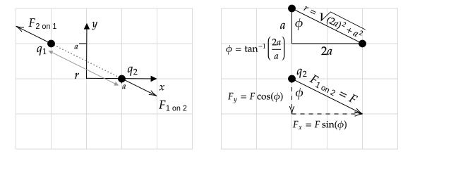
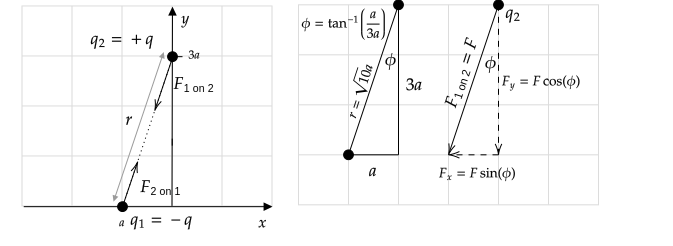

```mdextension
Title: Electric Force
```

% Figures:
% https://www.mathcha.io/editor/5wDQpF09tVvhYnVkOMFvlJp3hDwwMQ0sDKkZme

# Coulomb's Law

*Magnitude*

$$F_{1\mbox{ on } 2}=F_{2\mbox{ on } 1}=k\frac{|q_1q_2|}{r^2}$$

where $r$ is the distance between $q_1$ and $q_2$. To simplify notation, we are using $k$ in place of $1/4\pi\epsilon_o$. Note that by definition, the magnitude of a vector is positive, which is the reason for the use of the absolute value.

*Direction*: Along line that connects $q_1$ and $q_2$. Direction depends on signs of $q_1$ and $q_2$. (Likes repel, opposites attract.).

# Example

Charge $q_1$ is at $(x,y)=(-a,-a)$ and charge $q_2$ is at $(a, a)$. Both charges have a charge of $q$.

1. Find the magnitude of the force of $q_1$ on $q_2$.
2. Find the direction of the force of $q_1$ on $q_2$ in terms of an angle with respect to the $+x$--axis with counterclockwise positive.
3. Write the force of $q_1$ on $q_2$ in the form $\bfvec{F}=F_x\ihat + F_y\jhat$.
4. If $q_1=q$ and $q_2=-q$, how will your answers to 1.--3. change?
5. If $q_1=-q$ and $q_2=-q$, how will your answers to 1.--3. change?

**Solution**

1. The distance between the charges is $r=\sqrt{(2a)^2+(2a)^2}=\sqrt{8a^2}$, so

   $$F_{1\mbox{ on } 2}=k\frac{|q_1q_2|}{r^2}=\frac{k|qq|}{(\sqrt{8a^2})^2}=\frac{kq^2}{8a^2}$$

2. The charges will repel each other, so the direction of forces of one on the other will be as shown in the left part of the following diagram. The angle of $F_{1\mbox{ on } 2}$ is $+45^\circ$ with respect to the $+x$--axis with counterclockwise positive.

   

3. Let $F = F_{1\mbox{ on } 2}$ from part 1. to simplify notation. The right part of the above diagram shows the calculation of the components $F_x$ and $F_y$, from which it follows that $\bfvec{F} = F\cos 45^\circ \ihat + F\sin 45^\circ \jhat$. 

4. &nbsp;

   p1

   The magnitude will not change (it is by definition a positive number).

   p2
   
   The force vectors will reverse direction as shown on the left in the following diagram. The angle of $F_{1\mbox{ on } 2}$ is $225^\circ$ with respect to the $+x$ axis with counterclockwise positive.
 
   p3.
   
   When the angle $\theta$ of a vector $\bfvec{V}$ is given with respect to $+x$--axis, it can be written in component form without using a diagram using the formula $\bfvec{V} = V\cos\theta\ihat + V\sin\theta\jhat$. Thus,

    $\bfvec{F}_{1\mbox{ on } 2} = F\cos 225^\circ \ihat + F\sin 225^\circ \jhat$.

      Alternatively, the diagram on the right of the following figure shows the calculation of $\bfvec{F}_{1\mbox{ on } 2}$ using a different angle and manually inserting the signs of the components based on the diagram. The result is

      $\bfvec{F}_{1\mbox{ on } 2} = -F\cos 45^\circ \ihat - F\sin 45^\circ \jhat$.

      These two answers are identical (what trig identity can be used to show this?).

      Comparing $\bfvec{F}_{1\mbox{ on } 2} = -F\cos 45^\circ \ihat - F\sin 45^\circ \jhat$ with the answer for part 3. of the original problem, we see that to reverse the direction of a vector, we can multiply each of its components by $-1$.

   

5. The magnitude is the same, as before. The charges repel, so the direction is the same as in the answer to 2. and the force vector is the same as the answer to 3.
\ifsolutions
\newpage
\fi

# Problem I

Charge $q_1$ is at $(x,y)=(-a,a)$ and charge $q_2$ is at $(a, -a)$. Both charges have a charge of $q$. Draw this charge configuration and then using the steps in the previous example,

1. Find the magnitude of the force of $q_1$ on $q_2$.
2. Find the direction of the force of $q_1$ on $q_2$ in terms of an angle with respect to the $+x$--axis with counterclockwise positive.
3. Write the force of $q_1$ on $q_2$ in the form $\bfvec{F}=F_x\ihat + F_y\jhat$.
4. If $q_1=q$ and $q_2=-q$, how will your answers to 1. and 2. change?
5. If $q_1=-q$ and $q_2=-q$, how will your answers to 1.--3. change?

\ifsolutions
{\bf Solution}
1. $\ds F_{1\mbox{ on } 2}=k\frac{|q_1q_2|}{r^2}=\frac{k|qq|}{(\sqrt{8a^2})^2}=\frac{kq^2}{8a^2}$
2. $315^\circ$ (or $-45^\circ$)
3.  
   $\bfvec{F}_{1\mbox{ on } 2} = F_{1\mbox{ on } 2}(\cos 315^\circ \ihat + \sin 315^\circ \jhat)$

   or

   $\bfvec{F}_{1\mbox{ on } 2} = F_{1\mbox{ on } 2}(\cos 45^\circ \ihat - \sin 45^\circ \jhat)$

4.  
   p1. No change.

   p2. $+135^\circ$

   p3. 
      $\bfvec{F}_{1\mbox{ on } 2} = F_{1\mbox{ on } 2}(\cos 135^\circ \ihat + \sin 135^\circ \jhat)$

      or

      $\bfvec{F}_{1\mbox{ on } 2} = F_{1\mbox{ on } 2}(-\cos 45^\circ \ihat + \sin 45^\circ \jhat)$

5. Answers to 1.--3. are the same.

\else


\newpage

\fi

# Problem II

Answer the questions 1.--3. of Problem I in the previous problem for charge $q_1$ at $(x,y)=(-a,a)$ and charge $q_2$ is at $(a, 0)$.

\ifsolutions
{\bf Solution}



1. $\ds F_{1\mbox{ on } 2}=k\frac{|q_1q_2|}{r^2}=\frac{k|qq|}{(\sqrt{(2a)^2+a^2})^2}=\frac{kq^2}{5a^2}$
2. $\bfvec{F}_{1\mbox{ on } 2} = F_{1\mbox{ on } 2}(\sin \theta \ihat - \cos \theta\jhat)$, where $\theta=\tan^{-1}(2) = 63.4^\circ$.

   Alternatively, from the diagram on the right, $\sin\theta = 2a/\sqrt{5}a$ and $\cos\theta = 1a/\sqrt{5}a$, so 
   $\ds\bfvec{F}_{1\mbox{ on } 2} = F_{1\mbox{ on } 2}\left(\frac{2}{\sqrt{5}}\ihat - \frac{1}{\sqrt{5}}\jhat\right)$.

\else


\fi

# Problem III

Answer questions 1.--3. of Problem I for charge $q_1$ is at $(x,y)=(-a,0)$ and charge $q_2$ is at $(0, 3a)$. Charge $q_1$ has a charge of $-q$. Charge $q_2$ has a charge of $+q$.

\ifsolutions

{\bf Solution}


1. $r=\sqrt{a^2+(3a)^2}$, $F=k|q(-q)|/r^2=kq^2/10a^2$

2. The angle $\theta$ shown in the diagram is $\theta=\tan^{-1}(1/3)=18.4^\circ$, so the angle with respect to the $+x$--axis is $270-18.4=251.6^\circ$

3. 

   $\bfvec{F}=F\sin251.6\^\circ\ihat - F\cos251.6^\circ\jhat$

   or

   $\bfvec{F}=-F\sin 18.4\^\circ\ihat - F\cos18.4^\circ\jhat$

   Alternatively, from the diagram, 
   
   $\sin\theta = a/\sqrt{10}a$ and $\cos\theta = 3a/\sqrt{10}a$, so 
   
   $\ds\bfvec{F}_{1\mbox{ on } 2} = F\left(-\frac{1}{\sqrt{10}}\ihat - \frac{3}{\sqrt{10}}\jhat\right)$

\else


\fi

# Problem IV

Charge $q_1$ is at $(x,y)=(x_1,y_1)$ and charge $q_2$ is at $(x_2, y_2)$. Find the magnitude of the force of $q_1$ on $q_2$.

\ifsolutions
{\bf Solution}: $F=k|q_1q_2|/\left((x_2-x_1)^2 + (y_2-y_1)^2\right)$. Make sure that you can justify this with a diagram. Check to see if you can use this formula to find the magnitudes for the previous problems.
\fi