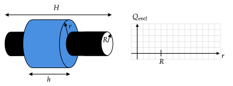
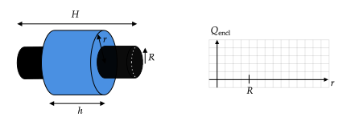
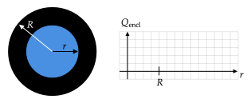
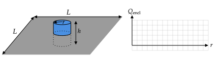

```mdextension
title: Enclosed Charge
```

# Overview

When using Gauss’s law, one must draw an imaginary volume in space and compute how much charge is inside the volume. Note that "charge enclosed" and "charge inside" are used interchangeably. 

In general, an imaginary volume is chosen is one for which computation of the electric flux is easy. That is, the imaginary volume will be such that the electric field is either parallel or perpendicular to all parts of the surface. In this activity, you are given the Gaussian volume. However, you should understand the reason for the choice of each Gaussian volume given.

# Densities

There are three types of charge densities, linear ($\lambda$), surface ($\sigma$), and volume ($\rho$).

Given a $Q$, and assuming $Q$ is uniformly distributed on (or within for a volume) an object, to find 

* $\lambda$, divide $Q$ by the length over which the charge is spread;
* $\sigma$, divide $Q$ by the area over which the charge is spread; and
* $\rho$, divide $Q$ by the volume over which the charge is spread.

To find $Q$ given a charge density, multiply the charge density by the relevant length, area, or volume.

Key formulas:

* $4\pi R^2$ -- surface area of sphere of radius $R$
* $2\pi R h$ -- surface area of curved part of cylinder of radius $R$ and height $h$
* $\pi R^2$ -- surface area of cap of cylinder of radius $R$
* $\pi R^2$ -- volume of cylinder cylinder of radius $R$ and height $h$: $\pi R^2 h
* $4\pi R^3/3$ -- volume of sphere of radius $R$

# Line of Charge

A total of $+3Q$ is uniformly distributed a non--conducting line of length $L$. The Gaussian cylinder shown has a length $h$, radius $r$, and the same center line as the charged line.


1. Find the linear charge density, $\lambda$, on the line.

   <div class="solutionstrue"> 
   {\bf Answer}: The linear charge density is the total charge divided by the length over which the charge is distributed: $\lambda={3Q}/{L}$.
   </div>

   <div class="solutionsfalse"> 
    <div style="height:3em"/>
   </div>

2. Find an equation for $Q_{\text{encl}}$ in terms of $\lambda$ and one or more of $r$, $h$, and $L$.

   <div class="solutionstrue">
   {\bf Answer}: The dashed line in the figure is the part of the line inside of the Gaussian cylinder. The length of the dashed line is $h$, so $Q_{\text{encl}}=\lambda h$. Another way of arriving at this is by noting that the charge enclosed is the total charge $\times$ the ratio $h/L$, so $Q_{\text{encl}}=3Q(h/L) = \lambda h$.
    </div>

   <div class="solutionsfalse"> 
    <div style="height:3em"/>
   </div>

3. Use your equation from 2. to find the amount of charge enclosed by the Gaussian cylinder when it has radii of $r=h/100$, $r=h/2$, $r=h$, and $r=2h$.

   <div class="solutionstrue">
   {\bf Answer}: $Q_{\text{encl}}=\lambda h$ for all four cases.
   </div>  

   <div class="solutionsfalse"> 
      <div style="height:3em"/>
   </div>

4. Plot the four values of enclosed charge calculated above versus the radius of the Gaussian cylinder. Then plot the equation found in part 2. as a smooth line.

   <div class="solutionstrue">
   {\bf Answer:}

   
   </div>

   <div class="solutionsfalse"> 
   \newpage
   </div>

# Cylindrical Shell

A non--conducting hollow cylinder of radius $R$ and length $H$ has a charge of $+3Q$ uniformly distributed _on its curved surface_. The Gaussian cylinder shown has a length $h$, radius $r$, and the same center line as the charged cylinder.



1. Find the linear charge density, $\lambda$, of the charged cylinder.

   <div class="solutionstrue"> 
   {\bf Answer}: The linear charge density is the total charge divided by the length over which the charge is distributed: $\lambda={3Q}/{H}$.

   {\bf Note}: The charges are distributed on a surface, so it may seem more natural to use a surface charge density, which is $\sigma = 3Q/(2\pi R H)$, where the denominator is the surface area of the curved part of the charged cylinder. In this case, the answer to 2. does not change and the answer to 3. is $Q_{\text{encl}} = \sigma 2\pi R h$ instead of $Q_{\text{encl}}=\lambda h$. We use charge per length in this problem because the formula for $Q_{\text{encl}}$ is simpler.
   </div>

   <div class="solutionsfalse"> 
      <div style="height:3em"/>
   </div>

2. Find an equation for $Q_{\text{encl}}$ for $r<R$.

   <div class="solutionstrue"> 
   {\bf Answer}: If the Gaussian cylinder is fully inside the hollow cylinder, there would be no charge inside of it. As a result, the charge enclosed for $r< R$ is zero: $Q_{\text{encl}}=0$.
   </div>

   <div class="solutionsfalse"> 
      <div style="height:3em"/>
   </div>

3. Find an equation for $Q_{\text{encl}}$ for $r>R$. Your equation should involve $\lambda$ and one or more of $h$, $r$, and $R$.

   <div class="solutionstrue"> 
   {\bf Answer}: The amount of charge enclosed is the charge per unit length $\times h = \lambda h$, so  $Q_{\text{encl}}=\lambda h$. (The amount of charge enclosed does not depend on $r$.)
   </div>

   <div class="solutionsfalse"> 
      <div style="height:3em"/>
   </div>

4. Find the amount of charge enclosed by the Gaussian cylinder when it has radii of $r=0$, $r=R/2$, $r=2R$, and $r=3R$.

   <div class="solutionstrue"> 
   {\bf Answer}: $0, 0, \lambda h, \lambda h$
   </div>

   <div class="solutionsfalse"> 
      <div style="height:3em"/>
   </div>

5. Plot the four values of enclosed charge calculated above versus the radius of the Gaussian cylinder. Then plot the equations found in parts 2. and 3 as a smooth line.

   <div class="solutionstrue"> 
      
   </div>

\newpage

# Solid Cylinder

A non--conducting solid cylinder of radius, $R$ and length, $L$ has a charge of $+3Q$ uniformly distributed _throughout it_. The Gaussian cylinder has length $h$, radius $r$, and the same center line as the charged cylinder.



1. Find the volume charge density, $\rho$, of the charged cylinder.

   <div class="solutionstrue"> 
   {\bf Answer:} The volume, $V$, of the charged cylinder is its cross-sectional area, $\pi R^2$, times its height, $H$: $V=\pi R^2 H$. The volume charge density is charge/volume: $\rho=3Q/(\pi R^2 H)$.
   </div>

   <div class="solutionsfalse"> 
      <div style="height:3em"/>
   </div>

2. Find an equation for $Q_{\text{encl}}$ for $r\le R$. Your equation should involve $\rho$ and one or more of $h$, $r$, and $R$.

   <div class="solutionstrue"> 
   {\bf Answer}: When $r<R$, the Gaussian cylinder is entirely inside the charged cylinder. The charge in the Gaussian cylinder is the charge density of the charged cylinder times the volume of _the Gaussian cylinder_: $Q_{\text{encl}}(r)=\rho \pi r^2 h$.
   </div>

   <div class="solutionsfalse"> 
      <div style="height:3em"/>
   </div>

3. Find an equation for $Q_{\text{encl}}$ for $r\ge R$. Your equation should involve $\rho$ and one or more of $h$, $r$, and $R$.

   <div class="solutionstrue"> 
   {\bf Answer}: For any $r\ge R$, $Q_{\text{encl}}=\rho \pi R^2 h$, which is independent of $r$. 
   </div>

   <div class="solutionsfalse"> 
      <div style="height:3em"/>
   </div>

2. Find the amount of charge enclosed in a Gaussian cylinder of radius $r=0$, $r=R/2$, $r=R$, and $r=2R$.

   <div class="solutionstrue"> 
   {\bf Answer}:  $0, \rho\pi R^2 h/4, \rho \pi R^2 h, \rho \pi R^2 h$
   </div>

   <div class="solutionsfalse"> 
      <div style="height:3em"/>
   </div>

3. Plot the four values of enclosed charge calculated above versus the radius of the Gaussian cylinder. Then plot the equations found in parts 2. and 3 as a smooth line.

   <div class="solutionstrue"> 
   {\bf Answer}:

    
   </div>

\newpage

# Spherical Shell

A non--conducting spherical shell of radius $R$ has a charge of $+3Q$ uniformly distributed _on its surface_. Its cross--section is shown along with that of a Gaussian sphere with the same center and a radius $r$.


1. Find the surface charge density on the sphere.

   <div class="solutionstrue"> 
   {\bf Answer}: $\sigma = 3Q/4\pi R^2$
   </div> 

   <div class="solutionsfalse"> 
      <div style="height:3em"/>
   </div>

2. Find an equation for $Q_{\text{encl}}$ for $r<R$.

   <div class="solutionstrue"> 
   {\bf Answer}: $Q_{\text{encl}}=0$
   </div>

   <div class="solutionsfalse"> 
      <div style="height:3em"/>
   </div>

3. Find an equation for $Q_{\text{encl}}$ for $r>R$. Your equation should involve $\sigma$ and one or more of $R$ and $r$.

   <div class="solutionstrue"> 
   {\bf Answer}: $Q_{\text{encl}}=\sigma 4\pi R^2$
   </div>

   <div class="solutionsfalse"> 
      <div style="height:3em"/>
   </div>

4. Find the amount of charge enclosed in Gaussian sphere of radii $r=0$, $r=R/2$, $r=2R$, and $r=3R$.

   <div class="solutionstrue"> 
   {\bf Answer}: $0, 0, \sigma 4 \pi R^2, \sigma 4\pi R^2$
   </div>

   <div class="solutionsfalse"> 
      <div style="height:3em"/>
   </div>

5. Plot the four values of enclosed charge calculated above versus the radius of the Gaussian sphere. Then plot the equations found in parts 2. and 3 as a smooth line.

   <div class="solutionstrue"> 
   {\bf Answer}: 

   
   </div>

\newpage

# Solid Sphere

A non--conducting sphere of radius $R$ has a charge of $+3Q$ distributed uniformly _throughout_ it. The cross--section of the sphere is shown along with a dashed line representing the surface of a Gaussian sphere, which has the same center as the charged sphere and a radius $r$.



1. Find the charged sphere's volume charge density, $\rho$.

   <div class="solutionstrue"> 
   {\bf Answer}: $\ds \rho=3Q/[(4/3)\pi R^3]$
   </div>

   <div class="solutionsfalse"> 
      <div style="height:3em"/>
   </div>

2. Find an equation for $Q_{\text{encl}}$ for $r<R$. Your answer should involve $\rho$ and one or more of $r$ and $R$.

   <div class="solutionstrue"> 
   {\bf Answer}: For $r \le R$, $Q_{\text{encl}}=\rho [(4/3)\pi r^3]$
   </div>

   <div class="solutionsfalse"> 
      <div style="height:3em"/>
   </div>
    
3. Find an equation for $Q_{\text{encl}}$ for $r>R$. Your answer should involve $\rho$ and one or more of $r$ and $R$.

   <div class="solutionstrue"> 
   {\bf Answer}: For $r \ge R$,  $Q_{\text{encl}}=\rho [(4/3)\pi R^3]$, which is independent of $r$.
   </div>

   <div class="solutionsfalse"> 
      <div style="height:3em"/>
   </div>

4. Find the amount of charge enclosed in Gaussian sphere of radii $r=0$, $r=R/2$, $r=R$, and $r=2R$.

   <div class="solutionstrue"> 
   {\bf Answer}: $0, (1/8)\rho (4/3)\pi R^3, \rho(4/3)\pi R^3, \rho(4/3)\pi R^3$
   </div>

   <div class="solutionsfalse"> 
      <div style="height:3em"/>
   </div>

5. Plot the four values of enclosed charge calculated above versus the radius of the Gaussian sphere. Then plot the equations found in parts 2. and 3 as a smooth line.

   <div class="solutionstrue"> 
      
   </div>

\newpage

# Large Sheet



A non--conducting square sheet with side length $L$ has a charge of $+3Q$ distributed uniformly on it. The Gaussian cylinder has a height $h$ and radius $r$, and half of it is above the sheet.

1. Find the surface charge density, $\sigma$, on the sheet.

   <div class="solutionstrue"> 
   {\bf Answer}: $\sigma=3Q/L^2$
   </div>

   <div class="solutionsfalse"> 
      <div style="height:3em"/>
   </div>

2. Find an equation for $Q_{\text{encl}}$ for $r<L$. Your answer should involve $\sigma$ and one or more of $r$, $h$, and $L$. (In Gauss's law problems, $L$ is much larger than $r$, so we do not need to consider $r > L$.)

   <div class="solutionstrue"> 
   {\bf Answer}: $Q_{\text{encl}}=\sigma \pi r^2$.
   </div>

   <div class="solutionsfalse"> 
      <div style="height:3em"/>
   </div>

3. Plot the enclosed charge calculated above versus the radius of the Gaussian cylinder.

   <div class="solutionstrue"> 
      
   </div>