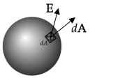
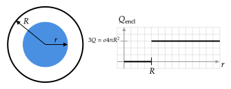
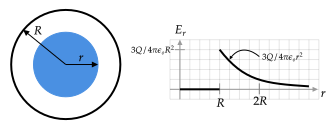
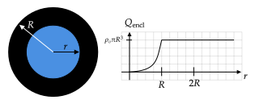

```mdextension
Title: Gauss's Law
```

# Introduction

Gauss's law is derived from Coulomb's law. Coulomb's law can always be used to find the electric field due to a continuous charge distribution when the charge density is known. Gauss's law is only useful for computing the electric field for certain continuous charge distributions. The list includes all of the charge distributions considered in the Enclosed Charge activity:

* near the center of a long and uniformly charged line,
* near the center of a long and uniformly charged cylindrical shell,
* at any location for a uniformly charged spherical shell, and
* near the center of a large and uniformly charged sheet.

Gauss's law can also be used to find the electric field due to a long and uniformly charged solid cylinder and a uniformly charged solid sphere -- the justification is that they can be created by nesting shells together, and the total electric field is the superposition of the electric field of each shell.

Gauss’s law states that the total electric flux through any closed surface is proportional to the total charge inside the surface.

$$\text{Gauss's law}\qquad\oint \bfvec{E}\cdot d\mathbf{A}=\frac{Q_{\text{encl}}}{\epsilon_o}$$

In the following diagram, a closed spherical surface is shown. According to Gauss's law, if we add all of the differential fluxes $\bfvec{E}\cdot d\mathbf{A}$ over a closed surface, the result will be ${Q_{\text{encl}}}/{\epsilon_o}$. The surface does not need to be spherical -- Gauss's law is valid for any closed surface. Any imaginary surface that we use in Gauss's law is referred to as a Gaussian surface.



Gauss's law can be used for computing the electric field due to a continuous charge distribution when the integral can be simplified. The required simplification occurs for a Gaussian surface on which the electric field is always

* zero, parallel, or perpendicular and
* if perpendicular, constant in magnitude.

There are two types of Gaussian surfaces that are used when Gauss's law can be used to find the electric field. (In this activity, we only consider the first case.)


1. For a spherical Gaussian surface, Gauss's law simplifies to $\ds E_rA = {Q_{\text{encl}}}/{\epsilon_o}$, where $A=4\pi r^2$ is a spherical shell with $Q_{\text{encl}}$ inside of it and $E_r$ is the radial electric field.

2. For a cylindrical Gaussian surface, we must consider three surfaces: the two end caps and the curved surface.

\newpage

# Example -- Point Charge

A spherical Gaussian surface of radius $r$ is centered on a point charge $q$. Because the electric field due to a point charge is radial, the electric field will be perpendicular to the Gaussian surface for any $r$, so

$\ds E_rA = {Q_{\text{encl}}}/{\epsilon_o}$ applies. The area of the surface of a sphere is $A = 4\pi r^2$, so

$\ds E_r 4\pi r^2 = {q}/{\epsilon_o}$. Solving for $E_r$ gives

$\ds E_r = \frac{1}{4\pi\epsilon_o}\frac{q}{r^2}$, which is what we expect from Coulomb's law.

# Example -- Spherical Shell

In the Enclosed Charge activity, a non--conducting spherical shell of radius $R$ with a charge of $+3Q$ uniformly distributed on its surface was considered. Its cross--section is shown along with that of a Gaussian sphere of radius $r$ and the same center.

It was found that when the radius $r$ of the Gaussian sphere is less than $R$, $Q_{\text{encl}}=0$. When the $r>R$, $Q_{\text{encl}}=+3Q$:

   $$
   Q_{\text{encl}} = \begin{cases}
     0   &\text{if } r < R \\
     +3Q &\text{if } r > R
   \end{cases}
   $$



1. Why can we assume that if there is an electric field, it must be radial so that the electric field will always be perpendicular to the Gaussian surface?
2. Find $E_r(r)$
3. Plot $E_r(r)$

\newpage

**Answer**


1. Pick a point in space at an arbitrary location to find the electric field. For any point, one can always find two charges on the shell whose electric field sum is radial. Given that one can construct a uniformly charged shell by placing such pairs of charges on a shell, the net electric field due to all charges on the shell must be radial. _Draw a diagram to demonstrate this_.

2. Because of our answer to 1., we can use

   $$E_rA = E_r 4\pi r^2 = {Q_{\text{encl}}}/{\epsilon_o}$$

   $Q_{\text{encl}}$ depends on $r$, so our answer for $E_r$ must also depend on $r$:

   $$
   E_r = \begin{cases}
     0   &\text{if } r < R \\\\
     \ds\frac{1}{4\pi\epsilon_o}\frac{3Q}{r^2} &\text{if } r > R
   \end{cases}
   $$

3. The plot is shown below. Notice that inside the uniformly charged shell, the electric field is zero. Outside, the electric field is the same as if all of the charge ($3Q$) was at the origin. This is a result that is often used when solving other problems and should be memorized.
 
   (You may recall from mechanics that a similar result held -- Newton showed that if mass was uniformly distributed on a spherical shell, the gravitational force on an object anywhere inside the shell was zero; outside the shell, the gravitational force was the same as if all of the mass was at the center of the shell.)

   

\newpage

# Problem -- Solid Sphere With Uniform Charge Density

In the Enclosed Charge activity, a non--conducting sphere of radius $R$ with a charge of $+3Q$ distributed uniformly _throughout_ it was considered. Its cross--section is shown along with that of a Gaussian sphere of radius $r$ with the same center as the charged sphere.

It was found that

$$
Q_{\text{encl}} = \begin{cases}
  \rho_o [(4/3)\pi r^3]   &\text{if  }r \le R \\\\
  \rho_o [(4/3)\pi R^3] &\text{if } r \ge R
\end{cases}
$$

where $\ds \rho_o=3Q/[(4/3)\pi R^3]$


1. Why can we assume that if there is an electric field, it must be radial so that the electric field will always be perpendicular to the Gaussian surface?

   \ifsolutions
   **Answer**: A uniformly charged sphere can be created by nesting uniformly charged spherical shells. We have justified the assumption that the electric field due to a uniformly charged spherical shell is radial in the previous problem. Therefore, by superposition, the electric field of a uniformly charged solid sphere will also be radial.
   \else
   \vspace{8em}
   \fi

2. Find $E_r(r)$

   \ifsolutions
   **Answer**

   Because of our answer to 1., we can use $E_rA = E_r 4\pi r^2 = {Q_{\text{encl}}}/{\epsilon_o}$. $Q_{\text{encl}}$ can be written in terms of the variables given as
   
   $$
   Q_{\text{encl}} = \begin{cases}
     \ds3Q\frac{r^3}{R^3}   &\text{if  }r \le R \\
     3Q    &\text{if  }r \ge R
   \end{cases}
   $$

   $Q_{\text{encl}}$ depends on $r$, so our answer for $E_r$ must also depend on $r$:

   $$
   E_r = \begin{cases}
     \ds\frac{3Q}{4\pi\epsilon_o}\frac{r}{R^3} & \text{if } r < R \\
     \ds\frac{3Q}{4\pi\epsilon_o}\frac{1}{r^2} &\text{if } r > R
   \end{cases}
   $$
   
   Notice that the equation for the electric field outside of the uniformly charged sphere is the same as the equation that applies if all of the charge on the sphere was at the origin. This is expected based on the result for the electric field due to a uniformly charged shell.
   \else
   \vspace{8em}
   \fi

3. Plot $E_r(r)$

   \ifsolutions
   **Answer**:

   
   \else
   \vspace{8em}
   \newpage
   \fi

# Problem -- Solid Sphere With Non--Uniform Charge Density

Suppose the charged sphere in the previous problem had a charge density that varied with radius according to $\rho(r) = \rho_o r/R$.

1. Why can we assume that if there is an electric field, it must be radial so that the electric field will always be perpendicular to the Gaussian surface?

   \ifsolutions
   **Answer**: We can create a charged sphere with a charge density that depends on $r$ by nesting charged shells with a surface charge density that depends on $r$. Each shell produces an electric field that is radial. Therefore, by superposition, the electric field of this solid sphere will also be radial. Note that this argument only applies when the charge density of a solid sphere varies with $r$ (and not $\theta$ and $\phi$; why?).
   \else
   \vspace{8em}
   \fi

2. Find and plot $Q_{\text{encl}}(r)$.

   \ifsolutions
   **Answer**: In general, $Q_{\text{encl}} = \int \rho dv$ -- enclosed charge is determined by integrating charge density over a volume. If the charge density only depends on $r$, we have
   
   $$Q_{\text{encl}}(r) = \int_0^r \rho(r') 4\pi r'^2 dr'$$
   
   (Can you justify this equation? As a check of this equation, use $\rho=\rho_o=\text{const}$ and verify that you get the same result as given the problem statement of the previous problem.)

   Substitution of $\rho(r) = \rho_o r/R$ gives

   $$Q_{\text{encl}}(r) = \int_0^r \left(\rho_o\frac{r'}{R}\right)4\pi r'^2 dr'$$
   
   Integration gives
   
   $$Q_{\text{encl}}(r) =\pi\rho_o\frac{r^4}{R}$$

   This equation applies for $r\le R$. For $r\ge R$, we can find the enclosed charge by using this equation with $r=R$, in which case $Q_{\text{encl}}=\pi\rho_oR^3$ (the total charge of the sphere).

   $$
   Q_{\text{encl}} = \begin{cases}
     \ds\pi\rho_o\frac{r^4}{R} &\text{if  }r \le R \\
     \pi\rho_oR^3 &\text{if  }r \ge R
   \end{cases}
   $$

   

   \else
   \vspace{12em}
   \fi

3. Find $E_r(r)$

   \ifsolutions
   **Answer**

   Because of our answer to 1., we can use $E_rA = E_r 4\pi r^2 = {Q_{\text{encl}}}/{\epsilon_o}$. Substitution gives

   $$
   E_r = \begin{cases}
    \ds\frac{\rho_o}{4\epsilon_o}\frac{r^2}{R} &\text{if  }r \le R \\
    \ds\frac{\rho_o}{4\epsilon_o} \frac{R^3}{r^2} &\text{if  }r \ge R
   \end{cases}
   $$

   Noting that the total charge of the sphere is $Q_T=\pi\rho_oR^3$, outside the sphere,

   $$E_r(r)=\frac{Q_T}{4\pi \epsilon_o}\frac{1}{r^2}$$
   
   so that outside the sphere, the electric field is the same as if all of the charge was at the origin.
   \else
   \vspace{12em}
   \fi

4. Plot $E_r(r)$

   \ifsolutions
   **Answer**:

   
   \else
   \vspace{8em}
   \newpage
   \fi
