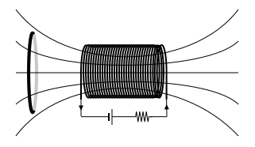

```mdextension
Title: Lenz's Law
```

# Introduction

## Magnetic Flux

A changing magnetic flux through a closed conducting loop induces the flow of a current in the loop.

In this activity, we consider a conducting loop with a current that is not driven by a battery -- it will be driven by a change in magnetic flux through the loop. This change will induce a current, and this induced current creates an induced magnetic field.

The general equation for magnetic flux is:

$$
\Phi_B = \int \bfvec{B}\cdot d\bfvec{A}
$$

If the magnitude of the magnetic field is not changing and the angle between the magnetic field vector and the area vector does not change, then integration is not required, and we can write

$
\Phi_B = \bfvec{B}\bfcdot \bfvec{A}
$
or, equivalently, $\Phi_B = BA\cos\phi$, where $\phi$ is the angle between the area vector, $\bfvec{B}$, and $\bfvec{A}$.

There are three ways that $\Phi_B$ can change:

1. The magnitude of $\bfvec{B}$ (that is, $B$) can change. To do this, a magnet can be moved closer or farther from a loop, a loop can be moved closer or farther from a magnet, or the current generating the magnetic field can be changed. See Example 29.1 in the textbook for an example of creating a changing magnetic field with an electromagnet.

2. The area $A$ can change. To do this, the loop cross--section can be expanded or contracted by heating or cooling a wire or, more commonly, using a device called a slidewire generator (see Example 29.5 in the textbook).

3. The angle $\phi$ can change. To do this, a conducting loop can be rotated (see Example 29.3 in the textbook). Electric motors use changes in $\phi$ to convert mechanical energy to electrical energy.

In this activity, you will determine the direction of the induced current in a conducting loop due to a changing magnetic flux through its area using Lenz's law for cases 1. and 2.

%Although Lenz's law can be used for case 3., we generally use Faraday's law first and then ask if our answer is consistent with Lenz's law. This is covered in a separate activity. Additionally, Lenz's law can be used to determine the direction of force or torque required by an external agent to cause the change in flux through the loop. This is also covered in a separate activity.

\newpage

## Lenz's Law

As described in the textbook,

{\bf Lenz’s Law:} The direction of any magnetic induction effect is such as to oppose the cause of the effect.

Here, we'll use a longer but more descriptive definition.

{\bf Lenz’s Law alternative}: When the magnetic flux due to an external source of a magnetic field through a conducting loop changes, a current appears (is induced) in the loop. The induced current creates an induced magnetic field. The direction of the induced current is such that the induced magnetic field opposes the change in flux.

In the examples given, we will first find the direction of the induced magnetic field needed to oppose a change in flux due to an external source of a magnetic field. Then, we will ask what direction of the induced current is consistent with this induced magnetic field using the current loop right--hand rule, which is described in the next section.

(Lenz's law follows from Faraday's law. In principle, Faraday's law, with careful attention paid to signs, can be used to determine the direction of induced current, in which case Lenz's law is not needed. In a similar way that using the right--hand rules to determine the general direction for force can be used to check your math on a cross--product, Lenz's Law provides can be used to check the direction of the induced current when using Faraday's law.)

# Current Loop Right--Hand Rule

Given a loop of current in a plane, one can determine the direction of its magnetic field near the center using the current loop right--hand rule: wrap your fingers around the loop in the direction of the current -- your thumb points in the direction of the magnetic field.


**Figure 28.12 of Young and Freedman 14th Edition**

\newpage

# $B$ Changing

## Example

A spatially uniform external magnetic field points out of the page, and its magnitude increases over time.


1. What is the direction of an induced magnetic field in the gray region that opposes the change in the magnetic flux?

2. What is the direction of induced current in the loop that is consistent with the induced magnetic field found in part 1?

{\bf Answer}:

To determine the direction of the induced magnetic field, we draw field lines through the area at $t=0$ and then a short time later. On the left--hand side of the following figure, field lines are shown pointing out of the page. A short time later, at $t=\Delta t$, $B_{\text{ext}}$ has increased, so we draw more field lines pointing out of the page.

The induced magnetic field is in the direction that opposes the change in magnetic flux, so the induced field must be in to the page. (The induced magnetic flux will not exactly cancel the increase in flux; the magnitude of the induced magnetic flux will depend on how much current is induced, which depends on the resistance of the wires.)

Finally, we ask what direction of induced current is consistent with a $B_{\text{ind}}$ directed into the page. Using the current loop right--hand rule, it is a clockwise current.


\newpage

## Problems

###

A spatially uniform external magnetic field points into the page, and its magnitude increases over time. A square conducting loop lies in the plane of the page.


1. Draw representitive field lines at $t=0$ and $t=\Delta t$ as done in the example.

   \ifsolutions
   \else
   
   \fi

2. What direction would an induced magnetic field have to be to oppose the change in the magnetic flux?

   \ifsolutions
   {\bf Answer}: Out of the page
   \else
   \fi

3. What is the direction of induced current in the loop that is consistent with the induced magnetic field found in part 2?

   \ifsolutions
   {\bf Answer}: Counterclockwise
   \else
   \fi

###

A spatially uniform external magnetic field points into the page, and its magnitude decreases in time.


1. Draw representitive field lines at $t=0$ and $t=\Delta t$ as done in the example.

   \ifsolutions
   \else
   
   \fi

2. What direction would an induced magnetic field have to be to oppose the change in the magnetic flux?

   \ifsolutions
   {\bf Answer}: Into the page
   \else
   \fi

3. What is the direction of induced current in the loop that is consistent with the induced magnetic field found in part 2?

   \ifsolutions
   {\bf Answer}: Clockwise
   \else
   \newpage
   \fi

###

As shown, a conducting wire loop is placed in the magnetic field of a solenoid. Treat the solenoid's magnetic field as the external magnetic field. Several representative magnetic field lines are shown without arrows that indicate direction.



1. Draw arrows on the magnetic field lines to indicate their direction.

   \ifsolutions
   {\bf Answer}: To the left. (Because the solenoid is composed of loops of current, the current loop right--hand rule can be used on a solenoid to determine the direction of the field it creates.)
   \else
   \fi

For the following cases, determine if an induced magnetic field will appear and, if so, its direction. Then, determine the direction of the induced current, if any, in the wire loop. (If there is no induced current or induced field, enter "N/A".)

2. The loop is stationary.

   \ifsolutions
   {\bf Answer}: a. No flux change, so no induced magnetic field. b. No current.
   \else
   a. Direction of induced magnetic field:

   b. Direction of induced current in the loop:

   \fi

3. The loop is moving to the right.

   \ifsolutions
   {\bf Answer}: As the loop moves to the right, the magnetic field is larger (field lines are more closely spaced). a. To oppose the change in flux, an induced magnetic field pointing to the left is needed. b. The current in the loop is such that the current on the darker part of the ring is upwards.

   

   \else
   a. Direction of induced magnetic field:

   b. Direction of induced current in loop:
   \fi

4. The loop is moving to the left.

   \ifsolutions
   {\bf Answer}: The magnetic field is smaller to the left of the loop (the field lines are less closely spaced). a. To oppose the change in flux, an induced magnetic field pointing to the right is needed. b. The current in the loop is such that the current on the darker part of the ring is downwards.
   \else
   a. Direction of induced magnetic field:

   b. Direction of induced current in the loop:
   \fi

###


The figure above shows a current $I$ running in a long straight wire. For conducting loops A--D moving with a velocity in the direction shown, determine if the current in the loop is zero, clockwise, or counterclockwise. Put your answers on the diagram.

   \ifsolutions
   {\bf Answer}: The field is out of the page above the long straight wire. Below, it is into the page (See section 28.3 of the Textbook). The magnitude of $\bfvec{B}$ is larger near the wire.

   A. The induced field points in to the page. The current is clockwise.

   B. No current.

   C. No current.

   D. The induced field points out of the page. The current is counterclockwise.
   \else
   \newpage
   \fi

# $A$ Changing

##

A spatially uniform external magnetic field points out of the page, and it does not change with time. The conducting loop is heated, causing the gray cross--sectional area to increase with time.

1. Draw representative field lines at $t=0$ and $t=\Delta t$.

   \ifsolutions
   \else
   
   \fi

2. What direction would an induced magnetic field have to be to oppose the change in the magnetic flux?

   \ifsolutions
   {\bf Answer}: Into the page
   \else
   \fi

3. What is the direction of the induced current in the loop that is consistent with the induced magnetic field found in part 1?

   \ifsolutions
   {\bf Answer}: Clockwise
   \else
   \fi

## 

An external magnetic field points into the page, and it does not change with time. The conducting loop is cooled, causing the gray cross--sectional area to decrease with time.

1. Draw representative field lines at $t=0$ and $t=\Delta t$.

   \ifsolutions
   \else
   
   \fi

2. What direction would an induced magnetic field have to be to oppose the change in the magnetic flux?

   \ifsolutions
   {\bf Answer}: Into the page
   \else
   \fi

3. What is the direction of the induced current in the loop that is consistent with the induced magnetic field found in part 2?

   \ifsolutions
   {\bf Answer}: Clockwise
   \else
   %\newpage
   \fi

##

In a region of space where an external magnetic field is spatially uniform, a conducting bar slides along a U-shaped conducting wire (this is known as a "slidewire generator").


1. What direction would an induced magnetic field have to be to oppose the change in the magnetic flux?

   \ifsolutions
   {\bf Answer}: Into the page.
   \else
   \fi

2. What is the direction of the induced current in the loop that is consistent with the induced magnetic field found in part 1?

   \ifsolutions
   {\bf Answer}: Clockwise.
   \else
   \fi
