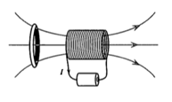

```mdextension
Title: Lenz's Law
```

# Introduction

## Magnetic Flux

A changing magnetic flux through a closed conducting loop can _induce_ the flow of a current in the conducting loop.

In this activity, we will deal with a conducting loop that has a current that is not driven by a battery -- it will be driven by a change in magnetic flux through the loop. This change will _induce_ a current and this induced current will create what we will refer to as an _induced_ magnetic field.

%Some modern cell phones can be "wirelessly" re--charged using induced currents. Instead of charging a cell phone using currents from a power outlet (which can be thought of as a battery), the cell phone is charged using currents induced by a changing magnetic flux through a conducting loop in your cell phone.

The general equation for magnetic flux is:

$$
\Phi_B = \int \bfvec{B}\cdot d\bfvec{A}
$$

If the magnitude (strength) of the magnetic field is not changing and the angle between the magnetic field vector and the area vector does not change over the surface, then integration is not required and we can write

$
\Phi_B = \bfvec{B}\cdot \bfvec{A}
$
or, equivalently,
$
\Phi_B = BA\cos\phi
$

where $\phi$ is the angle between the area vector and $\bfvec{B}$

There are three ways in which flux can change:

1. The magnitude of $\bfvec{B}$ (that is, $B$) can change. To do this, a magnet can be moved closer or farther away from a conducting loop, a loop can be moved closer or farther away from a magnet, or the current in the loop that is generating the magnetic field can be changed. See Example 29.1 in the textbook for an example of the creation of a changing magnetic field without a magnet.

2. The area $A$ can change. To do this, the loop cross--section can be expanded or contracted, either by heating or cooling a wire or, more commonly, using a device called a slidewire generator (see Example 29.5).

3. The angle $\phi$ can change. To do this, a conducting loop can be rotated (see Example 29.3). Electric motors use changes in $\phi$ to convert mechanical energy to electrical energy (or vice versa).

In this activity, you will determine the direction of the induced current in a conducting loop due to a changing magnetic flux through its area using Lenz's law for cases 1. and 2. Although Lenz's law can be used for case 3., we generally use Faraday's law first and then ask if our answer is consisten with Lenz's law. This is covered in a separate activity. Additionally, Lenz's law can be used to determine the direction of force or torque required by an external agent to cause the change in flux through the loop. This is also covered in a separte.

Lenz's law follows from Faraday's law. In principle, Faraday's law with careful attention paid to signs can be used to determine the direction of induced current, in which case Lenz's law is not needed. In a similar way that using the right--hand rules to get the general direction for force can be used to check your math on a cross--product, Lenz's Law provides a check on the direction of the induced current when using Faraday's law.

\newpage

## Currents Generated By Current Loops

Given a loop of current in a plane, one can determine the direction of magnetic field created by the current using a right--hand rule. Wrap your fingers around the loop in the direction of the current and your thumb points in the direction of the magnetic field.

## Lenz's Law

As described in the textbook,

{\bf Lenz’s Law:} The direction of any magnetic induction effect is such as to oppose the cause of the effect.

Here, we'll use a longer, but more descriptive definition.

{\bf Lenz’s Law alternative}: When the external magnetic flux through a conducting loop changes, a current appears (is induced) in the loop. This induced current creates an induced magnetic field. The direction of the induced current is such that the induced magnetic field it creates attempts to keep the magnetic flux unchanged.

In the examples given, we will first find the direction of the induced magnetic field. Then we will ask what direction of induced current is consistent with this induced magnetic field.

# A Method of Solution

For cases 1. and 2., it is useful to draw the system before and after the change in magnetic field magnitude or area. 

## $B$ Changing

When the magnetic field magnitude changes and is out of the page, draw the loop with a few dots representing a magnetic field pointing out of the page. Next, draw the loop after an increase or decrease in the magnetic field magnitude. If the magnitude increases, draw more dots. If the magnitude decreases, draw fewer dots. Then, ask what direction of induced field will be needed to give the same number of dots. Finally ask what direction of current in the loop will create this induced field. (If the magnetic field is into the page, use crosses instead of dots in this perscription.)


## $A$ Changing

If the magnetic field is constant and out of the page and the area of the loop changes, draw the loop with a uniformly spaced dots inside and outside of it. Next draw the loop after the area has changed. If there are more dots in the area, an induced field, represented with crosses, will into the page will be needed to "kill off" the extra dots. If there are fewer dots in the area, an induced field out of the page will be needed to replace the lost dots. (If the magnetic field is constant and into the page, swap "dots" and "crosses" in this perscription.)


# Examples

## Changing $B$

A spatially uniform external magnetic field points out of the page and its magnitude is increasing in time.


1. What is the direction of an induced magnetic field in the gray region that will counteract the change in the magnetic flux?

2. What is the direction of induced current in the loop that is consistent with the induced magnetic field found in part 1?

{\bf Answer}:

1. Into the page.

2. By the right--hand rule, to create a magnetic field into the page would require a clockwise current.

## Changing Area

A spatially uniform external magnetic field points out of the page and it is not changing with time.

The conducting loop is heated causing the gray cross--sectional area to increase with time.


1. What direction would an induced magnetic field have to be to oppose the change in the magnetic flux?

2. What is the direction of induced current in the loop that is consistent with the induced magnetic field found in part 1?

{\bf Answer}:

1. Into the page.

2. A clockwise current creates a magnetic field into the page.

\newpage

# Problems

## Changing $B$

A spatially uniform external magnetic field points into of the page and its magnitude is decreasing in time.


1. What direction would an induced magnetic field have to be to oppose the change in the magnetic flux?

   \ifsolutions
   {\bf Answer}: Into the page.
   \else
   \fi

2. What is the direction of induced current in the loop that is consistent with the induced magnetic field found in part 1?

   \ifsolutions
   {\bf Answer}: Clockwise.
   \else
   \fi

\newpage

## Changing $B$



1. A conducting wire loop is placed in the magnetic field of a solenoid as shown. Determine if an induced magnetic field will appear and if so, its direction.

   1. The loop is stationary.

      \ifsolutions
      {\bf Answer}: No flux change, so no induced magnetic field.
      \else
      \fi

   2. The loop is moving to the right.

      \ifsolutions
      {\bf Answer}: As the loop moves to the right, the magnetic field is larger (field lines are more closely spaced). To keep the flux the same, an induced magnetic field pointing to the left will appear.
      \else
      \fi

   3. The loop is moving to the left.

      \ifsolutions
      {\bf Answer}: As the loop moves to the left, the magnetic field is smaller (field lines are less closely spaced). To keep the flux the same, an induced magnetic field pointing to the right will appear.
      \else
      \fi

2. For each case in your answer to question 1. where there is an induced magnetic field find the direction of the current in the loop.

      \ifsolutions
      {\bf Answer}: Moving to the right: counter--clockwise when viewed from a point to the the left of the loop.
      
      Moving to the left: clockwise when viewed from a point to the the left of the loop.
      \else
      \fi

## Changing Area I

An external magnetic field points into the page and it is not changing with time.

The conducting loop is cooled causing the gray cross--sectional area to decrease with time.


1. What direction would an induced magnetic field have to be to oppose the change in the magnetic flux?

2. What is the direction of induced current in the loop that is consistent with the induced magnetic field found in part 1?

   \ifsolutions
   {\bf Answer}:
   1. The induced magnetic field will be into the page.

   2. By the right--hand rule, a clockwise current creates a magnetic field into the page.
   \else
   \fi

\newpage

## Changing Area II

A conducting bar slides along a U-shaped conducting wire as shown in a region of space where an external magnetic field is spatially uniform. (This is known as a "slidewire generator").


1. What direction would an induced magnetic field have to be to oppose the change in the magnetic flux?

   \ifsolutions
   {\bf Answer}: Into the page.
   \else
   \fi

2. What is the direction of induced current in the loop that is consistent with the induced magnetic field found in part 1?

   \ifsolutions
   {\bf Answer}: Clockwise.
   \else
   \fi

## Loop in Wire Field


In the figure above, there is a current $I$ running through a long straight wire as shown.

For conducting loops A--D that are with a velocity in the direction shown, determine if the current in each the loop is zero or flows clockwise or counterclockwise.

   \ifsolutions
   {\bf Answer}: Above the long straight wire, the field is out of the page. Below, it is into the page. The magnitude of $\bfvec{B}$ is larger near the wire.

   A. Induced field is into page. Current is clockwise.

   B. No current.

   C. No current.

   D. Induced field is into page. Current is clockwise.
   \else
   \fi