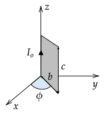

```mdextension
Title: Lorentz Force on Wires
```

# Forces on Straight Wires

A wire carrying a current contains many moving charges. If a current--carrying wire is in a region of space with a magnetic field, the forces on the moving charges in the wire results in force on the wire.

Each charge $q$ moving with a velocity $\bfvec{v}$ in a segment of wire  will have a force on it of

$$\bfvec{F} = q\bfvec{v}\times\bfvec{B}$$

This equation can be transformed into an equation involving the current $I$ and length $L$ of the wire segment using $q\bfvec{v}=\bfvec{I}L$ 

$$\bfvec{F} = L\bfvec{I}\times\bfvec{B}$$

or, equivalently, $q\bfvec{v}=I\bfvec{L}$.

$$\bfvec{F} = I\bfvec{L}\times\bfvec{B}$$

The length vector $\bfvec{L}$ is defined to be a vector in the direction of $\bfvec{I}$ with a magnitude of the length of the wire segment.

These equations apply to (1) straight wires with (2) the same $\bfvec{B}$ on all segments of wire.

%Computing the forces when the first constraint is not satisfied is considered in Section 5 of this tutorial. Also note that to have a steady current, the current must flow in a closed loop (see pg. 820 of Sears and Zemansky's University Physics, 14th edition).

## Example


In the figure above, a magnetic field of magnitude $B_o$ is pointing out of the page and the rectangle has a height of $6L_o$ and a width of $12L_o$.

Determine the magnitude and direction of the force on each segment of the wire and the net force on the loop. Draw the vector on the line segment and show your calculation on the figure. 

{\bf Answer: } In this problem, a coordinate system was not given. We are free to use any coordinate system directions provided that it is a right-handed coordinate system. In a right--handed coordinate system, $\ihat\times\jhat=\khat$. If we choose the $+x$ direction to be to the right and $+y$ up, then the $+z$ direction must be out of the page in order for $\ihat\times\jhat=\khat$. A common error in a problem such as this is to choose the $+z$ direction into the page. In this case, you answers will be be off by a factor of $-1$. 

$$\bfvec{F} = I\bfvec{L}\times\bfvec{B}$$

Left wire: The length of the left wire is $6L_0$ and the current is flowing downward (in the $-\jhat$ direction), so $\bfvec{L} = -6L_o\jhat$.

Right wire: The length is $6L_0$ and the current is flowing upward (in the $+\jhat$ direction), so $\bfvec{L} = +6L_o\jhat$. $\bfvec{F}=I_o(+6L_o\jhat)\times (B_o\khat)=+6I_oL_oB_o\ihat$.

Bottom wire: $\bfvec{F}=I_o(12L_o\ihat)\times (B_o\khat)=-12I_oL_oB_o\jhat$.

Top wire: $\bfvec{F}=I_o(-12L_o\ihat)\times (B_o\khat)=+12I_oL_oB_o\jhat$.

## Problem 


1. For the current loops in a. and b. in the figure above, determine the magnitude and direction of the force on each segment of the wire and the net force on the loop given that a magnetic field of magnitude $B_o$ points out of the page. Draw the vector on the line segments and show your calculation on the figure or in the space below.
\ifsolutions
\else
\vspace{6cm}
\fi

2. For the current loop in c., determine {\bf only} the direction of the force at each of the five points shown as solid dots. Draw a vector on the diagram to indicate the direction of the force at that point.

\ifsolutions
\else
\fi

\newpage

# Torques on Current Loops

In the previous section, you considered forces on the current loops when $\bfvec{B}=B_o\khat$. The forces on all of the current loops that you drew in Problem 1.1 should have been such that the loop would not tend to translate (the net force should have been zero). The general result is that a closed loop in a _constant_ magnetic field will not have a net force.

However, a closed loop in a constant magnetic field can have a net torque (it will tend to rotate).

The general equation for computing the torque on a current loop that lies in a plane is:

$$\boldsymbol{\tau} = \boldsymbol{\mu}\times\bfvec{B}$$

where $\boldsymbol{\mu}$ is the magnetic moment defined as $\boldsymbol{\mu}=I\bfvec{A}$ and $\bfvec{A}$ is the area vector for a loop. The magnitude of the area vector is simply the area of the loop. The direction of the area vector is determined by a right-hand-rule: wrap your fingers along the direction of current and your thumb points in the direction of the area vector.

The equation $\boldsymbol{\tau} = \boldsymbol{\mu}\times\bfvec{B}$ predicts that when $\bfvec{A}$ is perpendicular to $\bfvec{B}$, the torque magnitude is the largest. To see this, note that $\boldsymbol{\mu}\times\bfvec{B}$ can be equivalently written as $\mu A\sin\phi$, where $\phi$ is the angle between $\boldsymbol{\mu}$ and $\bfvec{B}$. When $\phi = \pm 90^\circ$, the cross product will have the largest magnitude.

**Interpreting the torque unit vector**

* A torque in the $\khat$ direction corresponds to rotation in the same sense as rotation of the $+x$-axis towards the $+y$ axis;
* a torque in the $\ihat$ direction corresponds to rotation in the same sense as rotation of the $+y$-axis towards the $+z$ axis;
* a torque in the $\jhat$ direction corresponds to rotation in the same sense as rotation of the $+z$-axis towards the $+x$ axis.

You do not need to memorize these -- they follow from table of cross products discussed in the last activity.

## Problem -- $\bfvec{B}$ $\perp$ to Loop

Although the forces on the current loops shown in Problem 1.1 were such that the loop would not have a net force, a current loop in a constant magnetic field can experience a net torque. To see this, consider loops a. and c. in the following figure (loop b. is a copy of loop a. to allow you to draw force vectors for two different magnetic field directions). The magnetic field is pointing to the right so that $\bfvec{B}=B_o\ihat$. 

\newpage


1. Will the loop a. tend to rotate? If so, what axis will it tend to rotate about? Determine this by drawing the direction of the force (determined using the right-hand-rule) on each segment of the wire.

   \ifsolutions
   {\bf Answer: }Yes. Will rotate about $y$-axis ccw when viewed from point on $+y$ axis.
   \else
   \vspace{2cm}
   \fi

2. If the current direction is reversed, will loop a. tend to rotate? If so, what axis will it tend to rotate about?

   \ifsolutions
   {\bf Answer: } Yes. Will rotate about $y$-axis cw when viewed from point on $+y$ axis. (All of the force vectors are rotated by $180^{\circ}$ because all of the length vectors $\bfvec{L}$ become $-\bfvec{L}$ when the current is reversed.)
   \else
   \vspace{2cm}
   \fi

3. Will loop c. tend to rotate? If so, what axis will it tend to rotate about?

   \ifsolutions
   {\bf Answer:} Yes. Will rotate about $x$-axis cw when viewed from point on $+x$ axis and about $y$-axis cw when viewed from point on $+y$ axis.
   \else
   \vspace{2cm}
   \fi

4. If the current direction is reversed, will loop c. tend to rotate? If so, what axis will it tend to rotate about?

   \ifsolutions
   {\bf Answer:} Same answer as 3. except rotation direction opposite.
   \else
   \vspace{2cm}
   \fi

5. What is the magnetic moment, $\boldsymbol{\mu}$, of loops a. and c.?

   \ifsolutions
   {\bf Answer:} $\boldsymbol{\mu}=I_o\bfvec{A}=I_o(6L_o\cdot 12 L_o)\khat=72I_oL_o^2\khat$
   \else
   \vspace{2cm}
   \fi

6. What is the torque, $\boldsymbol{\tau}$, on loops a. and c.? Verify that this torque vector corresponds to an axis of rotation that matches your previous answers. 

   \ifsolutions
   {\bf Answer: } $\boldsymbol{\tau}= (72I_oL_o^2\khat)\times (B_o\ihat)= 72I_oL_o^2\jhat$
   \else
   \vspace{2cm}
   \fi

7. For loop b., compute $\boldsymbol{\tau}$ when $\bfvec{B}=B_o\ihat + B_o\jhat$ and verify that this torque vector matches what you would expect from using the right-hand rule to determine the direction of the force on each segment of the loop.

   \ifsolutions
   {\bf Answer: }
   $$
   \begin{align}
   \boldsymbol{\tau} & =\boldsymbol{\mu}\times\bfvec{B}\\
   & =(72I_oL_o^2\khat)\times (B_o\ihat+B_o\jhat)\\
   & = 72I_oB_oL_o^2(\khat\times \ihat\; +    \;\khat\times \jhat)\\
   & =72I_oB_oL_o^2(\jhat-\ihat)\\
   & =72I_oB_oL_o^2(-\ihat+\jhat)
   \end{align}
   $$

   The torque vector has a negative $x$-component and a positive $y$-component. This is consistent with the answer ``will rotate about $x$-axis cw when viewed from point on $+x$ axis and about $y$-axis cw when viewed from point on $+y$ axis." given the convention that for torque vectors when you wrap your fingers on your right hand in the direction of rotation your thumb points in the direction corresponding to positive torque.

   You can also use the cross-product to get to your solution with respect to the direction. 

   \else
   \vspace{2cm}
   \fi

8. For loop c., compute $\boldsymbol{\tau}$ when $\bfvec{B}=B_o\ihat + B_o\jhat$ and verify that this torque vector matches what you would expect from using the right-hand rule to determine the direction of the force on each segment of the loop.

   \ifsolutions
   $\boldsymbol{\mu}=72I_oL_o^2\khat$ (same as Figure 3a.)

   The area is $A=(11L_o\cdot 6L_o)/2=33L_o^2$ and the direction of the area vector is into the page by the right-hand-rule, so $\bfvec{A}=-33L_o^2\khat$ and $\boldsymbol{\mu}=I\bfvec{A}=-33I_oL_o^2\khat$. Thus

   $$\boldsymbol{\tau}=\boldsymbol{\mu}\times\bfvec{B}= (-33I_oL_o^2\khat)\times (B_o\ihat)=-33I_oB_oL_o^2\jhat$$

   \else
   \vspace{2cm}
   \fi

## Problem -- $\bfvec{B}$ not $\perp$ to Loop



If $\bfvec{B}=B_o\ihat$,

1. Find the force on each segment of the loop.

2. Find the net force on the loop.

3. Find the net torque on the loop.
