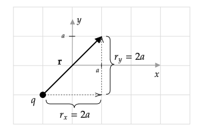

```mdextension
Title: Magnetic Field of a Moving Charge
```

# Introduction

In previous activities, you computed the force on moving charges in a region of space where there is a magnetic field. No mention was made of how the magnetic field was created.

In this activity, you compute the magnetic field created by moving charges.

The magnetic field due to a point charge $q$ moving with velocity $\bfvec{v}$ (when $|\bfvec{v}|$ is small compared to the speed of light) is

$$
\bfvec{B} = \frac{\mu_o}{4\pi}\frac{q\bfvec{v}\times\hat{\mathbf{r}}}{r^2}
$$

where $\rhat$ is the unit vector that points from the position of $q$ to the point in space where we want to know $\bfvec{B}$, and $r$ is the distance between $q$ and that point.

To find $\rhat$ (see also the $\rhat$ Unit Vector activity), 

1. draw a vector, $\bfvec{r}$, from $q$ to the point in space where you want to know $\bfvec{B}$;
2. Write $\bfvec{r}$ in the form $\bfvec{r}=r_x\ihat+r_y\jhat$; then
3. $\rhat=\bfvec{r}/r$, where $r=\sqrt{r_x^2+r_y^2}$.

In this activity, the examples and solutions are given using the above approach for computing $\bfvec{B}$. An alternative is to use the fact that $\bfvec{v}\times\hat{\mathbf{r}}=|\bfvec{v}|\sin\phi=v\sin\phi$, where $\phi$ is the angle between $\bfvec{v}$ and $\hat{\mathbf{r}}$ and $0 \le\phi \le 180^{\circ}$. With this, the magnitude of the magnetic field is

$$
B = \frac{\mu_o}{4\pi}\frac{|q|v\sin\phi}{r^2}
$$

and the right--hand rule can be used to determine the direction of $\bfvec{B}$. See the Cross Products activity for a discussion of when and how to compute the cross-product using this method.

\ifsolutions
\else
\newpage
\fi

# Example

If $q$ is at $(x,y)=(-a,-a)$ and has a velocity of $\bfvec{v}=v_o\ihat$, find $\bfvec{B}$ at $(x,y)=(a,a)$.

**Solution**

To find $\hat{\mathbf{r}}$, we draw a vector from $q$ to the point where we want to compute $\bfvec{B}$.



Based on the diagram, $\bfvec{r}=2a\ihat + 2a\jhat$ and $r = \sqrt{(2a)^2+(2a)^2}=2\sqrt{2}a$, so

$$\hat{\mathbf{r}}=\frac{\bfvec{r}}{r} = \left[\frac{1}{\sqrt{2}}\ihat + \frac{1}{\sqrt{2}}\jhat\right]$$

The cross-product is

$$\bfvec{v}\times\hat{\mathbf{r}} = v_o\ihat\times\left[\frac{1}{\sqrt{2}}\ihat + \frac{1}{\sqrt{2}}\jhat\right] = \frac{v_o}{\sqrt{2}}(\ihat\times\jhat) = \frac{v_o}{\sqrt{2}}\khat$$

Substitution into 

$$\bfvec{B} = \frac{\mu_o}{4\pi}\frac{q\bfvec{v}\times\hat{\mathbf{r}}}{r^2}$$

gives

$$\bfvec{B}(a,a) = \frac{\mu_o}{4\pi} \frac{q\frac{v_o}{\sqrt{2}}\khat}{(2\sqrt{2}a)^2} = \frac{\mu_o}{4\pi} \frac{qv_o}{(8\sqrt{2})a^2}\khat$$

Check: Use the right--hand rule for cross products on $\bfvec{v}\times\hat{\mathbf{r}}$ to verify that the result is out of the page. (Why do we know that the $\khat$ direction is out of the page?)

\ifsolutions
\else
\newpage
\fi

# Problem I

If $q$ is at $(x,y)=(a,a)$ and has a velocity of $\bfvec{v}=v_o\ihat$, find $\bfvec{B}$ at $(x,y)=(-a,-a)$.

\ifsolutions
**Solution**

$\bfvec{r}=-2a\ihat - 2a\jhat$ and $r=2\sqrt{2}a$, so

$$\hat{\mathbf{r}}=\frac{\bfvec{r}}{r} = \left[-\frac{1}{\sqrt{2}}\ihat - \frac{1}{\sqrt{2}}\jhat\right]$$

The cross--product is

$$\bfvec{v}\times\hat{\mathbf{r}}=v_o\ihat\times\left[-\frac{1}{\sqrt{2}}\ihat - \frac{1}{\sqrt{2}}\jhat\right] = -\frac{v_o}{\sqrt{2}}(\ihat\times\jhat) = -\frac{v_o}{\sqrt{2}}\khat$$

Substitution into 

$$\bfvec{B} = \frac{\mu_o}{4\pi}\frac{q\bfvec{v}\times\hat{\mathbf{r}}}{r^2}$$

gives

$$\bfvec{B}(-a,-a) = -\frac{\mu_o}{4\pi} \frac{qv_o}{(8\sqrt{2})a^2}\khat$$

Check: Using the right--hand rule for cross products on $\bfvec{v}\times\hat{\mathbf{r}}$ confirms that the result is into the page.

\else
\vspace{24em}
\fi

# Problem II

If $q$ is at $(x,y)=(a,0)$ and has a velocity of $\bfvec{v}=v_o\jhat$, find $\bfvec{B}$ vector at $(x,y)=(a,a)$.

\ifsolutions
**Answer**: $\bfvec{B}(a,a)=0$ (From a diagram, $\bfvec{v}$ and $\hat{\mathbf{r}}$ are parallel, so their cross product is zero.)
\else
\vspace{12em}
\fi

\ifsolutions
\else
\newpage
\fi

# Problem III

If $q$ is at $(x,y)=(a,2a)$ and has a velocity of $\bfvec{v}=v_o\jhat$, find $\bfvec{B}$ at $(x,y)=(-a,-a)$.

\ifsolutions
**Answer**: 
$$\bfvec{B}(-a,-a)= \frac{\mu_o}{4\pi} \frac{2qv_o\khat}{13\sqrt{13}a^2}$$
\else
\vspace{18em}
\fi

# Problem IV

If $q$ is at the position $(x_o,y_o)$ and has a velocity of $\bfvec{v}=v_x\ihat+v_y\jhat$, 

$$\bfvec{B}(x,y)= \frac{\mu_o}{4\pi} \frac{q}{r^3} \big[v_x(y-y_o) - v_y(x-x_o)\big]\khat$$

where

$$r=\sqrt{(x-x_o)^2+(y-y_o)^2}$$

1. Explain why $\bfvec{B}$ only has a $\khat$ component.
   \ifsolutions
   **Answer**: The $\bfvec{r}$ and $\bfvec{B}$ vectors are in the $x$--$y$ plane, and the result of a cross--product is a vector that is perpendicular to the plane to the two crossed vectors.
   \else
   \vspace{3em}
   \fi
2. Use this formula to find $\bfvec{B}$ for the example problem in section 2.
   \ifsolutions
   **Answer**: In the example problem, $q$ is at $(-a,-a)$ and has a velocity of $\bfvec{v}=v_o\ihat$ and we want to know $\bfvec{B}$ at $(a,a)$. In terms of the variables for the given equation, the position of the charge is $(x_o,y_o)=(-a,-a)$, the location where where we want to know $\bfvec{B}$ is $(x,y)=(a,a)$, $v_x=v_o$, and $v_y=0$. Plugging these values into

   \vspace{1em}

   $$r=\sqrt{(x-x_o)^2+(y-y_o)^2}$$

   \vspace{1em}

   $$
   \bfvec{B}(x,y)= \frac{\mu_o}{4\pi} \frac{q}{r^3} \big[v_x(y-y_o) - v_y(x-x_o)\big]\khat
   $$

   \vspace{1em}

   gives

   \vspace{1em}

   $$r=\sqrt{(a--a)^2+(a--a)^2}=\sqrt{8}a$$

   \vspace{1em}

   and
   
   \vspace{1em}

   $$
   \bfvec{B}(a,a)= \frac{\mu_o}{4\pi} \frac{q}{(\sqrt{8}a)^3} v_o(a--a)\khat
   $$

   \vspace{1em}

   Simplification gives the same result found in the example:

   \vspace{1em}

   $$
   \bfvec{B}(a,a) = \frac{\mu_o}{4\pi} \frac{qv_o}{(8\sqrt{2})a^2}\khat
   $$

   \else
   \vspace{8em}
   \fi
3. Derive this formula.

   \ifsolutions

   **Answer**: 
   The vector from the position of $q$, $(x_o,y_o)$, to the point where we want to know the field, $(x,y)$, is

   $\bfvec{r} = (x-x_o)\ihat + (y-y_o)\jhat$, so $r=\sqrt{(x-x_o)^2+(y-y_o)^2}$.

   Using this with $\rhat=\bfvec{r}/r$ and $\bfvec{v}=v_x\ihat+v_y\jhat$ in

   \vspace{1em}

   $$
   \bfvec{B} = \frac{\mu_o}{4\pi}\frac{q\bfvec{v}\times\hat{\mathbf{r}}}{r^2}
   $$

   gives

   $$
   \bfvec{B}(x,y) = \frac{\mu_o}{4\pi}\frac{q (v_x\ihat+v_y\jhat)\times\ds\frac{(x-x_o)\ihat + (y-y_o)\jhat}{r}}{r^2}
   $$

   or

   $$
   \bfvec{B}(x,y) = \frac{\mu_o}{4\pi}\frac{q}{r^3}(v_x\ihat+v_y\jhat)\times \big[(x-x_o)\ihat + (y-y_o)\jhat\big]
   $$

   Using the Multiply through method for cross--products (and dropping the terms involving $\ihat\times\ihat$ and $\jhat\times\jhat$) gives

   $$
   \bfvec{B}(x,y) = \frac{\mu_o}{4\pi}\frac{q}{r^3}\big[v_x\ihat\times (y-y_o)\jhat + v_y\jhat\times (x-x_o)\ihat\big]
   $$

   Evaluation of the cross--products gives

   $$
   \bfvec{B}(x,y)= \frac{\mu_o}{4\pi} \frac{1}{r^3} \big[v_x(y-y_o) - v_y(x-x_o)\big]\khat
   $$
   \else
   \fi
