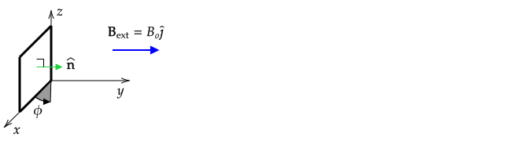

```mdextension
Title: Magnetic Flux
```

# Introduction

The definition of magnetic flux is

$$\Phi_B = \int \bfvec{B}\cdot d\mathbf{A}$$

When the magnitude and direction of $\bfvec{B}$ are the same at all points on the surface, the integral simplifies to 

$$\Phi_B = \bfvec{B}\cdot \mathbf{A}$$

or, equivalently,

$$\Phi_B = BA\cos\phi$$

where $\phi$ is the angle between the $\bfvec{B}$ and $\bfvec{A}$ vectors.

Note that previously, electric flux was covered. The same techniques that apply to computing electric flux apply to magnetic flux. See the Electric Flux activity for additional discussion.

\ifsolutions
\else
\newpage
\fi

# Computing $\Phi_B$

In the following figure, a square loop of area $A$ that can be rotated about the $z$ axis is shown. Assume that the normal direction of the loop is as shown in the diagram. A uniform external magnetic field points in the $\jhat$ direction.



1. At what angles in the range of $\phi=[0,360^\circ]$ is the magnetic flux zero?

   \ifsolutions
   {\bf Answer}: The magnetic flux will be zero when the normal vector is perpendicular to  $\bfvec{B}_{\text{ext}}$. This corresponds to $\phi = 90^\circ$ and $\phi = 270^\circ$
   \else
   \vspace{3em}
   \fi

2. Draw the loop, $\hat{\mathbf{n}}$, and $\bfvec{B}_{\text{ext}}$ as they would appear when viewed from above (on the positive $z$--axis) when $\phi=0^\circ$, $\phi=45^\circ$, $\phi=135^\circ$, and $\phi=180^\circ$.

   \ifsolutions
   **Answer**:

   
   \else
   \vspace{12em}
   \fi

3. When $\phi=45^\circ$, is the magnetic flux positive or negative? What is its value in terms of a fraction of $B_oA$?

   \ifsolutions
   **Answer**: From the above diagram, the angle between $\hat{\mathbf{n}}$ and $\bfvec{B}_{\text{ext}}$ is $\phi$, so the flux will be positive. Its value will be $B_oA\cos 45^\circ=B_oA/\sqrt{2}$.
   \else
   \vspace{3em}
   \fi

4. When $\phi=135^\circ$, is the magnetic flux positive or negative? What is its value in terms of a fraction of $B_oA$?

   \ifsolutions
    **Answer**: From the above diagram, the angle between $\hat{\mathbf{n}}$ and $\bfvec{B}_{\text{ext}}$ is $\phi$, so the flux will be negative. Its value will be $B_oA\cos 135^\circ=-B_oA\cos 45^\circ=-B_oA/\sqrt{2}$.
  \else
  \vspace{3em}
  \fi

5. Sketch a plot of the magnetic flux, $\Phi_B$, as a function of $\phi$.

  \ifsolutions

   From the diagram above, the angle of rotation of the plane is the same as the angle between the  $\hat{\mathbf{n}}$ and $\bfvec{B}_{\text{ext}}$, so the general formula is $\Phi=B_oA\cos\phi$, which is sketched below along with dots that correspond to answers to the above problems.

   

  \else
  \vspace{5em}
  \fi

# Computing $d\Phi_B/dt$

The time rate of change of magnetic flux through a closed loop is a quantity that will be used when Faraday's law is covered.

Suppose the loop in the previous problem rotates at a constant rate such that $\phi=\omega t$, where $\omega$ is a contant.


1. At what angles in the range $\phi=[0^\circ, 360^\circ]$ is $d\Phi_B/dt=0$?

  \ifsolutions
  The answer to part 5. of the previous problem is $\Phi_B=B_oA\cos\phi$, which is sketched below. The slope of $\Phi_B$ is zero at $\phi = 0, 180^\circ$, and $360^\circ$.

  

  \else
  \vspace{5em}
  \fi

2. For what angle range is $d\Phi_B/dt$ increasing?

  \ifsolutions
  From the plot of $\Phi_B$, the slope is positive for $180^\circ \lt \phi \lt 360^\circ$
  \else
  \vspace{5em}
  \fi

3. For what angle range is $d\Phi_B/dt$ decreasing?

  \ifsolutions
  From the plot of $\Phi_B$, the slope is negative for $0^\circ \lt \phi \lt 180^\circ$
  \else
  \vspace{5em}
  \fi

4. What is the formula for $d\Phi_B(t)/dt$ in terms of $B_o$, $A$, $t$, and $\omega$?

  \ifsolutions
  $\Phi_B=B_oA\cos\phi$, so $d\Phi_B/dt = -B_oA\omega\sin\omega t$
  \else
  \fi
