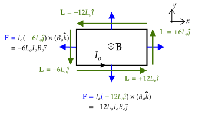
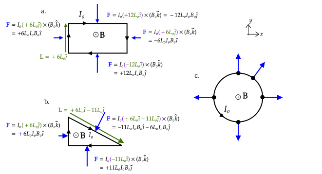
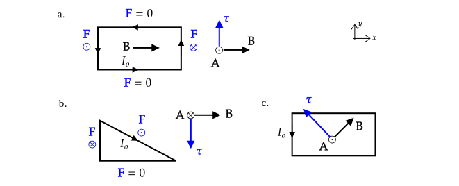
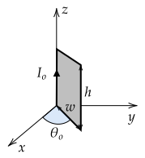

```mdextension
Title: Magnetic Force and Torque
```

# Forces on Straight Wires

A wire carrying a current contains many moving charges. If a current--carrying wire is in a region of space with a magnetic field, the magnetic force on the moving charges in the wire results in a force on the wire.

Each charge $q$ moving with a velocity $\bfvec{v}$ in a segment of wire  will have a magnetic force on it of

$$\bfvec{F} = q\bfvec{v}\times\bfvec{B}$$

For a straight segment of wire of length $L$ with the same $\bfvec{B}$ on all parts of it, this equation can be transformed into an equation for the force on a straight segment with current $\bfvec{I}$:

$$\bfvec{F} = L\bfvec{I}\times\bfvec{B}$$

or, equivalently, by defining a length vector $\bfvec{L}$ with the same direction as $\bfvec{I}$ and a magnitude of the length of the wire segment,

$$\bfvec{F} = I\bfvec{L}\times\bfvec{B}$$

As was the case for the magnetic force equation for a charge $q$, the magnitude of this cross--product can be written in a simplified form:

$$F=ILB\sin\phi$$

where $\phi$ is the angle between $\bfvec{L}$ and $\bfvec{B}$ and $0 \le\phi \le 180^{\circ}$. The direction of the force is determined using the cross--product right--hand rule by crossing $\bfvec{L}$ with $\bfvec{B}$.

\newpage

## Example


In the figure above, a magnetic field of magnitude $B_o$ is pointing out of the page, and the rectangle--shaped wire carries a current $I_o$, has a height of $6L_o$, and a width of $12L_o$.

Determine the force on each side of the rectangle and the net force on the loop.

{\bf Answer: } In this problem, a coordinate system was not given. We are free to use any coordinate system directions provided that it is a right--handed coordinate system. (In a right--handed coordinate system, $\ihat\times\jhat=\khat$. If we choose the $+x$ direction to be to the right and $+y$ up, then the $+z$ direction must be out of the page in order for $\ihat\times\jhat=\khat$.)



* Left segment: The length is $6L_o$ and the current is flowing downward (in the $-\jhat$ direction), so $\bfvec{L} = -6L_o\jhat$ and $$\bfvec{F} = I\bfvec{L}\times\bfvec{B} = I_o(-6L_o\jhat)\times B_o\khat=-6I_oL_oB_o\jhat\times \khat=-6I_oL_oB_o\ihat$$

  Check: The direction of the force is consistent with that from using the right--hand rule for cross products (crossing $\bfvec{L}$ with $\bfvec{B}$). The magnitude of the force can also be found using $F=ILB\sin\phi$. Using the given variables, $F=I_o(6L_o)B_o\sin\phi$. Here $\phi=90^\circ$ because $\bfvec{L}$ and $\bfvec{B}$ are perpendicular to each other. This leaves $F=6I_oL_oB_o$, which is the magnitude of $\bfvec{F}=-6I_oL_oB_o\ihat$ found above using vector notation.

* Right: The length is $6L_0$ and the current is flowing upward (in the $+\jhat$ direction), so $\bfvec{L} = +6L_o\jhat$ and

   $\bfvec{F}=I_o(+6L_o\jhat)\times (B_o\khat)=+6I_oL_oB_o\ihat$

* Bottom: $\bfvec{F}=I_o(+12L_o\ihat)\times (B_o\khat) = 12I_oL_oB_o\ihat\times\khat = -12I_oL_oB_o\jhat$.

* Top: $\bfvec{F}=I_o(-12L_o\ihat)\times (B_o\khat)=+12I_oL_oB_o\jhat$.

The sum of the forces is zero.

## Problem 

\ifsolutions

\else

\fi

1. For the current loops in a. and b. in the figure above, determine the magnitude and direction of the force on each segment of the wire and the net force on the loop given that a magnetic field of magnitude $B_o$ points out of the page. Draw the force vector on the wire segments and show your calculation on the figure or in the space below.

   \ifsolutions
   The force on each segment is shown on the diagram above. The net force is zero for both cases.
   \else
   \vspace{6cm}
   \fi

2. For the current loop in c., determine {\bf only} the direction of the force at each of the five points shown as solid dots when $\bfvec{B}=B_o\khat$. Draw a vector on the diagram to indicate the direction of the force at that point. What is the net force on this loop?

   \ifsolutions
   The force vectors are shown on the diagram above. The net force is zero.
   \else
   \newpage
   \fi

# Torques on Current Loops

In the previous section, you considered forces on the current loops when $\bfvec{B}=B_o\khat$. The forces on all of the current loops that you drew should have been such that the loop would not tend to translate (the net force should have been zero). 

%The general result is the net force on a closed loop in a _constant_ magnetic field is zero. To see this, think of computing the force by adding all of the force vectors in each of the previous problems head--to--tail. The head of the last vector will end up at the tail of the first vector, so the sum of all of the blue vectors is zero.

The net torque on a closed loop in a constant magnetic field can be non--zero (in which case it will tend to rotate).

The torque on a current loop that lies in a plane is:

$$\vec{\boldsymbol{\tau}} = \vec{\boldsymbol{\mu}}\times\bfvec{B}$$

where $\vec{\boldsymbol{\mu}}$ is the magnetic moment defined as $\vec{\boldsymbol{\mu}}=I\bfvec{A}$ and $\bfvec{A}=A\hat{\mathbf{n}}$ is the area vector for a loop. The magnitude of the area vector is simply the area of the loop. The direction of the area vector is determined by a right--hand rule: wrap your fingers along the direction of the current and your thumb points in the direction of the area vector.

The equation $\vec{\boldsymbol{\tau}} = \boldsymbol{\mu}\times\bfvec{B} = I\bfvec{A}\times\bfvec{B}$ predicts that when $\bfvec{A}$ is perpendicular to $\bfvec{B}$, the torque magnitude is the largest. To see this, note that $I\bfvec{A}\times\bfvec{B}$ can be equivalently written as $IAB\sin\phi$, where $\phi$ is the angle between $\bfvec{A}$ and $\bfvec{B}$. When $\phi = 90^\circ$, the cross product will have the largest magnitude.

**Interpreting the torque unit vector**

1. A torque in the $+\khat$ direction corresponds to a rotation in the same sense as rotation from the $+\ihat$ axis towards the $+\jhat$ axis;
2. a torque in the $+\ihat$ direction corresponds to a rotation in the same sense as rotation from the $+\jhat$ axis towards the $+\khat$ axis;
3. a torque in the $+\jhat$ direction corresponds to a rotation in the same sense as rotation from the $+\khat$ axis towards the $+\ihat$ axis.

You do not need to memorize these -- they can be obtained from the following diagram. Rotating $\ihat$ towards $\jhat$ gives $\khat$ (item 1. above). Rotating $\jhat$ towards $\khat$ gives $\ihat$ (item 2. above), etc.


\ifsolutions
\else
\newpage
\fi

## Problem -- $\bfvec{B}$ in Plane of Loop

\ifsolutions

\else

\fi

The three current loops are in a region of space with a constant magnetic field with a magnitude of $B_o$.

1. Will loop a. tend to rotate? If so, what axis will it tend to rotate about? Determine this by drawing the direction of the force (determined using the right--hand rule) on each segment of the wire.

   \ifsolutions
   {\bf Answer: }Yes. Will rotate about $y$ ($\jhat$) axis counterclockwise when viewed from a point on $+y$ axis. (Or, rotates in the same sense as rotation of $z$ ($\khat$) towards $x$ ($\ihat$).)
   \else
   \vspace{2cm}
   \fi

2. If the current direction is reversed, will loop a. tend to rotate? If so, what axis will it tend to rotate about?

   \ifsolutions
   {\bf Answer: } Yes. Rotation opposite of answer to 1.
   \else
   \vspace{2cm}
   \fi

3. Will loop b. tend to rotate? If so, what axis will it tend to rotate about?

   \ifsolutions
   {\bf Answer:} Yes. Will rotate about $y$ ($\jhat$) axis clockwise when viewed from a point on $+y$ axis. (Or, rotates in the same sense as rotation of $x$ ($\ihat$) towards $z$ ($\khat$).
   \else
   \vspace{2cm}
   \fi

4. If the current direction is reversed, will loop b. tend to rotate? If so, what axis will it tend to rotate about?

   \ifsolutions
   {\bf Answer: } Yes. Rotation opposite of answer to 3.
   \else
   \vspace{2cm}
   \fi

5. What is the magnetic moment, $\boldsymbol{\mu}$, of loops a. and b.?

   \ifsolutions
   {\bf Answer:} 
   
   a. Using $\boldsymbol{\mu} = I_o\bfvec{A}$, $\bfvec{A} = A\hat{\mathbf{n}}$, and $\hat{\mathbf{n}} = +\khat$ gives $\boldsymbol{\mu } = I_o(6L_o\cdot 12 L_o)(+\khat) = 72I_oL_o^2\khat$.
   
   b.  Using $\boldsymbol{\mu} = I_o\bfvec{A}$, $\bfvec{A} = A\hat{\mathbf{n}}$, and $\hat{\mathbf{n}} = -\khat$ gives $\boldsymbol{\mu } = I_o\frac{1}{2}(6L_o\cdot 11 L_o)(-\khat) = -33I_oL_o^2\khat$.
   \else
   \vspace{2cm}
   \fi

6. What is the torque, $\boldsymbol{\tau}$, on loops a. and b.? Verify that this torque vector corresponds to an axis of rotation that matches your previous answers. 

   \ifsolutions
   {\bf Answer: }

   a. $\boldsymbol{\tau}= (72I_oL_o^2\khat)\times (B_o\ihat)= 72I_oL_o^2B_o\jhat$

   b. $\boldsymbol{\tau}= (-33I_oL_o^2\khat)\times (B_o\ihat)= -33I_oL_o^2B_o\jhat$
   \else
   \vspace{2cm}
   \fi

7. For loop c., compute $\boldsymbol{\tau}$ when $\bfvec{B}=(B_o/\sqrt{2})\ihat + (B_o/\sqrt{2})\jhat$ and verify that this torque vector matches what you would expect from using the right-hand rule to determine the direction of the force on each segment of the loop.

   \ifsolutions
   {\bf Answer: }
   $$
   \begin{align*}
   \boldsymbol{\tau} & = \boldsymbol{\mu}\times\bfvec{B} \\
   &  =(72I_oL_o^2\khat)\times (B_o\ihat+B_o\jhat)/\sqrt{2}\\
   & = 72I_oB_oL_o^2(\khat\times \ihat + \khat\times \jhat)/\sqrt{2}\\
   & = 72I_oB_oL_o^2(\jhat-\ihat)/\sqrt{2}\\
   & = 72I_oB_oL_o^2(-\ihat+\jhat)/\sqrt{2}
   \end{align*}
   $$

   The torque vector has a negative $x$-component and a positive $y$-component. To see that this makes sense, consider solving this problem using superposition -- first find the torque for $\bfvec{B}=(B_o/\sqrt{2})\ihat$ add the result to the torque for $\bfvec{B}=(B_o/\sqrt{2})\jhat$.
   \else
   \vspace{2cm}
   \fi

## Problem -- $\bfvec{B}$ not in Plane of Loop



If $\bfvec{B}=B_o\ihat$,

1. Find the force on each segment of the loop.

2. Find the net force on the loop.

3. Find the net torque on the loop.

\ifsolutions

**Answers**
1. 
   Left: $\bfvec{L} = h\khat$; $\bfvec{F}=I_o\mathbf{L}\times\mathbf{B}=I_ohB_o\khat\times\ihat=I_ohB_o\jhat$
   
   Right: $\bfvec{L} = -h\khat$; $\bfvec{F}=-I_ohB_o\jhat$

   From a diagram viewing the system from a point on the $+z$--axis to determine $\mathbf{L}$,

   Top: $\bfvec{L}=w\cos\theta_o\ihat + w\sin\theta_o\jhat$; $\bfvec{F}=-I_owB_o\sin\theta_o\khat$

   Bottom: $\bfvec{L}=-w\cos\theta_o\ihat - w\sin\theta_o\jhat$; $\bfvec{F}=I_owB_o\sin\theta_o\khat$

2. $0$
3. From a diagram, $\hat{\mathbf{n}}=-\sin\theta_o\ihat + \cos\theta_o\jhat$, and using $\bfvec{A}=A\hat{\mathbf{n}}$,

   $\boldsymbol{\tau}=\boldsymbol{\mu}\times\bfvec{B}=I_oA\hat{\mathbf{n}}\times\bfvec{B} = I_owhB_o(-\sin\theta_o\ihat + \cos\theta_o\jhat)\times\ihat=-I_owhB_o\cos\theta_o\khat$

\else
\fi