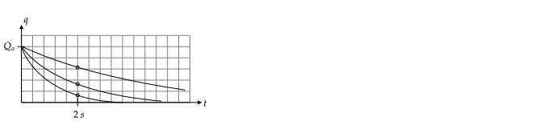

```mdextension
Title: RC Circuits
```

# Notation and Equations

* We use the the letter "C" as a label for a capacitor and the units of charge. When used as a label, $C$ is usually written in italics. Thus

  "$Q_C= 10 \text{ C}$" means "the capacitor labeled $C$ has a charge of $10$ Coulombs."

* Lower case letters are used for electrical quantities that vary in time. In circuits with only emfs and resistors, currents and voltages are constant, and we used $I$ and $V$. In the circuits considered in this activity, the currents, charges, and voltages vary in time, so we use $i(t)$, $q(t)$, and $v(t)$.

# Discharging Capacitor

If one capacitor with capacitance $C$ is in a circuit with other resistors (and no emfs), the charge on the capacitor changes with time according to

$q(t)=Q_oe^{-t/\tau}$,

where $\tau\equiv RC$, $Q_o$ is the charge on the capacitor at $t=0$, and $R$ is the equivalent resistance. The quantity $\tau$ is called "$RC$ time constant." The equation for $q(t)$ follows from solving the differential equation that follows from using Kirchhoff's voltage law.

## Problem

Find $\tau$ in seconds for the following two circuits. Use $R=10\text{ k}\Omega$ and $C=1\text{ }\mu\text{F}$. Note that $1 \text{ }\Omega\cdot \text{F} = 1 \text{ second}$.


\ifsolutions
**Answer**:
* Left: $R_{\text{eq}}=20\text{ k}\Omega$; $\tau = R_{\text{eq}}C = (20\cdot 10^3\text{ }\Omega) \cdot (10^{-6}\text{ F}) = 0.02\text{ s}$
* Right: $R_{\text{eq}}=5\text{ k}\Omega$; $\tau=.005\text{ s}$ 
\else
\vspace{1in}
\fi

\newpage

## Problem

For the following circuit, find the charge $q$ on the capacitor at $t=2\text{ s}$ if the switch is closed at $t=0$ and the capacitor has an initial charge of $Q_o$ for the following three cases.

1. $RC=1\text{ s}\qquad$ $q(2\text{ s})=\fbox{\qquad\phantom M}$

2. $RC=2\text{ s}\qquad$ $q(2\text{ s})=\fbox{\qquad\phantom M}$

3. $RC=4\text{ s}\qquad$ $q(2\text{ s})=\fbox{\qquad\phantom M}$

\ifsolutions
\else
\vspace{2cm}
\fi

4. Next, sketch a plot of $q(t)$ from $t=0$ to $t=6\text{ s}$ for each of these three cases. Used a solid, dashed, and dotted line for case 1., 2., and 3., respectively. (Hint: For all curves $q(0)=Q_o$. Use the $q(2)$ values from parts 1.--3. to help sketch the curve.)


\ifsolutions
**Answer**:

$q(2)=Q_oe^{-2/RC}$, assuming $RC$ has units of seconds. So

1. $q(2)=Q_oe^{-2/1}=Q_o/e^2 \simeq 0.14 Q_o$

2. $q(2)=Q_oe^{-2/2}=Q_o/e \simeq 0.37 Q_o$

3. $q(2)=Q_oe^{-2/4}=Q_o/\sqrt{e} \simeq 0.61 Q_o$

4. All curves decay exponentially. To plot, start at $Q_o$, and draw an exponentially decaying curve that passes through one of the values above at $t=2\text{ s}$.


\fi

## Problem


In the circuit above, the values of $R$ and $C$ are such that $RC=1\text{ s}$.

1. If the capacitor has a charge of $10\text{ nC}$ and the switch is closed, how long will it take for the charge on the capacitor to fall to half of this value?

2. If the capacitor instead had a charge of $20\text{ nC}$ and the switch is closed, how long will it take for the charge on the capacitor to fall to half of this value?

\ifsolutions
**Answer**:

$q(t)=Q_oe^{-t/\tau}$, where $\tau=RC=1\text{ s}$ was given and we want $t$ when $q(t)=Q_o/2$, so need to solve 

$Q_o/2=Q_oe^{-t/\tau}\quad$ or $\quad 1/2=e^{-t/\tau}$

Taking the natural log of boths sides, and using $\ln(1/x)=-\ln x$, gives

$$-\ln(2) = \ln e^{-t/\tau} = -\frac{t}{\tau}$$

so $t=\tau\ln(2)\simeq 0.70\tau=0.70RC=0.70\text{ s}$. The answer does not depend on $Q_o$, so this is the answer for parts 1. and 2.
\else
\newpage
\fi

# Charging a Capacitor

If a single capacitor is in series with other resistors and a DC voltage source, the charge of the capacitor varies according to 

$$q(t)=Q_f(1-e^{-t/\tau})$$

where $\tau\equiv RC$, $R$ is the equivalent resistance, and $Q_f$ is the final charge on the capacitor, that is, the charge on the capacitor as $t\rightarrow\infty$ (it is technically more accurate to say $t\gg \tau$ instead of $t\rightarrow\infty$; why?).

To find $Q_f$, replace the capacitor with an open circuit and use Kirchhoff's voltage law to find the voltage across the capacitor, $V_f$. Then use $Q_f=CV_f$.

## Example

Find $q(t)$ for the following circuit, assuming the switch is closed at $t=0$ and the capacitor is initially uncharged.


**Answer**: When the switch is closed, charge builds up on the capacitor. This build--up continues until the charge on the capacitor is such that no current flows in the circuit. If no current flows through the capacitor, the circuit is equivalent to one in which the capacitor is replaced with an open circuit, as shown below. 


Kirchhoff's voltage Law gives $\mathcal{E}-i(t)R-v_C(t)=0$, where $v_C(t)$ is the voltage across the capacitor. For large $t$, $i(t)=0$, leaving $v_{C}(t)=\mathcal{E}$. This voltage is for large $t$, so we relabel it as $V_f$. Using $Q_f=CV_f$ gives $Q_f=C\mathcal{E}$, so

$$q(t)=C\mathcal{E}(1-e^{-t/RC})$$

Note that the general formula $q(t)=Q_f(1-e^{-t/\tau})$ that applies for all $t$ is derived by solving the differential equation $\mathcal{E}-i(t)R-v_C(t)=0$ using $i(t)=dq(t)/dt$ and $v_C(t)=q(t)/C$.

\ifsolutions
\else
\newpage
\fi

## Problem

For a circuit with any number of capacitors, DC voltage sources, and resistors, finding the equation for $q(t)$ for each capacitor requires solving a system of differential equations, which is not covered in this course. However, you can find the currents and charges on the capacitor after a long time by replacing all capacitors with open circuits and then using KVL.


(In the above circuit, the equation used in the previous problem does not apply and so you are only asked for the state of the circuit after a long time.)

1. Find the charge on the capacitor a long time after the switch is closed. 
2. Find the current in the left, middle, and right resistors a long time after the switch is closed.

\ifsolutions
**Answer**
1. $\ds Q_f=\frac{\mathcal{E}}{2}C$
2. $\ds i_{\text{Left}}=i_{\text{Middle}}=\frac{\mathcal{E}}{2R}$ and $i_{\text{Right}}=0$.

%Note that the exact equation for $q(t)$ can be found using the technique covered in the textbook because the equation for $q$ on the capacitor simplifies to a single differential equation. Using KVL and KCL, one can show

%$\ds\frac{dq}{dt}+\frac{q}{\tau}=\frac{\mathcal{E}}{3R}$, where $\ds\tau=\frac{3}{2}RC$, so if the capacitor was initially uncharged, $q(t)=\frac{\mathcal{CE}}{2}(1-e^{-t/\tau})$. After a long time ($t\gg \tau$), the 

%exponential term is zero and we recover the answer to part 1.
\else
\fi

\newpage
# Charge/Discharge Problem

## Part I


The switch in the above circuit has been in position $a$ for a long time. At $t = 0$, the switch is moved instantaneously to position $b$. The values of the circuit elements are $\mathcal{E}= 12\text{ V}$, $C = 10\text{ mF}$, and $R = 20\text{ }\Omega$.

Let $t=0^-$ correspond to the time just before the switch is moved from $a$ to $b$. Let $t=0^+$ correspond to the time just after the switch is moved from $a$ to $b$.

1. What is the current through the resistor at $t=0^-$?

   \ifsolutions
   **Answer**: Zero. The battery charges the capacitor until the charge on the capacitor is such that it is equivalent to a battery with an emf of $\mathcal{E}$ oriented such that no current flows through it.
   \else
   \vspace{2cm}
   \fi

2. What is the charge on the capacitor at $t=0^-$?

   \ifsolutions
   **Answer**: After a long time in position $a$, the current is zero. Replacing the capacitor with an open circuit and using KVL gives $v_C=\mathcal{E}$. So $q(0^-) = Cv_C(0^-) = (10 \text{ mF})(12\text{ V}) = 120\text{ mC}$.
   \else
   \vspace{2cm}
   \fi

3. What is the charge on the capacitor at $t=0^+$?

   \ifsolutions
   **Answer**: $120\text{ mC}$
   \else
   \vspace{2cm}
   \fi

4. What is the voltage across the capacitor at $t=0^+$?

   \ifsolutions
   **Answer**: Using $V=Q/C$ gives $v_C(0^+)=120\text{ mC}/(10\text{ mF}) = 12\text{ V} = \mathcal{E}$
   \else
   \vspace{2cm}
   \fi

5. What is the current through the resistor at $t=0^+$?

   \ifsolutions
   **Answer**: Immediately after the switch is moved to $b$, the capacitor starts to discharge though the resistor. Kirchhoff's Voltage law for the new closed loop states that the voltage across the resistor equals the voltage across the capacitor, $v_C$. By Ohm's law current through the resistor is $i(0^+) = v_C(0^+)/R = 12\text{ V}/20\text{ }\Omega = 0.6\text{ A}$.
   \else
   \vspace{2cm}
   \fi

6. What is the charge on the capacitor at $t = 200\text{ ms}$?

   \ifsolutions
   {\bf Answer: } The time constant is $RC= (10\text{ mF}) (20\text{ }\Omega) = 200\text{ ms}$. At $t = 200\text{ ms}$, the capacitor is in the process of discharging. The charge on the capacitor varies according to $q(t)=Q_oe^{-t/RC}$, so

   $q(200\text{ ms}) = Q_0e^{-200\text{ ms}/RC} = 120\text{ mC} \cdot e^{-200\text{ ms}/200\text{ ms}} \simeq120\text{ mC}\cdot 0.37 \simeq 44 \text{ mC}$.
   \else
   \fi

\newpage
## Part II


The switch in the above circuit has been in position $b$ for a long time. At $t = 0$, the switch is moved instantaneously to position $a$. The values of the circuit elements are $\mathcal{E}= 12\text{ V}$, $C = 10\text{ mF}$, and $R = 20\text{ }\Omega$.

Let $t=0^-$ correspond to the time just before the switch is moved from $b$ to $a$. Let $t=0^+$ correspond to the time just after the switch is moved from $b$ to $a$.

1. What is the current through the resistor at $t=0^-$?

   \ifsolutions
   {\bf Answer: } Since the switch is on position $b$ for a long time, the charge on and voltage across the capacitor is zero. If the voltage across the capacitor is zero, then by Kirchhoff's voltage law, the voltage across the resistor must be zero. So the current through the resistor is zero; $i_C(0^-)=0$.
   \else
   \vspace{2cm}
   \fi

2. What is the voltage across the capacitor at $t=0^-$?

   \ifsolutions
   {\bf Answer: } $v_C(0^-)=0$. This follows from KVL, $i(0^-)R-v_C(0^-)=0$, and the fact that $i(0^-)=0$ because the circuit had the switch at $b$ for a long time so that the capacitor was fully discharged.
   \else
   \vspace{2cm}
   \fi

3. What is the charge on the capacitor at (a) $t=0^-$ and (b) $t=0^+$?

   \ifsolutions
   {\bf Answer: } (a) Zero; (b) Zero
   \else
   \vspace{2cm}
   \fi

4. What is the voltage across the capacitor at $t=0^+$?

   \ifsolutions
   {\bf Answer: } $v_C(0^+)=0$.
   \else
   \vspace{2cm}
   \fi

5. What is the current through the resistor at $t=0^+$?

   \ifsolutions
   {\bf Answer:} Kirchhoff's voltage law at this time is

   $\mathcal{E}-i(0^+)R-v_C(0^+)=0$

   At $t=0^+$ the voltage across the capacitor is zero because it is uncharged, so $i(0^+)R=\mathcal{E}$. Thus, $i(0^+) = \mathcal{E}/R = 12\text{ V}/20\text{ }\Omega = 0.6\text{ A}$.
   \else
   \vspace{2cm}
   \fi

6. What is the charge on the capacitor at time $t = 200\text{ ms}$?

   \ifsolutions
   {\bf Answer: } The time constant is $RC=200\text{ ms}$. At $t=200\text{ ms}$, the charge accumulated on the capacitor is:

   $$q(200\text{ s}) = C\mathcal{E}(1-e^{-(200\text{ s})/RC}) = (10\text{ mF} \cdot 12\text{ V})(1-e^{-200/200})\simeq (120\text{ mV})(0.63)\simeq 75.9\text{ mV}$$
   \else
   \fi
