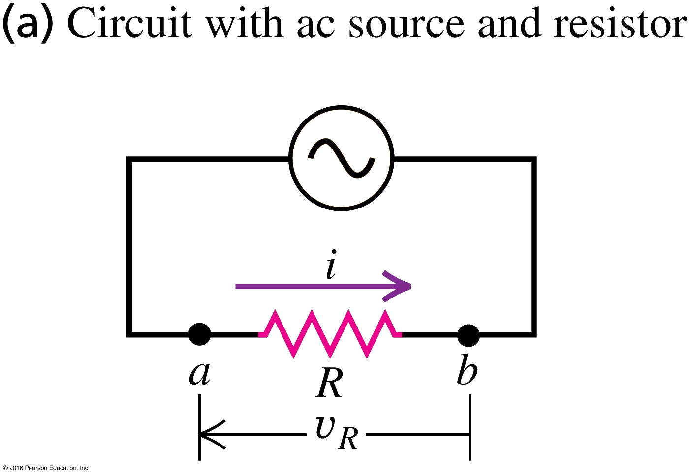
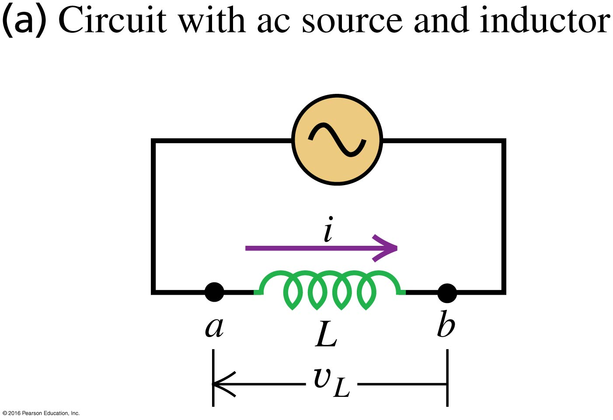
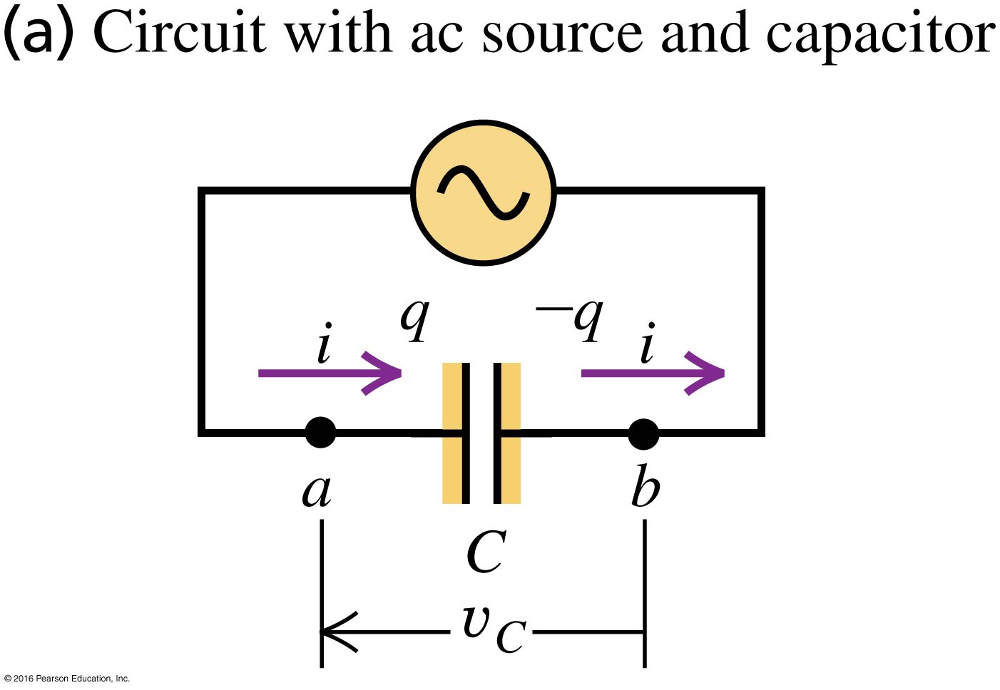
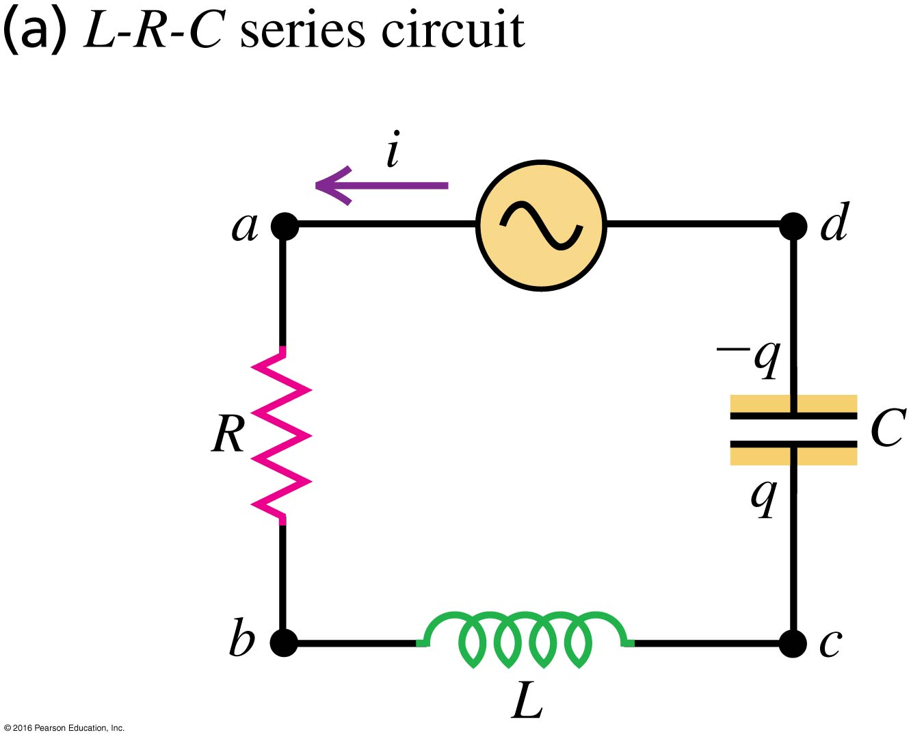
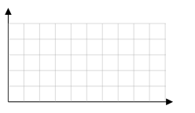

```mdextension
Title: LRC AC Circuits
```

# Introduction

Previously, we have examined circuits with either capacitors and resistors or inductors and resistors that were powered by batteries that produce constant voltage. These are called a direct current (DC) circuits. When a switch was closed to complete a circuit, the current varied in time and the time dependence was exponential (the current had a term $e^{-t/\tau}$.

If instead of a battery we use a voltage source that varies in time sinusouidally, the current will also vary in time sinusoidally, possibly with a differnt phase. (Technically, there will also be exponential terms, but after a short amount of time they approach zero.)

## R Only

Figure (a) below shows a circuit in which an AC power source causes the current to vary sinusoidally in time according to $i(t)=I\cos(\omega t)$. By Ohm's law, the equation for the instantaneous voltage across the resistor is $v_R(t) = IR\cos(\omega t) = V_R\cos(\omega t)$.

Figure (b) shows the current and voltage. The voltage and current are "in phase" because the peaks, valleys, and zero crossings in the plots of $i(t)$ and $v_R(t)$ occur at the same time.




## L Only

Figure (a) below shows a $RL$ circuit in which an AC power source causes the current to vary sinusoidally in time according to $i(t)=I\cos(\omega t)$.

The voltage across the inductor varies according to $v_L(t) = I\omega L\cos(\omega t + 90^o)$.

The term $\omega L$ is called the inductive reactance: $X_L \equiv \omega L$. With this new variable, $v_L(t) = IX_L\cos(\omega t + 90^\circ)$.

Figure (b) shows the $v(t)$ and $i(t)$. The voltage across the inductor "leads" the current by $90^\circ$ (or, equivalently, $T/4$) because the maxima (or minima) in $v_L(t)$ occur before the maxima (or minima) in $i(t)$.




## C Only

Figure (a) below shows a $RC$ circuit in which an AC power source causes the current to vary sinusoidally in time according to $i(t)=I\cos(\omega t)$.

The voltage across the capacitor varies according to $v_C(t) = \frac{I}{\omega C}\cos(\omega t - 90^o)$.

The term $1/(\omega C)$ is called the capacitive reactance: $X_C \equiv 1/(\omega C)$. With this new variable, $v_C(t) = IX_C\cos(\omega t - 90^\circ)$.

Figure (b) shows the $v(t)$ and $i(t)$. The voltage across the inductor "lags" the current by $90^\circ$ (or, equivalently, $T/4$) because the maxima (or minima) in $v_C(t)$ occur after the maxima (or minima) in $i(t)$.




## Series LRC circuit

Suppose that we know the current $i(t)$ in the following series LRC circuit is $i(t)=I\cos(\omega t)$.



We want to know the voltage across the AC power supply, $v_{d}-v_{a}$, which we call $v$. We know the voltage across each of the components from the discussion above:

$$
v_R(t) = IR\cos(\omega t)
$$

$$
v_L(t) = I\omega L\cos(\omega t + 90^\circ) = IX_L\cos(\omega t + 90^\circ)
$$

$$
v_C(t) = \frac{I}{\omega C}\cos(\omega t - 90^\circ)=IX_C\cos(\omega t - 90^\circ)
$$

From Kirchhoff's voltage law:

$$
v(t) - v_R(t) - v_L(t) - v_C(t)
$$

Substitution gives

$$
v(t)=IR\cos(\omega t)+IX_L\cos(\omega t + 90^\circ)+IX_C\cos(\omega t - 90^\circ)
$$

In this activity, you will compute $v(t)$ in two ways. First, you will use the above formula and a trig identity to write $v(t)$ in the form $IZ\cos(\omega t+\phi)$, where the constants $Z$ and $\phi$ depend on $R$, $L$, and $C$ (or equivalently, $R$, $X_L$, and $X_C$). Next, you will use a general formula to compute $Z$ and $\phi$.

# Problem I

A series LRC circuit with known values of $I$, $R$, $L$, and $C$ are such that $IR=1\text{ V}$, $IX_L=1\text{ V}$, and $X_C=0$. In addition, assume $i(t)=(1\text{  A})\cos\omega t$ and $\omega = 2\pi\text{ }\text{ s}^{-1}$.

Plot all quantites on the same graph.



1. Compute the period, $T$, of $i(t)$

   \ifsolutions
   **Answer**: There are two ways to answer this.
   1. The current is $i(t)=\cos\omega t$.
      * At $t=0\text{ s}$, $i(0\text{ s})=1$.
      * When $\omega t=2\pi\text{ s}$, $i(2\pi\text{ s})=1$ again for the first time.

       So the time for the $i(t)$ to return to its starting value is $t$ such that $\omega t=2\pi \Rightarrow t = 2\pi/(2\pi\text{ s}^{-1})=1\text{ s}$.
   2. Using the formula $T=2\pi/\omega$.
   \else
   \vspace{3em}
   \fi

2. Plot $i(t)$

   \ifsolutions
   **Answer**: See [Desmos plot](https://www.desmos.com/calculator/klkajsstdc)
   \else
   \vspace{3em}
   \fi

3.  Plot $v_R(t)$

   \ifsolutions
   **Answer**: See [Desmos plot](https://www.desmos.com/calculator/klkajsstdc)
   \else
   \vspace{3em}
   \fi

4. Plot $v_L(t)$

   \ifsolutions
   **Answer**: See [Desmos plot](https://www.desmos.com/calculator/klkajsstdc)
   \else
   \vspace{3em}
   \fi

5. Plot $v_C(t)$

   \ifsolutions
   **Answer**: See [Desmos plot](https://www.desmos.com/calculator/klkajsstdc). Note that $v_C = 0$ when $X_C=1/(\omega C)=0$. To get $X_C\approx 0$ in the Desmos plot, we set $C=1000$.
   \else
   \fi

6. Starting with $v(t)=v_R(t)+v_L(t)+v_C(t)$, use the trig identity

   $A\cos(\theta) + B\cos(\theta + \pi/2)=\sqrt{A^2+B^2}\cos\left(\theta + \tan^{-1}(B/A)\right)$

   to write $v(t)$ in the form $v(t)=Z\cos(\omega t + \phi)$.

   That is, find the constants $Z$ and $\phi$.

   \ifsolutions
   **Answer**:  Here we have $v_R(t)=\cos\omega t$, $v_L(t)=\cos(\omega t+\pi/2)$, and $v_C(t)=0$, so 
   
   $v(t)=\cos\omega t+\cos(\omega t+\pi/2)$.
   
   Comparing this with the identity, $A=B=1$ and we get
   
   $v(t)=\sqrt{2}\cos(\omega t + \tan^{-1}(1/1))=\sqrt{2}\cos(\omega t+\pi/4)$.
   
   Because of the $+\pi/4$, we say that $v(t)$ leads $i(t)$ by $\pi/4$ (or $45^\circ$ or $T/8$).
   \else
   \fi

7.  Plot $v(t)$

   \ifsolutions
   **Answer**: See [Desmos plot](https://www.desmos.com/calculator/klkajsstdc). Try to adjust the parameters $R$, $L$, and $C$ to see how they change the curves (both amplitudes and phases).
   \else
   \fi

## Problem II

In the previous problem, computing $v(t)$ required the use of a trig identity to combine $v_R$ and $v_L$ and write $v(t)$ in the form $v(t)=Z\cos(\omega t + \phi)$, where $Z$ and $\phi$ are constants that depend on $L$ and $R$. When $v_C$ is not zero, additional algebra is needed to compute $v(t)$ (by using the trig identity again). However, there is formula that can be used to find $v(t)$ in general so that trig identities are not needed to compute $v(t)$.

It can be shown that in general, the voltage across the AC power source is

$$
v(t) = IZ\cos(\omega t + \phi)
$$

Where the series LRC impedance $Z$ is defined as

$$
Z = \sqrt{R^2 + (X_L-X_C)^2}
$$

and

$$
\phi = \tan^{-1}\left(\frac{X_L - X_C}{R}\right) = \tan^{-1}\left(\frac{\omega L - \frac{1}{\omega C}}{R}\right)
$$

When $\phi$ is positive, $v(t)$ leads $i(t)$. When $\phi$ is negative, $v(t)$ lags $i(t)$. When $\phi=0$, $v(t)$ is in phase with $i(t)$.

1. Using the parameters given in the previous problem, find $v(t)$ using the above formula.

   \ifsolutions
   {\bf Answer}: In the previous problem, we were given $I=1$ and $\omega=2\pi$, $IR=1$, $IX_L=I\omega L=1$, $X_C=1/(\omega C)$. From this, we conclude $R=1$, $\omega L=1$, and $1/(\omega C)=0$. Thus

   $$
   Z = \sqrt{R^2 + (X_L-X_C)^2} = \sqrt{1^2 + (1 - 0)^2}
   $$

   and

   $$
   \phi = \tan^{-1}\left(\frac{X_L - X_C}{R}\right) = \tan^{-1}\left(\frac{1-0}{1}\right)=\tan^{-1}\left(\frac{1}{1}\right) = \frac{\pi}{4}
   $$

   Thus,

   $$
   v(t) = IZ\cos(\omega t + \phi) = \sqrt{2}\cos(\omega t+\pi/4)
   $$

   which is the same as found in the previous problem.
   \else
   \fi

2. Does $v(t)$ lead or lag $i(t)$?

   \ifsolutions
   **Answer**: Lead. A plot of $i(t)$ and $v(t)$ shows that peaks in $v(t)$ occur {\it before} peaks in $i(t)$.
   \else
   \fi
