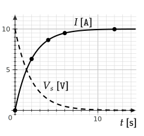
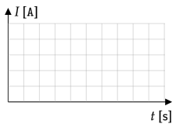
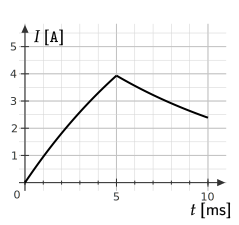

```mdextension
Title: LR Circuits
```

# Introduction


The above figure shows a RL series circuit consisting of an inductor of inductance $L$ connected in series with a resistor of resistance $R$. The switch, $S$, is closed at a time $t = 0$ and then remains closed.

Using Kirchhoff’s voltage law around the loop, we have

$$
V_s - I(t) \cdot R - L \frac{dI(t)}{dt} = 0
$$

The term $\ds L\frac{dI}{dt}$ is called the induced emf. The above differential equation can be solved for $I(t)$, the current at any time given the initial value of $I$, which is zero. The result is

$$
I(t)=\frac{V_s}{R}\left(1-e^{-t/(L/R)}\right)
$$

After a long time, the current approaches a constant value of $I = V_s/R$ because the exponential term approaches zero. How quickly the exponential term approaches zero depends on a quantity called the RL time constant defined by

$$\tau = L/R$$

which has units of seconds when $L$ is in Henrys ($\text{H}$) and $R$ is in Ohms ($\Omega$). Using $\tau$, we have

$$
I(t) = \frac{V_s}{R}\left(1-e^{-t/\tau}\right)
$$

In this equation, at $t=0$, the current is

$$
I(0) = (V_s/R)\left(1-e^{-0/\tau}\right)=(V_s/R)\left(1-1\right)=0
$$

As a result, we state that initially the inductor behaves like an open circuit because current does not flow though it.

For large $t/\tau$, the exponential term $e^{-t/\tau}$ becomes much smaller than one and so $I(t)\rightarrow V_s/R$. If we replace the inductor with a wire, this is the same current that we would find. As a result, we state that after a long time, an inductor behaves like a resistanceless wire.

\newpage

# Problem I

In this problem, you will consider the circuit and equation

$$I(t) = \frac{V_s}{R}\left(1-e^{-t/\tau}\right)$$

that was described in the introduction.

1. If $V_s = 10\text{ V}$ and $R=1\text{ }\Omega$, plot dots for the values of $I$ at $t=0, 2, 4, 6, 12\text{ s}$ with $L/R = \tau = 2\text{ s}$ 

   \ifsolutions
   
   \else
   
   \fi

2. Based on the equation, at $t=0$ does the inductor behave like an open circuit or a resistanceless wire?

   \ifsolutions
   {\bf Answer}: At $t=0$ the current will be zero, which is the same current that would be found if the inductor was removed and the wires that were connected to the inductor were left disconnected (so an open circuit).
   \else
   \vspace{1em}
   \fi

3. Based on the equation, at $t\gg \tau$ does an inductor behave like an open circuit or a resistanceless wire?

   \ifsolutions
   {\bf Answer}: At $t \gg \tau$ the current will be $V_s/R$, which is the same current that would be found if the inductor was replaced with a resistanceless wire.
   \else
   \vspace{2em}
   \fi
    
3. If $L$ doubles but $R$ remains constant
    
   a. does the time constant $\tau$ increase, decrease, or remain the same?;
    
   b. how will the position of the points that you drew for part 1. change? (Will they move up, down, or remain the same?) 

   c. Does your answer to b. make sense physically? That is, an inductor tends to impede changes in current and so is your answer to b. consistent with this? 

   \ifsolutions
   {\bf Answer}: If $L$ increases, the inductor provides more opposition to change in the currrent through it. Thus we expect the current to take longer to reach its final state. All of the points (except for $t=0$ will move downward).
   \else
   \vspace{4em}
   \fi

4. The voltage across the inductor is $LdI/dt$. Compute $dI/dt$ and sketch its curve on the graph above. Is this equation consistent with the statement that for large $t/\tau$, the voltage across the inductor is zero?

   \ifsolutions
    {\bf Answer:} $LdI/dt = V_se^{-t/\tau}$. Yes. The voltage across the inductor is $V_se^{-t/\tau}$ and for large $t/\tau$, $e^{-t/\tau}$ is small.
   \else
   \fi

\newpage

# Problem II

An inductor with an inductance of $40\text{ mH}$ and a resistor with a resistance of $2\text{ }\Omega$ are connected together to form a RL series circuit. If they are connected to a $20\text{ V}$ DC voltage source,

1. What is the current after a very long time?

   \ifsolutions
   {\bf Answer}: $I = V_s/R=(20\text{ V})/(2\text{ }\Omega) = 10\text{ A}$
   \else
   \vspace{3em}
   \fi

2. What is the time constant of this RL series circuit?

   \ifsolutions
   {\bf Answer}: The time constant is given by $\tau = L/R = (40\text{ mH})/(2\text{ }\Omega) = 20 \text{ ms}$
   \else
   \vspace{2em}
   \fi

3. How long does it takes for the current to reach $63$\% of its maximum value?

   \ifsolutions
   {\bf Answer}: The current in the circuit is expressed as:

   $$
   I(t)=  \frac{V_s}{R}\left(1-e^{-t/\tau}\right)
   $$

   The maximum current value is $I_{\text{max}}=V_s/R$. Therefore,

   $$
   \frac{I(t)}{I_{\text{max}}} = 1-e^{-t/\tau} = 1-e^{-t/\tau}
   $$

   Setting $I(t)/I_{\text{max}} =0.63\quad$ gives $\quad0.63 = 1-e^{-t/\tau}\quad\Rightarrow\quad e^{-t/\tau} = 1-0.63 = 0.37$

   $e^{-t/\tau} = 0.37\quad\Rightarrow\quad -t/\tau = \ln(0.37)=-0.9943\quad\Rightarrow\quad t = 19.89\text{ ms}$

   Thus, it takes roughly $20\text{ ms}$ ($\simeq \tau$) to reach $63$\% of the maximum current value. (So $0.63$ is a special number for an RL circuit -- at $t=\tau$, the current is $63$\% of its maximum value.)
   \else
   \vspace{5em}
   \fi

4. What is the value of the induced emf after $10\text{ ms}$?

   \ifsolutions
   {\bf Answer}: After 10 ms, the current is calculated as:

   $$
   I(t) = \frac{V_s}{R}(1-e^{-t/(L/R)}) = \frac{20 \text{ V}}{2\text{ }\Omega} \left(1-e^{-(10\text{ ms})/(20\text{ ms})}\right) = 3.9\text{ A} 
   $$

   The induced emf is:

   $$
   \text{emf} = V_s - IR= 20\text{ V} - 3.9\text{ A} \cdot 2~\Omega=12.2\text{ V} 
   $$
   \else
   \vspace{3em}
   \fi

5. What is the value of the circuit current one time constant (that is, at $t=\tau$) after the switch is closed?

   \ifsolutions
   {\bf Answer}: At time $t = \tau$,

   $$
   I(t) =  \frac{V_s}{R} (1-e^{-t/\tau})=10 \times (1-0.368) = 6.32\text{ A}
   $$

   This question is related to question 3. In the answer to question 3., it was found that it takes approximately one time constant to reach $63$\% of the maximum value. So in this problem we expect that the answer to be approximately $63$\% of the final value.
   \else
   \fi

\newpage

# Problem III


In the circuit above, an inductor with $L=10\text{ mH}$ and a resistor with $R=1\text{ }\Omega$ is connected as shown. The battery has an emf of $10\text{ V}$. At $t=0$, the switch $S_1$ is closed.


1. What is the current through the resistor at $t=0$?

   \ifsolutions
   {\bf Answer}: Zero. There is no closed path for current to flow.
   \else
   \vspace{1em}
   \fi

2. What is the current through the inductor at $t=0$?

   \ifsolutions
   {\bf Answer}: Zero. There is no closed path for current to flow.
   \else
   \vspace{1em}
   \fi

3. After a long time, what will the current be through the resistor and inductor?

   \ifsolutions
   {\bf Answer}: The current in the circuit as a function of time is

   $$
   I(t) =  \frac{V_s}{R}\left(1-e^{-t/(L/R)}\right)
   $$

   For large $t$, the exponential term is near zero, leaving $V_s/R=10\text{ V}/1 \text{ }\Omega$ = $10\text{ A}$.
   \else
   \vspace{3em}
   \fi

4. After a long time, switch $S_1$ is opened and $S_2$ is closed simultaneously. Write Kirchhoff's voltage law around the new closed loop.

   \ifsolutions
   {\bf Answer}: $\ds -I(t) R - L\frac{dI(t)}{dt} = 0$
   \else
   \vspace{3em}
   \fi

5. Show that the equation $I(t)=I_oe^{-(t-t_o)/\tau}$ satisfies the equation in your answer to the previous question.

   \ifsolutions
   {\bf Answer}: Starting with

   $$-I(t) \cdot R - L \frac{dI(t)}{dt} = 0$$

   and using
   
   $$I=I_oe^{-(t-t_o)/\tau}$$
   
   and
   
   $$\frac{d}{dt}\left(e^{-(t-t_o)/\tau}\right) = -\frac{1}{\tau} e^{-(t-t_o)/\tau}$$

   we have

   $$-I_oe^{-(t-t_o)/\tau} \cdot (1\text{ }\Omega) + (10\text{ mH}/\tau)e^{-(t-t_o)/\tau} = 0$$

   Using $\tau = L/R$ one arrives at

   $-I_oe^{-(t-t_o)/\tau} + I_oe^{-(t-t_o)/\tau} = 0$.
   \else
   \vspace{5em}
   \fi

6. If switch $S_1$ was opened and switch $S_2$ was closed at $t_o=5\text{ ms}$, plot $I(t)$ from $t=0$ to $t=10\text{ ms}$.

   \ifsolutions
   In the range $t=[0, 5]\text{ ms}$

   $$I(t) = \frac{V_s}{R}\left(1-e^{-t/\tau}\right)$$

   Starting at $t=5\text{ ms}$, the solution is
   
   $I(t) = I_o e^{-(t-t_o)/\tau}$
   
   To find $I_o$, use the fact that the current is continuous at $t=5\text{ ms}$. From the first equation,
   
   $I(5\text{ ms}) = (10\text{ V})\left(1-e^{-5\text{ ms}/10\text{ ms}}\right) \approx 4\text{ V}$
   
   and
   
   $I(5\text{ ms}) = I_oe^{-(5\text{ ms}-5\text{ ms})/10\text{ ms}} = I_o$

   Thus, $I_o = (10\text{ V})(1-e^{-1/2})\approx 4\text{ V}$
   
   
   \else
   
   \fi
