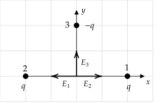

```mdextension
Title: Superposition and Symmetry
```

% Figures:
% https://www.mathcha.io/editor/M55KMuQLiLmH9Vgp0Ptw6QGB3HnpzJnnuM6VoB7

# Overview

In previous activities, only one charge was responsible for creating the electric field. When there are more charges, superposition can be used to find the total electric field by summing $\bfvec{E}$ due to each charge. Superposition can also be used to find the total electric force on a charge due to two or more charges.

Superposition problems are often simplified by recognizing a symmetry. For example, if we want to know the electric field at the origin due to charges $+q$ at $(x,y)=(\pm a, 0)$, we can state the answer is zero without computing the fields due to each charge -- we know they will be equal and opposite.

# Problem 

Charge $q_1 = +q$ is at $(x, y) = (a, 0)$, charge $q_2 = +q$ is at $(x, y) = (-a, 0)$, and charge $q_3 = -q$ is at $(x, y) = (0, a)$. Assume that $q$ is a positive number.

1. Draw this charge configuration below.

\ifsolutions

\else

\fi

2. Why does it not make sense to ask what the electric _force_ is at the origin?

   \ifsolutions
   Answer: There is no charge at the origin. (The electric field can be used to find the force on a charge _if_ it was placed at the origin.)
   \else
   <div style="height:2em"/>
   \fi

In the following, 

3. Find the electric field at the origin due to $q_1$. Write your answer in the form $\bfvec{E}\_1=E_{x1}\ihat + E_{y1}\jhat$.

   \ifsolutions
   {\bf Answer}: $\ds\bfvec{E}\_1=-\frac{kq}{a^2}\ihat$
   \else
   <div style="height:6em"/>
   \fi

4. Find the electric field at the origin due to $q_2$. Write your answer in the form $\bfvec{E}\_2=E_{x2}\ihat + E_{y2}\jhat$.

   \ifsolutions
   {\bf Answer}: $\ds\bfvec{E}\_2=+\frac{kq}{a^2}\ihat$
   \else
   <div style="height:6em"/>
   \fi

5. Find the electric field at the origin due to $q_3$. Write your answer in the form $\bfvec{E}\_3=E_{x3}\ihat + E_{y3}\jhat$.

   \ifsolutions
   {\bf Answer}: $\ds\bfvec{E}\_3=+\frac{kq}{a^2}\jhat$
   \else
   <div style="height:6em"/>
   \fi

6. Find the total electric field at the origin by adding $\bfvec{E}_1$, $\bfvec{E}_2$, and $\bfvec{E}_3$. Write your answer in the form $\bfvec{E}=E_{x}\ihat + E_{y}\jhat$.

   \ifsolutions
   {\bf Answer}: $\ds\bfvec{E}=+\frac{kq}{a^2}\jhat$
   \else
   <div style="height:6em"/>
   \fi

7. Will your answers to 3.--6. change if the problem had asked for the electric field at a different position? If so, which answers?

   \ifsolutions
    Yes, all answers. The electric field at a given location due to each charge depends on the distance to the location. If the location changes, the distance changes.
   \else
   <div style="height:6em"/>
   \fi

8. Find the electric field at the origin if charge $q_1=2q$ (instead of $q$).

   \ifsolutions
   {\bf Answer}: $\ds\bfvec{E}=-\frac{kq}{a^2}\ihat+\frac{kq}{a^2}\jhat$
   \else
   <div style="height:6em"/>
   \fi

9. Find the electric field at the origin if charge $q_1=-2q$ (instead of $q$).

   \ifsolutions
   {\bf Answer}: $\ds\bfvec{E}=+\frac{3kq}{a^2}\ihat+\frac{kq}{a^2}\jhat$
   \else
   <div style="height:6em"/>
   \fi
 