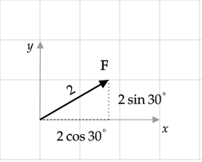
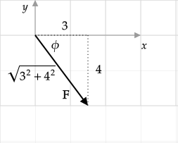

```mdextension
Title: Vectors
```

# Problem I

A vector $\bfvec{F}$ has a magnitude of $2$ and makes an angle of $30^\circ$ with the $x$--axis (with positive rotation counterclockwise).

1. Draw $\bfvec{F}$.
2. Write $\bfvec{F}$ in the form $F_x\ihat + F_y\jhat$.

\ifsolutions
**Solution**

1. &nbsp;

  

2. $\bfvec{F} = 2\cos(30^\circ)\ihat + 2\sin(30^\circ)\jhat=\sqrt{3}\ihat + \jhat$, where $\cos(30^\circ)=\sqrt{3}/2$ and $\sin(30^\circ)=1/2$ was used in the last step.

\else


\fi

# Problem II

Given $\bfvec{F}=3\ihat - 4\jhat$,

1. Draw $\bfvec{F}$.
2. Compute $F$.
3. The angle  $\bfvec{F}$ makes with respect to the $x$--axis (with positive rotation counterclockwise).

\ifsolutions
**Solution**

1. &nbsp;

   

2. $F=\sqrt{3^2+4^2}=5$
3. $\ds\theta = 360^\circ - \phi = 360^\circ - \frac{180}{\pi}\tan^{-1}(4/3)\simeq 307^\circ$

\else


\fi