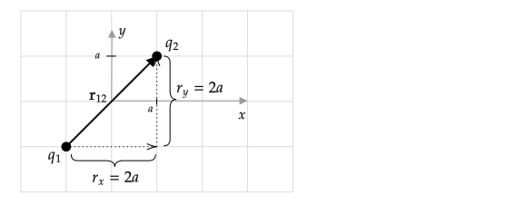

```mdextension
Title: The $\rhat$ Unit Vector
```

% Figures:
% https://www.mathcha.io/editor/M55KMuQLiLmH9Vgp0Ptw6QGB3HnpzJnnuM6VoB7

# The $\rhat$ Unit Vector

One approach to finding the electric force between two charges is to use
$F=k{|q_1q_2|}/{r^2}$ to find the magnitude and a diagram and trigonometry to write $\bfvec{F}$ in the form $\bfvec{F}=F_x\ihat + F_y\jhat$.

An alternative approach is to use an equation for electric force using a unit vector $\rhat$:

$$\bfvec{F}_{q_1\text{ on }q_2}=kq_1q_2\frac{\rhat_{12}}{r^2}$$

where $\rhat_{12}$ is the unit vector that points from the position of $q_1$ to the position of $q_2$, and $r$ is the distance between $q_1$ and $q_2$.

To find $\rhat_{12}$,

1. draw a vector, $\bfvec{r}_{12}$, from $q_1$ to $q_2$;
2. Write $\bfvec{r}_{12}$ in the form $\bfvec{r}_{12}=r_x\ihat+r_y\jhat$ using the diagram; then
3. $\rhat_{12}=\bfvec{r}_{12}/r$, where $r=\sqrt{r_x^2+r_y^2}$.

The equation for electric field using a unit vector $\rhat$ is

$$\bfvec{E}_{\text{due to }q}=kq\frac{\rhat}{r^2}$$

where $\rhat$ is the unit vector that points from the position of $q$ to the point in space where we want to know $\bfvec{E}$, and $r$ is the distance between $q$ and that point. 

To find $\rhat$, 

1. draw a vector, $\bfvec{r}$,from $q$ to the point in space where you want to know $\bfvec{E}$;
2. Write $\bfvec{r}$ in the form $\bfvec{r}=r_x\ihat+r_y\jhat$ using the diagram; then
3. $\rhat=\bfvec{r}/r$, where $r=\sqrt{r_x^2+r_y^2}$.

Note that in the equations for $\bfvec{F}$ and $\bfvec{E}$, we do not need to take the absolute value of the charges.

\newpage

# Example I

Charge $q_1$ is at $(x,y)=(-a,-a)$ and charge $q_2$ is at $(a, a)$. Find

1. $\rhat_{12}$
2. $\bfvec{F}_{q_1\text{ on }q_2}$
3. $F_{q_1\text{ on }q_2}$

**Solution**



$\bfvec{r}_{12}=r\cos(45^\circ)\ihat + r\sin(45^\circ)\jhat$, $\ds\rhat_{12}=\frac{\bfvec{r}}{r}=\cos(45^\circ)\ihat +\sin(45^\circ)\jhat$

Note that the magnitude of $\rhat_{12}=1$: $|\rhat_{12}|=\sqrt{\cos^2(45^\circ)+\sin^2(45^\circ)}=1$

The sides of the right triangle have length $2a$, so the hypotenuse $r=\sqrt{8}a$. Substitution gives

$$\bfvec{F}_{q_1\text{ on }q_2}=kq_1q_2\frac{\rhat_{12}}{r^2} = \frac{kq_1q_2}{8a^2}(\cos 45^\circ \ihat + \sin 45^\circ \jhat) =\frac{kq_1q_2}{8a^2}\left[\frac{1}{\sqrt{2}}\ihat + \frac{1}{\sqrt{2}}\jhat\right]$$

Check: if $q_1$ and $q_2$ are both positive or both negative, the force on $q_2$ is upwards and to the right, as expected.

To calculate $|\bfvec{F}|$, we can use $|\bfvec{F}|=F=\sqrt{F_x^2+F_y^2}$ and plug in $F_x=k\frac{q_1q_2}{8a^2}\frac{1}{\sqrt{2}}$ and $E_y=k\frac{q_1q_2}{8a^2}\frac{1}{\sqrt{2}}$ and use $\sqrt{c^2}=|c|$ (where $c$ is a real number) to show that $F=k|q_1q_2|/{8a^2}$. There is an easier way. Taking the magnitude of both sides of

$\ds\bfvec{F}=kq_2q_1\frac{\rhat}{r^2}\quad$
gives
$\quad\ds|\bfvec{F}|=F=k|q_1q_2|\frac{|\rhat|}{r^2}$.

The magnitude of a unit vector is $1$, so
$\ds F=k|q_1q_2|\frac{1}{r^2}=k|q_1q_2|\frac{1}{8a^2}$.

\newpage

# Problem I

Charge $q_1$ is at $(x,y)=(-a,a)$ and charge $q_2$ is at $(a, 0)$. Find

1. $\rhat_{12}$
2. $\bfvec{F}_{q_1\text{ on }q_2}$
3. $F_{q_1\text{ on }q_2}$

\ifsolutions
**Solution**

$r = \sqrt{5}a$

$\bfvec{r}_{12}=2a\ihat-a\jhat$

$\rhat_{12}=\bfvec{r}_{12}/r=\frac{2}{\sqrt{5}}\ihat-\frac{1}{\sqrt{5}}\jhat$

$\ds\bfvec{F}_{q_1\text{ on }q_2}=kq_1q_2\frac{\rhat_{12}}{r^2}=\frac{kq_1q_2}{5a^2}\left(\frac{2}{\sqrt{5}}\ihat-\frac{1}{\sqrt{5}}\jhat\right)$

$\ds F_{q_1\text{ on }q_2} = k|q_1q_2|\frac{1}{r^2}= k|q_1q_2|\frac{1}{5a^2}$

\else

\fi

\newpage

# Example II

If $q_1$ is at $(x,y)=(-a,-a)$, find

1. $\rhat$
2. $\bfvec{E}_{\text{at }(a,a)\text{ due to }q_1}$
3. $E_{\text{at }(a,a)\text{ due to }q_1}$

**Solution**

The calculation of $\rhat$ is the same as that shown in the diagram Example I (except we do not need subscripts for the $\bfvec{E}$ formula).

Substitution gives

$$\bfvec{E}_{\text{at }(a,a)\text{ due to }q_1}=kq_1\frac{\rhat}{r^2} = kq_1\frac{1}{8a^2}(\cos 45^\circ \ihat + \sin 45^\circ \jhat) =\frac{kq_1}{8a^2}\left[\frac{1}{\sqrt{2}}\ihat + \frac{1}{\sqrt{2}}\jhat\right]$$

(Notice the relationship between the answers to this problem and the answers to Example I.)

Check: If a positive charge was placed at $(x,y)=(a,a)$, it would tend to move up and to the right, which is consitent with the signs on the components of the electric field found above.

To calculate $|\bfvec{E}|$, we can use

$$|\bfvec{E}|=E=\sqrt{E_x^2+E_y^2}$$

and plug in $E_x=k\frac{q_1}{8a^2}\frac{1}{\sqrt{2}}$ and $E_y=k\frac{q_1}{8a^2}\frac{1}{\sqrt{2}}$ and use $\sqrt{c^2}=|c|$ (where $c$ is a real number) to show that $E=k|q_1|/{8a^2}$. There is an easier way. Taking the magnitude of both sides of

$\ds\bfvec{E}=kq_1\frac{\rhat}{r^2}\quad$
gives
$\quad\ds|\bfvec{E}|=k|q_1|\frac{|\rhat|}{r^2}$.

The magnitude of a unit vector is $1$, so

$\ds|\bfvec{E}|=k|q_1|\frac{1}{r^2}=\frac{k|q_1|}{8a^2}$.

\newpage

# Problem II

If $q_1$ is at $(x,y)=(-a,a)$, find 

1. $\rhat$
2. $\bfvec{E}_{\text{at }(a,0)\text{ due to }q_1}$
3. $E_{\text{at }(a,0)\text{ due to }q_1}$

\ifsolutions
{\bf Solution}:

(Notice the relationship between the answers to this problem and the answers to Problem I.)

$r = \sqrt{5}a$

$\bfvec{r}_{12}=2a\ihat-a\jhat$

$\rhat_{12}=\bfvec{r}_{12}/r=\frac{2}{\sqrt{5}}\ihat-\frac{1}{\sqrt{5}}\jhat$

$\ds\bfvec{E}=kq_1\frac{\rhat}{r^2}=\frac{kq_1}{5a^2}\left(\frac{2}{\sqrt{5}}\ihat-\frac{1}{\sqrt{5}}\jhat\right)$

$\ds E = k|q_1|\frac{1}{r^2}= k|q_1|\frac{1}{5a^2}$
\else


\fi

\newpage

# Additional Problems

## Computing $\rhat$ for $\bfvec{F}$ formula

If $q_1$ is at $(x,y)=(-a,2a)$ and $q_2$ is at $(x,y)=(a,0)$, find

1. $\rhat_{12}$
2. $\rhat_{21}$
3. $r$

## Computing $\rhat$ for $\bfvec{E}$ formula

If $q_1$ is at $(x,y)=(a,0)$ and the point where we want to compute $\bfvec{E}$ is at $(x,y)=(-a,2a)$, find

1. $\rhat$
2. $\rhat$
3. $r$

## Problem I Follow-up

For the charge configuration given in Problem I, find

1. $\rhat_{21}$
2. $\bfvec{F}_{q_2\text{ on }q_1}$
3. $F_{q_2\text{ on }q_1}$


